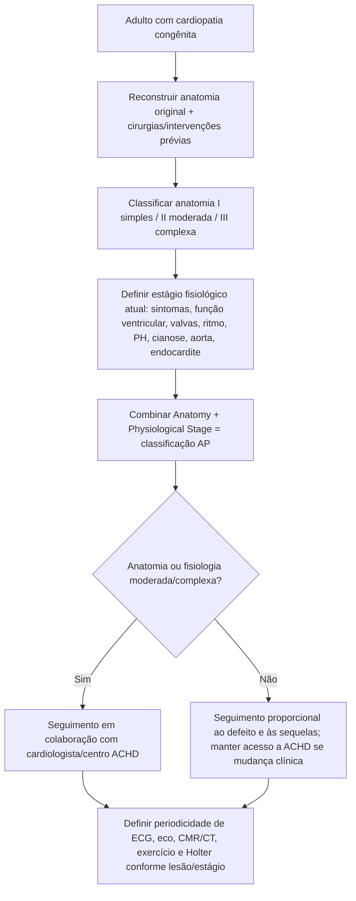
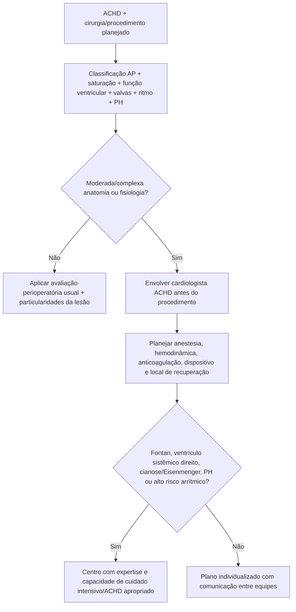
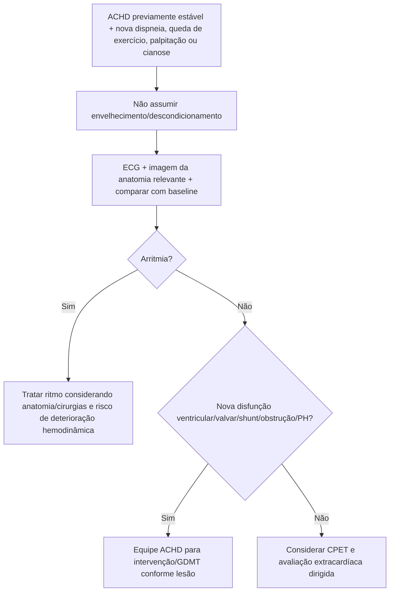

# Cardiopatia congênita do adulto — diretriz ACC/AHA 2025/2026

## O que mudou

A nova diretriz ACC/AHA/HRS/ISACHD/SCAI para adultos com cardiopatia congênita foi publicada em dezembro de 2025 e substitui formalmente a diretriz de 2018. A atualização reforça que a gravidade clínica **não pode ser definida apenas pelo nome anatômico da cardiopatia**.

O sistema central é a classificação **AP — Anatomy + Physiological Stage**:

> **complexidade anatômica + estado fisiológico atual = classificação ACHD que orienta seguimento e decisão clínica.**

Isso evita dois erros: subestimar um “defeito simples” que evoluiu com complicações e superestimar um defeito complexo bem reparado e fisiologicamente estável.

## Complexidade anatômica

O sistema classifica a anatomia em:

- **I — simples**;
- **II — moderada complexidade**;
- **III — grande complexidade/complexa**.

Exemplos citados pela AHA:

### Anatomia simples

- CIA ostium secundum;
- persistência do canal arterial, entre outras lesões simples.

### Moderada complexidade

- origem aórtica anômala de coronária do seio oposto;
- coronária anômala originada da artéria pulmonar;
- várias lesões reparadas ou com fisiologia intermediária.

### Grande complexidade

- ventrículo de dupla via de saída;
- **fisiologia de Fontan**;
- outras cardiopatias univentriculares/complexas.

A lista completa deve ser consultada na tabela oficial antes de implementação automatizada.

## Estado fisiológico

A dimensão fisiológica incorpora o que está acontecendo **agora**, como:

- sintomas e capacidade funcional;
- função ventricular;
- valvopatia residual;
- arritmias;
- hipertensão pulmonar;
- hipoxemia/cianose;
- doença aórtica;
- endocardite recente;
- complicações específicas da circulação congênita.

A diretriz 2025 adicionou **endocardite** à classificação fisiológica; endocardite bacteriana subaguda no último ano é considerada condição de estágio fisiológico avançado no sistema.

## Árvore de classificação e encaminhamento

## Procedimentos não cardíacos: não tratar como adulto “cardiológico comum”

A diretriz recomenda envolvimento de cardiologista ACHD em pacientes com anatomia **moderada ou complexa** ou estado fisiológico relevante que serão submetidos a procedimentos cardíacos ou **não cardíacos**, para orientar:

- risco do procedimento;
- anestesia;
- manejo de volume e resistência vascular;
- acesso venoso;
- risco arrítmico;
- anticoagulação;
- cuidados pós-procedimento.

## Árvore perioperatória em ACHD

## Insuficiência cardíaca em ACHD

A diretriz incorpora recomendações atualizadas de GDMT para IC em cardiopatia congênita, reconhecendo que o substrato pode ser:

- ventrículo esquerdo sistêmico;
- **ventrículo direito sistêmico**;
- circulação de Fontan;
- fisiologia residual pós-reparo.

Estratégias de pacing também são discutidas especificamente para ventrículo direito sistêmico e Fontan, evitando extrapolação automática de algoritmos da cardiomiopatia adquirida.

## Gravidez

A diretriz reforça que a maioria das gestantes com ACHD pode ter **parto vaginal** com segurança quando adequadamente estratificada e monitorada. A escolha de via de parto deve ser orientada por indicação obstétrica e hemodinâmica específica, não por “cardiopatia congênita” isoladamente.

Pacientes com lesões moderadas/complexas devem ter planejamento pré-concepcional e acompanhamento conjunto ACHD/cardio-obstetrícia.

## Endocardite em válvula pulmonar bioprotética

A diretriz chama atenção para **disfunção aguda ou subaguda de prótese pulmonar biológica**: endocardite deve fazer parte do diferencial, em vez de atribuir automaticamente a deterioração a degeneração estrutural.

## Árvore: mudança clínica em ACHD

## Por que CPET ganha importância

A avaliação de exercício em ACHD pode revelar deterioração antes de sintomas espontaneamente relatados. Uma declaração AHA de 2025 dedicada à interpretação de CPET em cardiopatia congênita reforça seu valor ao longo da vida para:

- quantificar limitação;
- comparar trajetória serial;
- identificar mecanismo cardiovascular/pulmonar;
- auxiliar prognóstico e decisão intervencionista.

## Armadilhas

1. Não definir risco apenas pela anatomia original.
2. Não considerar paciente “curado” porque foi operado na infância.
3. Não submeter ACHD moderada/complexa a cirurgia não cardíaca importante sem discutir particularidades com especialista quando disponível.
4. Não atribuir queda funcional apenas à idade sem comparar fisiologia/anatomia.
5. Não aplicar GDMT, pacing ou decisões de gravidez de cardiopatia adquirida sem considerar a circulação congênita específica.

## Fontes verificadas

1. Gurvitz M, Krieger EV, Fuller S, et al. 2025 ACC/AHA/HRS/ISACHD/SCAI Guideline for the Management of Adults With Congenital Heart Disease. *Circulation.* 2026;153(8):e115-e251. PMID **41411375**. DOI **10.1161/CIR.0000000000001402**.
2. Versão JACC: *J Am Coll Cardiol.* 2026;87(7):822-976. PMID **41411480**. DOI **10.1016/j.jacc.2025.09.006**.
3. Correction. *Circulation.* 2026;153(14):e1115. PMID **41941552**. DOI **10.1161/CIR.0000000000001432**.
4. Cifra B, Cordina RL, Gauthier N, et al. Cardiopulmonary Exercise Test Interpretation Across the Lifespan in Congenital Heart Disease. *J Am Heart Assoc.* 2025;14(4):e038200. PMID **39782908**. PMCID **PMC12074744**. DOI **10.1161/JAHA.124.038200**.

## Status de revisão

`VERIFICAÇÃO HUMANA NECESSÁRIA`: antes de criar uma calculadora AP automática, transcrever e testar contra a tabela oficial completa de anatomias e estágios fisiológicos da diretriz 2025.
