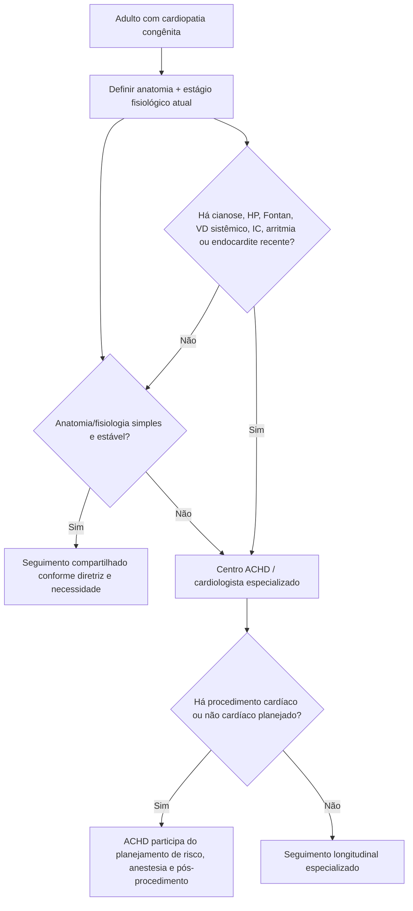
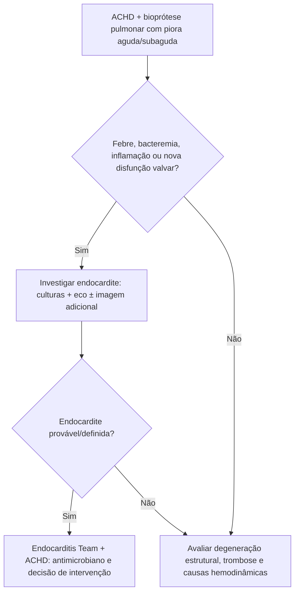

# Diretriz ACC/AHA 2025 — adulto com cardiopatia congênita

A diretriz norte-americana de 2025 atualiza a abordagem do adulto com cardiopatia congênita (ACHD) e reforça que a complexidade anatômica e fisiológica não desaparece quando o paciente chega à idade adulta. O cuidado deve ser organizado por **complexidade anatômica + estágio fisiológico**, não apenas pelo nome da cardiopatia operada na infância.

## 1. Centro especializado é parte do tratamento

Adultos com cardiopatia congênita se beneficiam de seguimento em centros de ACHD e em colaboração com cardiologistas especializados.

Para pacientes com anatomia ou fisiologia **moderada ou complexa** submetidos a procedimento cardíaco **ou não cardíaco**, a diretriz recomenda participação de cardiologista de ACHD para orientar:

- risco procedimental;
- anestesia;
- monitorização;
- manejo de shunts, cianose, circulação de Fontan ou ventrículo sistêmico direito;
- cuidados pós-procedimento.

## 2. A classificação deve incluir fisiologia atual

Dois pacientes com a mesma anatomia podem ter riscos completamente diferentes se um apresenta boa função ventricular e o outro tem cianose, arritmia, hipertensão pulmonar, endocardite recente ou falência da circulação de Fontan.

O estágio fisiológico deve ser atualizado longitudinalmente.

## 3. Endocardite e prótese pulmonar

A diretriz destaca que **endocardite deve ser investigada em disfunção aguda ou subaguda de bioprótese pulmonar**. Endocardite bacteriana subaguda no último ano foi incorporada à classificação fisiológica como marcador de estágio avançado.

Uma elevação abrupta de gradiente de prótese, nova regurgitação, febre ou bacteremia não deve ser interpretada apenas como degeneração estrutural.

## 4. Insuficiência cardíaca em ACHD

A atualização inclui recomendações mais explícitas de terapia orientada por diretriz para IC em ACHD, inclusive:

- ventrículo esquerdo sistêmico;
- ventrículo direito sistêmico;
- circulação de Fontan;
- estratégias de pacing em cenários específicos.

A extrapolação de evidência da IC adquirida deve considerar anatomia, fisiologia e causa da disfunção.

## 5. Gravidez

A maioria das gestantes com ACHD pode ter **parto vaginal com segurança**, desde que haja estratificação de risco e monitorização apropriadas.

A escolha da via de parto não deve ser baseada apenas no diagnóstico de cardiopatia congênita. Lesões de maior risco exigem planejamento conjunto com ACHD, cardio-obstetrícia/MFM, anestesia e equipe neonatal.

## Árvore de decisão — onde o adulto com cardiopatia congênita deve ser acompanhado

## Árvore — disfunção de bioprótese pulmonar

## Armadilhas

- Dar alta do seguimento especializado porque a cirurgia infantil "corrigiu" a anatomia.
- Aplicar risco cirúrgico de adulto sem considerar fisiologia congênita.
- Interpretar piora de prótese pulmonar apenas como degeneração sem pesquisar infecção.
- Indicar cesárea de rotina apenas por haver cardiopatia congênita.
- Tratar ventrículo direito sistêmico exatamente como ventrículo esquerdo sistêmico sem avaliação especializada.
- Ignorar impacto de dispositivos, cicatrizes cirúrgicas e anatomia venosa antes de pacing/ablação.

## Regra prática

**Em ACHD, o nome da cardiopatia é só o começo.** A decisão correta depende da anatomia residual, fisiologia atual, cirurgias prévias, circulação, arritmias, função ventricular e contexto do procedimento.