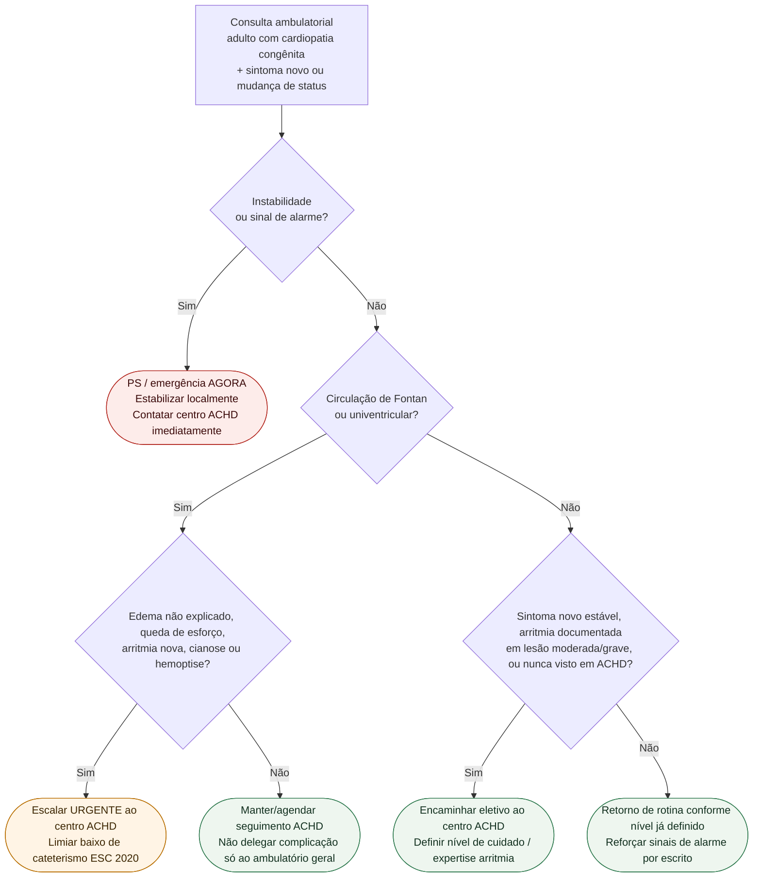

# Fluxograma ambulatorial ACHD: sintoma novo → destino

Prosa: [`sinalizadores-ambulatoriais-em-cardiopatia-congenita-do-adulto-quando-encaminhar`](sinalizadores-ambulatoriais-em-cardiopatia-congenita-do-adulto-quando-encaminhar.md). Braço Fontan: [`sinalizadores-ambulatoriais-pos-fontan-quando-escalar`](sinalizadores-ambulatoriais-pos-fontan-quando-escalar.md). Hub: [`cardiopatia-congenita-do-adulto-achd-manejo-abrangente-esc-2020`](cardiopatia-congenita-do-adulto-achd-manejo-abrangente-esc-2020.md).

## Árvore de decisão

## Notas

- **D1** = gate de segurança (ESC 2020: não atrasar tratamento de instabilidade).
- **D2/D3** = ramo Fontan com limiar baixo (edema, esforço, arritmia nova, cianose, hemoptise).
- **D4** = escalação eletiva / primeira avaliação em centro ACHD.
- Não decide lesão-específico de intervenção nem doses.
