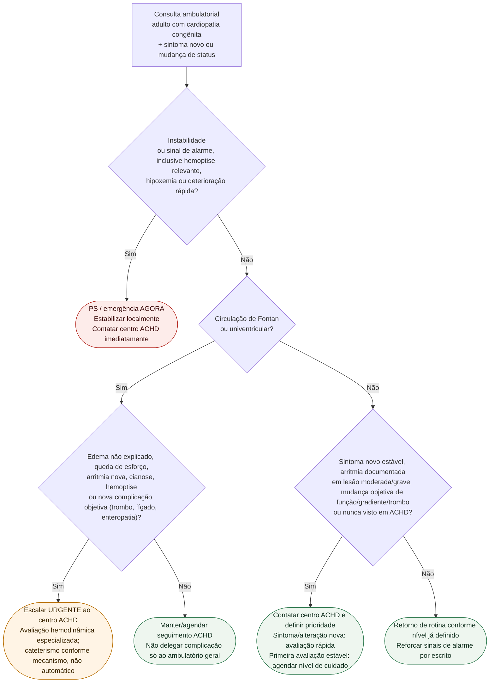

# Fluxograma ambulatorial ACHD: sintoma novo → destino

Prosa: [sinalizadores-ambulatoriais-em-cardiopatia-congenita-do-adulto-quando-encaminhar](/biblioteca/sinalizadores-ambulatoriais-em-cardiopatia-congenita-do-adulto-quando-encaminhar). Braço Fontan: [sinalizadores-ambulatoriais-pos-fontan-quando-escalar](/biblioteca/sinalizadores-ambulatoriais-pos-fontan-quando-escalar). Hub: [cardiopatia-congenita-do-adulto-achd-manejo-abrangente-esc-2020](/biblioteca/cardiopatia-congenita-do-adulto-achd-manejo-abrangente-esc-2020).

## Árvore de decisão

## Notas

- **D1** = gate de segurança (ESC 2020: não atrasar tratamento de instabilidade).
- **D2/D3** = ramo Fontan com limiar baixo (edema, esforço, arritmia nova, cianose, hemoptise).
- **D4** = separar alteração nova, que exige avaliação prioritária conforme gravidade, da primeira avaliação de paciente estável sem complicação. Trombo novo exige contato imediato com especialista para definir tratamento e necessidade de hospitalização, sem aguardar fila eletiva.
- Não decide lesão-específico de intervenção nem doses.

## Informação para transferência e gravidez

Informar anatomia, cirurgias/intervenções, shunts/conduits/fenestração, dispositivos, arritmias, anticoagulação e saturação/hemodinâmica basais. Gestação requer estratificação mWHO e Pregnancy Heart Team conforme ESC 2025; estabilidade não elimina necessidade de revisão especializada. Hemoptise pequena nova no Fontan/cianótico exige avaliação rápida com baixa tolerância à espera; gravidade e acesso definem hospitalização.
