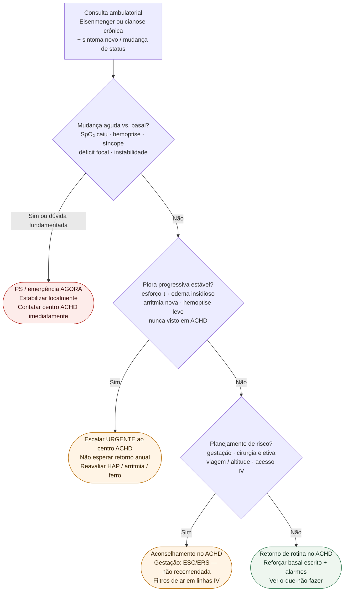

# Fluxograma ambulatorial Eisenmenger/cianose: destino

Prosa: [`sinalizadores-ambulatoriais-eisenmenger-cianose-quando-escalar`](sinalizadores-ambulatoriais-eisenmenger-cianose-quando-escalar.md). Braço o-que-não-fazer: [`eisenmenger-cianose-ambulatorial-o-que-nao-fazer-sem-doses`](eisenmenger-cianose-ambulatorial-o-que-nao-fazer-sem-doses.md). ACHD geral (#845): [`sinalizadores-ambulatoriais-em-cardiopatia-congenita-do-adulto-quando-encaminhar`](sinalizadores-ambulatoriais-em-cardiopatia-congenita-do-adulto-quando-encaminhar.md). Hospitalar: [`descompensacao-aguda-da-sindrome-de-eisenmenger-e-cardiopatia-cianotica`](descompensacao-aguda-da-sindrome-de-eisenmenger-e-cardiopatia-cianotica.md).

## Árvore de decisão

## Notas

- **D1** = gate de segurança (mudança vs. basal — ESC ACHD 2020).
- **D2** = escalação urgente ao centro ACHD sem instabilidade franca.
- **D3** = aconselhamento (gestação, procedimentos, embolia paradoxal) — ESC/ERS PH 2022.
- Não decide doses de terapia de HAP, anticoagulação, flebotomia terapêutica nem O₂ contínuo.
