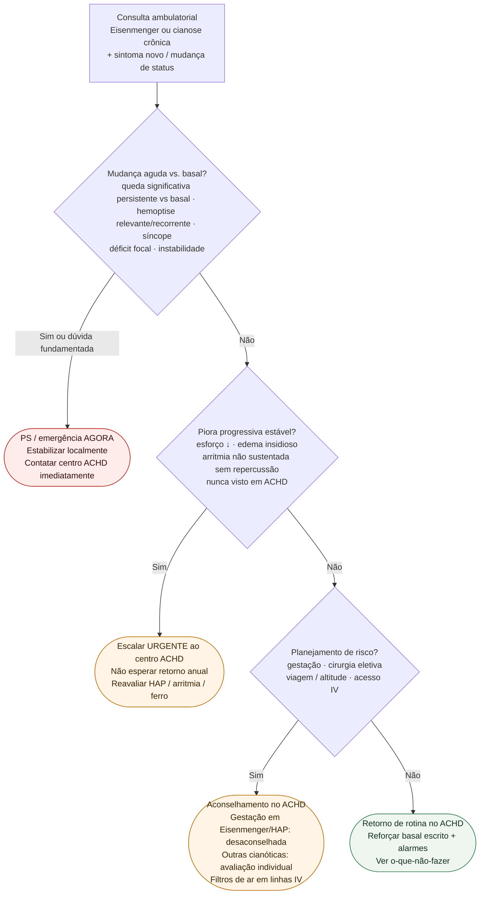

# Fluxograma ambulatorial Eisenmenger/cianose: destino

Prosa: [`sinalizadores-ambulatoriais-eisenmenger-cianose-quando-escalar`](/biblioteca/sinalizadores-ambulatoriais-eisenmenger-cianose-quando-escalar). Braço o-que-não-fazer: [`eisenmenger-cianose-ambulatorial-o-que-nao-fazer-sem-doses`](/biblioteca/eisenmenger-cianose-ambulatorial-o-que-nao-fazer-sem-doses). ACHD geral (#845): [`sinalizadores-ambulatoriais-em-cardiopatia-congenita-do-adulto-quando-encaminhar`](/biblioteca/descompensacao-aguda-da-sindrome-de-eisenmenger-e-cardiopatia-cianotica). Hospitalar: [`descompensacao-aguda-da-sindrome-de-eisenmenger-e-cardiopatia-cianotica`](/biblioteca/descompensacao-aguda-da-sindrome-de-eisenmenger-e-cardiopatia-cianotica).

## Árvore de decisão

## Notas

- **D1** = gate de segurança (mudança vs. basal — ESC ACHD 2020).
- **D2** = escalação urgente ao centro ACHD sem instabilidade franca.
- **D3** = aconselhamento (gestação, procedimentos, embolia paradoxal) — ESC/ERS PH 2022.
- Não decide doses de terapia de HAP, anticoagulação, flebotomia terapêutica nem O₂ contínuo.

## Critérios de precedência

Hemoptise nova, mesmo pequena e autolimitada, recebe avaliação urgente no mesmo dia; PS se relevante, recorrente, queda de Hb/saturação, repercussão ou acesso inseguro. Seguimento ambulatorial só após avaliação e plano explícito. Cianose crônica usa basal individual, não alvo de SpO₂ 100%. Oxigênio não é rotina apenas pelo número, mas pode ser necessário em situação aguda ou benefício documentado. Flebotomia somente em contexto de hiperviscosidade moderada/grave, após excluir desidratação e ferropenia, pelo centro com reposição volêmica; Ht alto isolado não indica. Arritmia atrial/trombo exigem balanço trombose–sangramento, não anticoagulação automática. Gestação assintomática em Eisenmenger/HAP pede prioridade ACHD/Pregnancy Heart Team, não PS só por gestação. Eliminar ar e usar filtro em linha IV.
