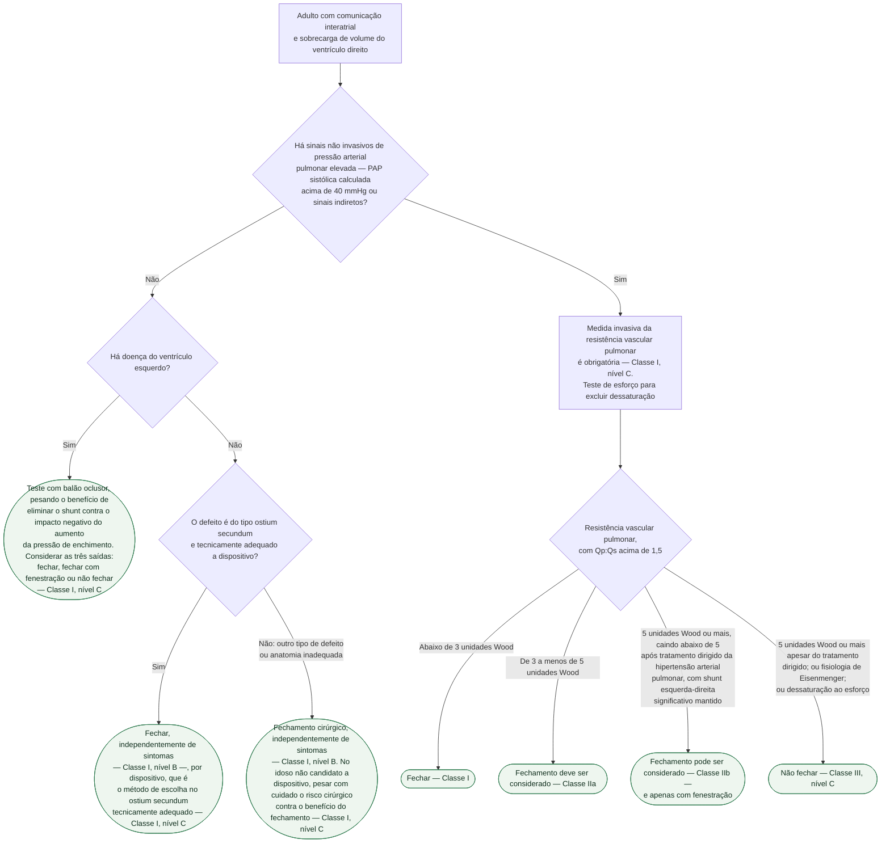
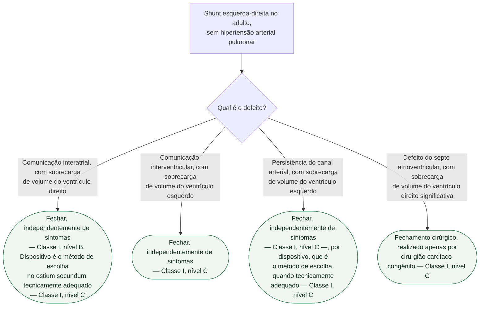

# Fluxograma: Comunicação interatrial e shunt esquerda-direita no adulto — decisão de fechar (ESC 2020)

A diretriz de 2020 tornou a indicação de fechar shunt **mais restritiva** que a de
2010, e organizou a decisão em torno de um único número: a **resistência vascular
pulmonar em unidades Wood**, medida invasivamente. Três pontos que a árvore torna
difíceis de contornar:

- **Sinal não invasivo de pressão pulmonar elevada obriga cateterismo.** Não é
  sugestão: medir a resistência vascular pulmonar de forma invasiva é **Classe I**
  quando há PAP sistólica calculada acima de 40 mmHg ou sinais indiretos. Decidir
  fechar com base só no ecocardiograma, nesse cenário, pula uma recomendação
  Classe I.
- **Resistência de 5 unidades Wood ou mais apesar de tratamento dirigido é
  Classe III** — não fechar. O mesmo vale para fisiologia de Eisenmenger e para
  dessaturação ao esforço, que entrou como contraindicação nesta edição.
- **Doença do ventrículo esquerdo muda o sinal do benefício.** Fechar a
  comunicação interatrial de quem tem disfunção diastólica ou doença do VE pode
  piorar o paciente, ao elevar a pressão de enchimento. A diretriz manda fazer
  teste com balão oclusor e considerar explicitamente três saídas — fechar,
  fechar com fenestração ou não fechar.

## Árvore de decisão: comunicação interatrial

## Árvore de decisão: os demais shunts esquerda-direita

Esta árvore pressupõe **ausência de hipertensão arterial pulmonar**, definida na
diretriz como não haver sinal não invasivo de pressão pulmonar elevada — ou,
havendo, confirmação invasiva de resistência vascular pulmonar abaixo de
3 unidades Wood.

## A tabela de resistência que decide a primeira árvore

Com Qp:Qs acima de 1,5, a diretriz ajustou as recomendações de fechamento de
shunt conforme a resistência vascular pulmonar calculada:

| Resistência vascular pulmonar | CIA | CIV e PCA |
|---|---|---|
| abaixo de 3 UW | Classe I | Classe I |
| de 3 a menos de 5 UW | Classe IIa | Classe IIa |
| 5 UW ou mais, caindo abaixo de 5 após tratamento dirigido | Classe IIb — **apenas fechamento fenestrado** | — |
| 5 UW ou mais | Classe III, se persistir apesar do tratamento dirigido | Classe IIb, como decisão individual cuidadosa em centro especializado |

Repare na assimetria: **na comunicação interatrial, 5 unidades Wood ou mais
apesar de tratamento dirigido fecha a porta — Classe III**; na comunicação
interventricular e na persistência do canal arterial, a mesma faixa permanece
como decisão individual cuidadosa em centro especializado, Classe IIb. Não é
inconsistência da diretriz: reflete que o átrio não protege o leito pulmonar do
mesmo modo, e que o shunt atrial pode inverter com mais facilidade.

## Onde não fechar, nas três lesões

O `Classe III` aparece com redação quase idêntica em CIA, CIV, defeito do septo
atrioventricular e persistência do canal arterial:

- **fisiologia de Eisenmenger**;
- **hipertensão arterial pulmonar grave, com resistência de 5 unidades Wood ou
  mais**, que na CIA vale quando persiste apesar do tratamento dirigido;
- **dessaturação ao esforço** — na persistência do canal arterial, dessaturação
  de membros inferiores.

A dessaturação ao esforço como contraindicação foi **acrescentada nesta edição**
para CIA, CIV, defeito do septo atrioventricular e canal arterial. Por isso o
teste de esforço aparece na árvore junto do cateterismo: sem ele, uma
contraindicação formal simplesmente não é procurada.

## O que as árvores não mostram

**A investigação por imagem que antecede tudo isso.** O ecocardiograma
transesofágico é em geral necessário para diagnosticar defeito do tipo seio
venoso, e é exigido antes do fechamento percutâneo de defeito ostium secundum —
para medir o defeito, examinar a morfologia e a qualidade das bordas do septo
residual, excluir defeitos adicionais e confirmar conexão venosa pulmonar
normal. A ressonância cardíaca raramente é necessária, mas ajuda na sobrecarga
de volume do VD, no defeito de seio venoso inferior e na quantificação do Qp:Qs.

**O tamanho do shunt não é o critério isolado.** A diretriz é explícita ao
preferir, como base da decisão, a **consequência hemodinâmica do defeito** — a
sobrecarga de volume da câmara — em vez da razão de fluxos isolada.

**Defeito do septo atrioventricular tem regras valvares próprias**, que não
couberam na árvore: cirurgia valvar, preferencialmente reparo, é recomendada no
paciente sintomático com regurgitação atrioventricular moderada a grave — Classe I,
nível C. No assintomático com regurgitação grave da valva atrioventricular
esquerda, a cirurgia é recomendada quando o diâmetro sistólico final do VE atinge
45 mm ou mais e/ou a fração de ejeção cai a 60% ou menos, afastadas outras causas
de disfunção — Classe I, nível C.

**Gravidez e hipertensão pulmonar não se misturam.** É recomendado que a paciente
com cardiopatia congênita e hipertensão pulmonar pré-capilar confirmada seja
aconselhada contra engravidar — Classe I, nível C.
