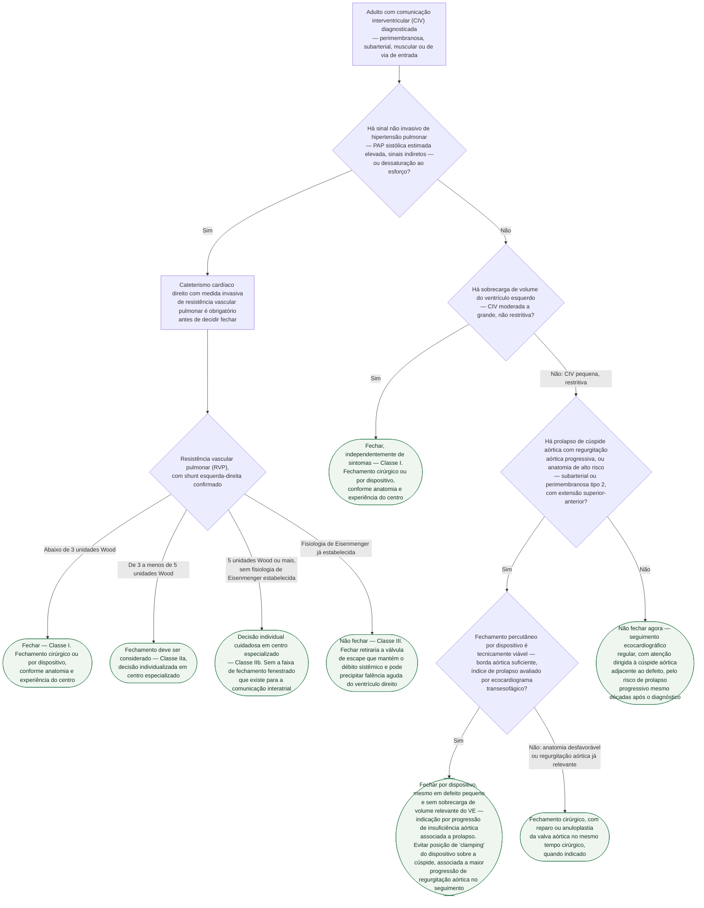

# Fluxograma: Comunicação interventricular no adulto — quando fechar (ESC 2020)

A comunicação interventricular (CIV) isolada é a cardiopatia congênita mais
frequente, e a maioria fecha espontaneamente ou é corrigida na infância. Esta
árvore cobre o adulto com CIV ainda não fechada — seja porque nunca indicou
fechamento na infância (defeito pequeno e restritivo), seja porque é achado
tardio — e organiza a decisão em torno de dois eixos que a diretriz ESC 2020
de cardiopatia congênita do adulto trata como independentes: a **repercussão
hemodinâmica** (resistência vascular pulmonar e sobrecarga de volume do
ventrículo esquerdo) e o **risco valvar aórtico associado**, que pode indicar
fechamento mesmo em defeito pequeno e sem sobrecarga de volume relevante.

## Árvore de decisão

## Por que a árvore separa hemodinâmica de risco valvar

A diretriz ESC 2020 usa **a mesma tabela de resistência vascular pulmonar** já
publicada no fluxograma "Comunicação interatrial e shunt esquerda-direita no
adulto" desta pasta para decidir a CIV com hipertensão pulmonar — com uma
diferença que a árvore preserva: **na CIV e na persistência do canal
arterial, a faixa de 5 unidades Wood ou mais sem Eisenmenger estabelecido é
Classe IIb** (decisão individual cuidadosa em centro especializado), não
Classe III como na comunicação interatrial, e **não existe a opção de
fechamento fenestrado** que existe para a CIA — a fisiologia ventricular não
comporta essa saída intermediária da mesma forma que a atrial.

**O ramo de risco valvar aórtico é o que diferencia esta árvore da de shunt
esquerda-direita genérico.** Em certos tipos anatômicos — sobretudo CIV
subarterial e perimembranosa tipo 2 (extensão superior-anterior) — o próprio
jato de shunt tracina a cúspide coronariana direita ou não coronariana para
dentro do orifício por efeito Venturi, levando a insuficiência aórtica
progressiva ao longo dos anos, **independentemente do tamanho do defeito**.
É por isso que a árvore chega a indicar fechamento em CIV pequena e sem
sobrecarga de volume relevante do VE: a indicação, nesse ramo, vem da
progressão da valva aórtica, não do shunt.

## O que a árvore não mostra

- **A investigação por imagem que antecede toda a árvore.** O ecocardiograma
  transtorácico localiza o defeito, mede o gradiente transdefeito e avalia
  prolapso/regurgitação da valva aórtica; o ecocardiograma transesofágico é
  recomendado antes de qualquer fechamento percutâneo, para caracterizar
  bordas do defeito e morfologia tridimensional; a ressonância cardíaca
  quantifica sobrecarga de volume do VE quando a janela ecocardiográfica é
  limitada.
- **A classificação anatômica em 7 tipos morfológicos da CIV perimembranosa**
  orienta a escolha do dispositivo quando o fechamento é percutâneo: tipos com
  extensão superior (associados a prolapso aórtico) exigem dispositivos
  flexíveis e de perfil baixo; tipos próximos ao sistema de condução exigem
  implante dentro do aneurisma do septo membranoso, quando presente, para
  reduzir risco de bloqueio atrioventricular.
- **O índice de prolapso da cúspide coronariana direita**, quantificado por
  ecocardiograma transesofágico, é hoje o único preditor independente de
  falha do fechamento por dispositivo em análise multivariada — não é
  observação secundária, é o dado que decide se o dispositivo é viável no
  ramo de risco valvar da árvore.
- **CIV associada a defeito do septo atrioventricular** segue regra própria,
  cirúrgica, já documentada no fluxograma de shunt esquerda-direita desta
  pasta — não os critérios de fechamento por dispositivo descritos aqui.
- **Gestação em mulher com CIV pequena não fechada e resistência vascular
  pulmonar normal** costuma ser bem tolerada; gestação com hipertensão
  arterial pulmonar associada segue contraindicada, mesma regra já registrada
  no fluxograma de shunt esquerda-direita desta pasta.

## Referências

Ver `source_refs` no front matter deste documento. As mesmas fontes já foram
conferidas e usadas no documento "Comunicação Interventricular (CIV) no
Adulto: História Natural, Fechamento Tardio e Prolapso da Valva Aórtica",
publicado nesta pasta — nenhum PMID ou DOI novo foi consultado nesta sessão.
