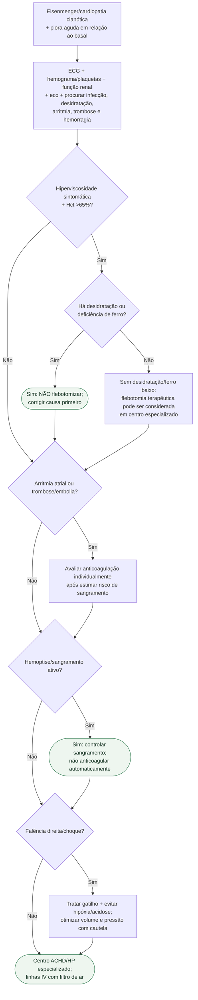

# Descompensação aguda de Eisenmenger

## Regra prática

No Eisenmenger, **alto hematócrito, baixa saturação e risco trombótico são parte de uma fisiologia adaptada**; nenhum deles deve disparar automaticamente flebotomia, oxigênio contínuo ou anticoagulação.