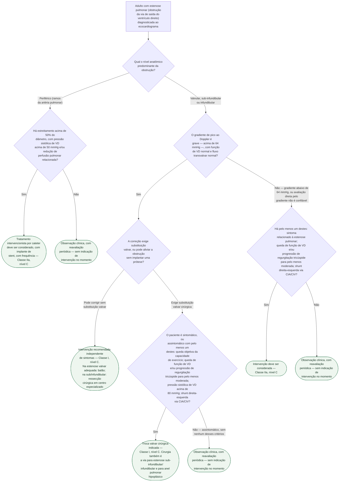

# Fluxograma: Estenose pulmonar no adulto — indicação de intervenção (ESC 2020)

A estenose pulmonar é a lesão congênita isolada mais comum, e a diretriz
europeia de 2020 organiza a indicação de intervir em torno de três eixos:
**o nível anatômico da obstrução** (que decide a técnica), **o gradiente de
pico ao Doppler** (que decide se é Classe I independente de sintomas) e, só
quando o gradiente não é grave o suficiente para justificar sozinho, **um
conjunto de critérios acessórios** — sintoma, função de VD, regurgitação
tricúspide, shunt residual. O gradiente vale como medida direta de gravidade
apenas com função de VD normal e fluxo transvalvar normal; havendo mais de
uma estenose em série ou estreitamento alongado, a equação de Bernoulli
superestima o gradiente, e a velocidade de regurgitação tricúspide passa a
ser a estimativa mais confiável.

## Árvore de decisão

## A escolha da técnica, que a árvore não repete a cada folha

**Valvuloplastia por balão via cateter** é a via recomendada para estenose
pulmonar **valvar** não displásica. Na estenose **periférica dos ramos da
artéria pulmonar**, a técnica é angioplastia por balão, frequentemente com
implante de stent; o procedimento não envolve a valva. **Cirurgia** é a via
para estenose sub-infundibular
ou infundibular, para anel pulmonar hipoplásico, e para a valva **displásica**
(cúspides pouco móveis, espessamento mixomatoso, frequentemente parte da
síndrome de Noonan) — a literatura mostra taxa de sucesso menor da
valvuloplastia por balão nesse subtipo, o que antecipa a indicação cirúrgica.

## O que a árvore não mostra

**A armadilha de medida do gradiente em série.** Se houver mais de uma
estenose em série (por exemplo subvalvular e valvular associadas) ou
estreitamento alongado, a equação de Bernoulli superestima o gradiente de
pico — nesse cenário, a velocidade de regurgitação tricúspide ao Doppler é
estimativa mais confiável da pressão de VD, e portanto da gravidade real da
obstrução, do que o número lido direto na via de saída.

**O corte para troca valvar é mais alto de propósito.** Quando a troca valvar
cirúrgica é a única opção — não a valvuloplastia por balão —, o limiar de
intervenção no paciente assintomático soma vários critérios acessórios em vez
de bastar o gradiente isoladamente: é assim porque os riscos de longo prazo
de uma prótese (endocardite, reintervenção por falência protética) entram na
conta antes de indicar cirurgia em quem não tem sintoma.

**Exercício e gestação têm considerações próprias, fora da árvore.** Estenose
leve residual não restringe esporte; a moderada deve evitar esporte estático e
de alta intensidade; a grave fica restrita a esporte de baixa intensidade. Na
gestação, a estenose costuma ser bem tolerada — exceto se extremamente grave
ou com falência de VD relevante —, e a valvuloplastia por balão transcateter
pode ser realizada durante a gravidez se necessário.

**Este fluxograma não cobre a regurgitação pulmonar pós-reparo de Tetralogia
de Fallot**, incluindo a indicação de troca valvar pulmonar (PVRep) e de
intervenção por cateter (TPVI) — tema com tratamento próprio no documento de
seguimento tardio de Tetralogia de Fallot e coarctação de aorta desta pasta.
