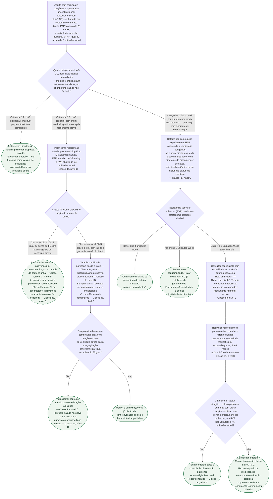

# Fluxograma: Hipertensão arterial pulmonar associada à cardiopatia congênita — terapia farmacológica e estratégia Treat and Repair (JCS 2022)

A diretriz japonesa de 2022 organiza o manejo da hipertensão arterial pulmonar
associada a shunt (HAP-CC) por **categoria fisiopatológica**, não por um único
algoritmo genérico de hipertensão pulmonar. A Tabela 15 do documento distingue
quatro situações que exigem conduta farmacológica diferente:

- **1.1** — HAP residual, sem shunt residual significativo, depois do
  fechamento do defeito (pode surgir logo após a cirurgia ou décadas depois);
- **1.2** — HAP essencialmente idiopática, com um shunt pequeno ou restritivo
  coincidente, que não é a causa da HAP;
- **1.3** — HAP por shunt grande e não restritivo, ainda não fechado, que
  **ainda não** atingiu a fisiologia de Eisenmenger;
- **1.4** — síndrome de Eisenmenger propriamente dita: RVP tão elevada que o
  shunt inverte, predominantemente direita-esquerda, com hipoxemia e cianose.

A definição de hipertensão pulmonar usada é a do 6º Simpósio Mundial (Nice,
2018): pressão arterial pulmonar média (PAPm) acima de 20 mmHg, com resistência
vascular pulmonar (RVP) de 3 unidades Wood ou mais como critério adicional para
HP pré-capilar.

Três pontos que a árvore torna difíceis de contornar:

- **Nem todo shunt residual deve ser fechado.** No shunt pequeno coincidente
  com HAP essencialmente idiopática (categoria 1.2), a diretriz trata o defeito
  como **válvula de segurança contra a falência do ventrículo direito** — fechar
  esse shunt residual pode ser prejudicial, não benéfico.
- **A escolha do fármaco de primeira linha depende da gravidade, não de
  preferência.** Prostaciclina injetável só é terapia de primeira linha na HAP
  residual grave, com classe funcional da OMS igual ou acima de III e falência
  de ventrículo direito — Classe I, nível C. Fora desse cenário, ela é
  reservada para quando a combinação oral já otimizada falhar.
- **"Treat and Repair" inverte a lógica clássica de contraindicação cirúrgica
  no shunt grande.** RVP acima de 8 unidades Wood tradicionalmente contraindica
  o fechamento — mas a diretriz descreve tratamento agressivo com vasodilatador
  pulmonar seguido de reavaliação hemodinâmica em 3 a 6 meses, para verificar se
  o defeito passou a ser fechável.

## Árvore de decisão

## O arsenal farmacológico citado pela diretriz

Fármacos disponíveis no Japão e referidos como base da escada terapêutica:
antagonistas orais do receptor de endotelina (bosentana, ambrisentana,
macitentana), inibidores orais da fosfodiesterase-5 (sildenafila, tadalafila),
um estimulador oral da guanilato ciclase solúvel (riociguate) e derivados da
prostaciclina — epoprostenol intravenoso, treprostinil intravenoso ou
transdérmico, iloprosto inalado, beraprosta oral e selexipague oral. A regra
prática que a diretriz deixa clara: **cada fármaco em combinação mantém a
eficácia esperada de quando usado isolado** — Classe IIa, nível B —, o que
sustenta começar com combinação em vez de escalar um fármaco de cada vez.

## Por que a categoria muda a meta hemodinâmica

Na HAP residual sem shunt (categoria 1.1), a fisiopatologia e a resposta a
fármacos são consideradas equivalentes às da HAP idiopática — só que a HAP
progride mais devagar, porque o fluxo pulmonar elevado que a predispôs já não
existe mais. A meta hemodinâmica citada — PAPm abaixo de 35 mmHg e RVP abaixo
de 7,5 unidades Wood — vem de um relato sobre função ventricular direita
preservada em coração estruturalmente normal, e a diretriz a adota como alvo
de tratamento combinado (Classe IIa, nível C), distinta da meta de PAPm abaixo
de 42,5 mmHg citada para HAP idiopática em geral.

## O que a árvore não mostra

**A combinação inadvertida de vasodilatadores pode piorar o shunt grande
ainda aberto.** A diretriz alerta que, na categoria 1.3/1.4, associar
vasodilatadores pulmonares sem controle cuidadoso pode causar queda abrupta da
RVP com aumento do fluxo pulmonar esquerda-direita, sobrecarregando de volume
o coração e piorando a regurgitação atrioventricular — o oposto do efeito
pretendido. Por isso a diretriz insiste que a administração de fármacos nesse
grupo seja supervisionada por equipe experiente (Classe IIa, nível C).

**Falência de Fontan por RVP elevada é tratada como categoria à parte** (item
2 da Tabela 15, fora desta árvore): bosentana melhora tolerância ao exercício
e hemodinâmica em Fontan em falência, e sildenafila melhora a capacidade de
exercício por via da eficiência ventilatória — mas a diretriz não atribui
classe/nível explícitos a essas observações, e por isso não entraram como
conduta graduada nesta árvore.

**Uso perioperatório de prostaciclina injetável em crise de hipertensão
pulmonar** é conduta separada (Classe I, nível C) — quando a HP piora
abruptamente no perioperatório, o fármaco injetável é usado sem hesitação,
sendo reduzido ou suspenso assim que a fase aguda passa; esse cenário agudo
já está coberto pelo fluxograma de descompensação aguda de Eisenmenger/
cardiopatia cianótica publicado nesta mesma pasta, e não foi duplicado aqui.

**A meia-vida da decisão de fechar depende de uma reavaliação, não de um
único cateterismo.** Na estratégia Treat and Repair, o critério que autoriza o
fechamento — aumento do fluxo pulmonar sem piorar a função cardíaca, sem
elevar a pressão arterial pulmonar e sem que a RVP ultrapasse 7,5 unidades
Wood — só pode ser verificado depois de 3 a 6 meses de terapia (Classe IIa,
nível C), nunca no momento do diagnóstico inicial.
