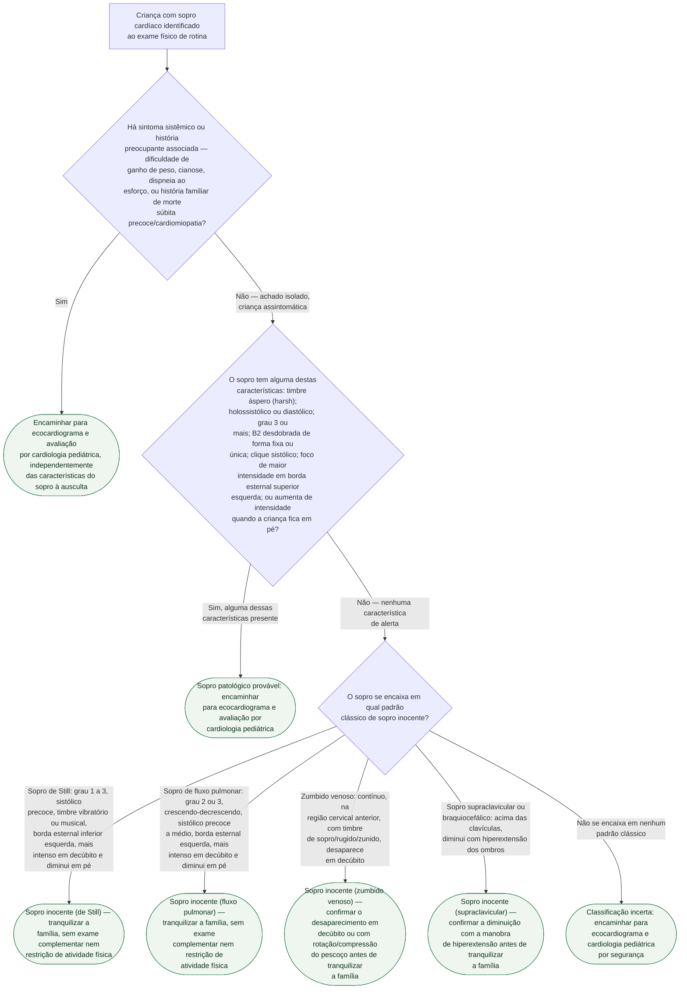

# Fluxograma: Sopro cardíaco na criança — inocente versus patológico

Sopro cardíaco é achado extremamente comum na infância, e a maioria é
inocente — sem doença estrutural por trás. O trabalho do exame clínico é
separar, sem exame complementar, quem pode ser tranquilizado na consulta de
quem precisa de ecocardiograma. Duas perguntas fazem a maior parte desse
trabalho: existe **algum sintoma ou história associada** que já tira o caso
da faixa "achado isolado", e, não havendo isso, o sopro tem **alguma
característica de alerta** à ausculta — e só depois disso vale checar se ele
se encaixa no padrão clássico de um dos sopros inocentes nomeados.

## Árvore de decisão

## O que a árvore não mostra

**"Aumenta em pé" é o sinal invertido do que separa inocente de patológico
nesta árvore.** Os dois sopros inocentes sistólicos mais comuns (Still e
fluxo pulmonar) **diminuem** quando a criança fica em pé, porque dependem de
maior retorno venoso em decúbito; um sopro que **aumenta** de intensidade em
pé — como o de uma cardiomiopatia hipertrófica obstrutiva — é justamente o
oposto, e por isso entra como achado de alerta na segunda pergunta da árvore,
não como característica de um sopro inocente.

**A manobra confirmatória é parte do diagnóstico, não um detalhe.** O
zumbido venoso e o sopro supraclavicular só são caracterizados como inocentes
depois que a manobra postural (decúbito/rotação cervical no primeiro,
hiperextensão dos ombros no segundo) muda a intensidade do sopro — pular essa
etapa e classificar pelo local de ausculta isoladamente é o erro mais comum
nesses dois.

**Recém-nascido é população à parte.** Sopro identificado nos primeiros dias
de vida tem menor especificidade dos critérios acima — o fechamento do canal
arterial e a queda da resistência vascular pulmonar ainda em curso mudam a
ausculta ao longo dos primeiros dias, e a fonte consultada recomenda limiar
mais baixo para investigação complementar nesse período, sem propor um
critério numérico único.

**Este fluxograma não substitui a investigação dirigida de uma cardiopatia
congênita já suspeita por outro motivo** (cianose neonatal, achado
pré-natal, síndrome genética associada) — ele organiza o raciocínio do sopro
como achado isolado no exame de rotina, que é o cenário mais frequente na
prática ambulatorial.
