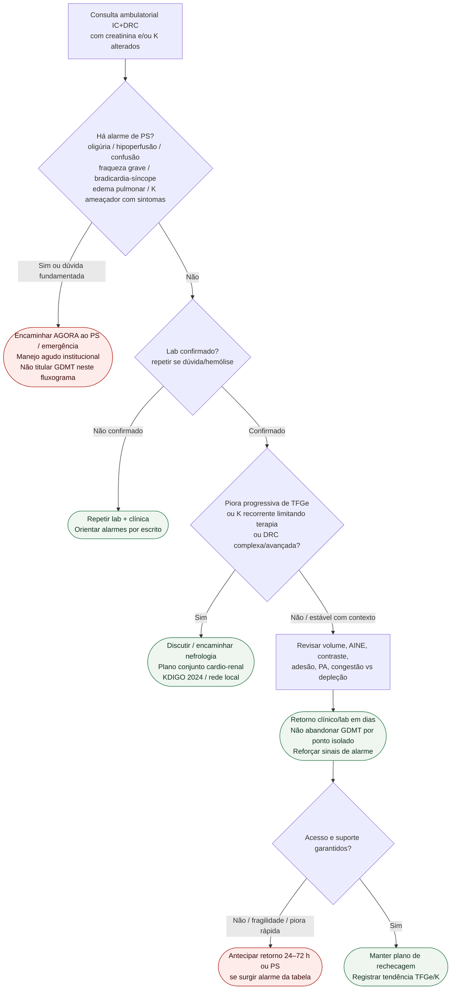

# Fluxograma ambulatorial: creatinina e potássio na IC com DRC — destino

Prosa creatinina: [`piora-de-creatinina-sob-gdmt-ambulatorial-quando-encaminhar-nefrologia`](piora-de-creatinina-sob-gdmt-ambulatorial-quando-encaminhar-nefrologia.md). Prosa K: [`hiperpotassemia-ambulatorial-na-ic-com-drc-quando-escalar`](hiperpotassemia-ambulatorial-na-ic-com-drc-quando-escalar.md). Conceito segurança K (#829): não duplicar aqui.

## Árvore de decisão

## Notas

- **D1** = gate de segurança (destino, não dose).
- **D2** = confirmação laboratorial antes de decisões permanentes.
- **D3** = gatilho de nefrologia / complexidade (KDIGO CGA + recorrência de K).
- Não decide doses de GDMT, quelantes, diurético IV nem ultrafiltração.
