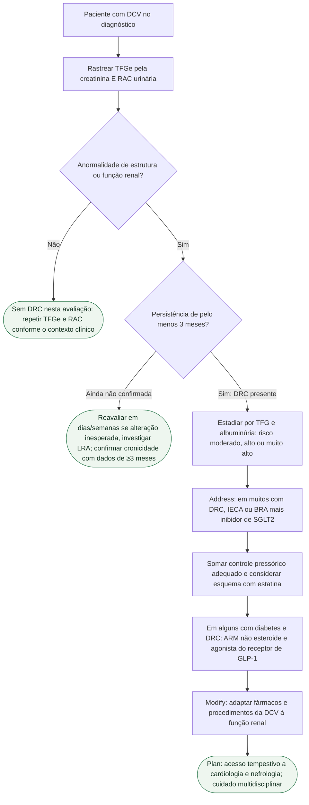

Primeira diretriz dedicada da ESC à coexistência de doença cardiovascular (DCV) e doença renal crônica (DRC), em colaboração com a European Renal Association. O acrônimo operacional é **STAMP on CKD**, apresentado no comunicado da ESC de 28 de agosto de 2026: **S**creen, **T**riage, **A**ddress CKD Risk, **M**odify CVD management, **P**lan health services. Estima-se cerca de 100 milhões de pessoas com DRC na Europa, todas com risco aumentado de um espectro amplo de DCV.

Este arquivo é o fluxograma de decisão. Não substitui o documento narrativo da diretriz no mesmo tema.

## Definição e rastreio

DRC: anormalidades de estrutura ou função renal presentes por pelo menos 3 meses, com implicações para a saúde. Rastrear **todos** os pacientes com DCV no diagnóstico: TFGe a partir da creatinina **e** razão albumina/creatinina urinária (RAC). Não basta a creatinina isolada. A diretriz recomenda classificar a DRC por TFG e albuminúria em categorias de risco moderado, alto ou muito alto. Classificação por TFG e albuminúria: I A. Rastreio de DRC na DCV: I C.

Triage: avaliação do risco de falência renal e do risco cardiovascular com sistemas validados que incorporem a função renal.

## Conduta após o diagnóstico (o que o extrato afirma)

Com base em grandes ensaios, muitos pacientes com DRC devem ter manejo do risco de falência renal com **IECA ou BRA, mais inibidor de SGLT2**. Isso se soma a um padrão de cuidado cardiovascular com **controle pressórico adequadamente intensivo** e **consideração de esquema baseado em estatina**. Em **alguns pacientes com diabetes e DRC**, a diretriz recomenda também antagonista não esteroide do receptor mineralocorticoide (ARM não esteroide) e agonista do receptor de GLP-1. Doses não constam deste extrato e não são inventadas.

Modify: a coexistência de DRC exige ajustes no tratamento da DCV (escolha e posologia de fármacos cuja depuração cai com a TFGe, procedimentos, anticoagulação). Plan: serviços que reconheçam o paciente de alto risco e ofereçam acesso tempestivo a cardiologia e nefrologia, sem atraso do tratamento cardiológico pela complexidade renal; comunicação ativa entre especialidades.

## Árvore de decisão

## Como usar o fluxograma

O primeiro passo não é “quem tem creatinina alterada”. É **todo paciente com DCV**, no diagnóstico, com os dois testes. A RAC identifica dano glomerular quando a TFGe ainda é preservada; omiti-la deixa passar DRC albuminúrica. A confirmação em ≥3 meses evita rotular lesão renal aguda como DRC.

Depois do estadiamento, a ordem do STAMP é terapêutica e organizacional: reduzir risco de falência renal (IECA/BRA + iSGLT2 na população em que a diretriz o afirma), tratar o risco CV residual (pressão e estatina), acrescentar ARM não esteroide e AR-GLP-1 quando diabetes e DRC o justificam segundo a diretriz, e, simultaneamente, adaptar o manejo da DCV e organizar o cuidado. Não há hierarquia de “primeiro o coração, depois o rim”: o ponto da diretriz é que um acelera o outro.

Limite desta árvore: não detalha classes de recomendação por fenótipo de DCV (síndrome coronariana, IC, fibrilação atrial, DAP), não lista limiares de TFGe para cada fármaco e não substitui a tabela de interações e ajuste renal da diretriz completa. O extrato da ilustração central também afirma que pacientes com IC crônica e DRC devem receber iSGLT2 independentemente da FEVE; isso pertence ao passo Modify/Address na IC e não foi desdobrado em ramificações adicionais para não inventar cortes.

## Tudo com Tudo

- **Diabetes e cardiologia**: o passo “alguns com diabetes e DRC” aponta para AR-GLP-1 e ARM não esteroide; o SOUL (semaglutida oral) reduz MACE nessa interseção, mas o composto renal do SOUL não foi positivo — não usar o SOUL como substituto do FLOW.
- **Insuficiência cardíaca**: iSGLT2 independente da FEVE na IC crônica com DRC; ARM (esteroide ou não esteroide conforme o fenótipo) na diretriz de IC 2026.
- **Prevenção e lipídios**: o “considerar esquema com estatina” é parte explícita do Address/padrão CV, não um apêndice.
- **Doença coronariana**: o rastreio se aplica a todo paciente com DCV, inclusive síndromes coronarianas; Modify inclui precauções com contraste e ajuste de anti-trombóticos quando a TFGe cai.
