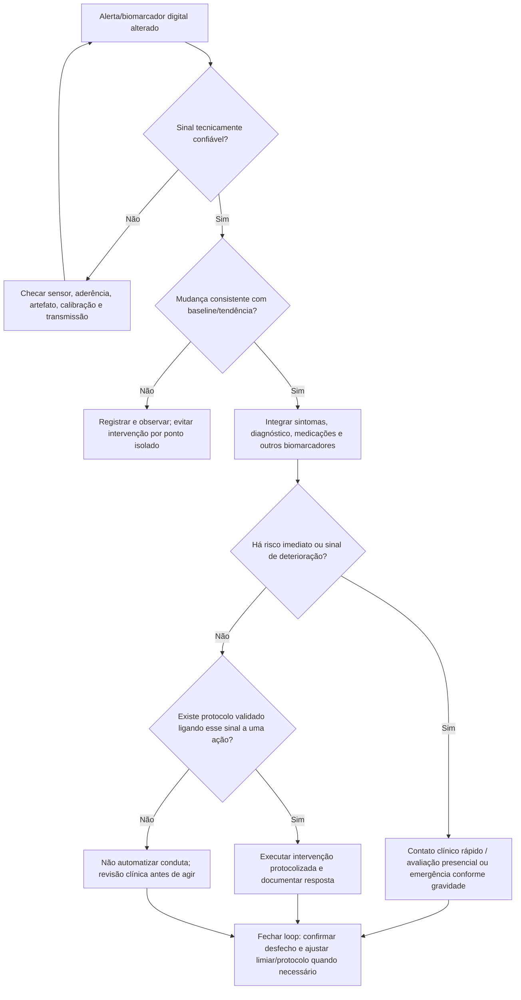
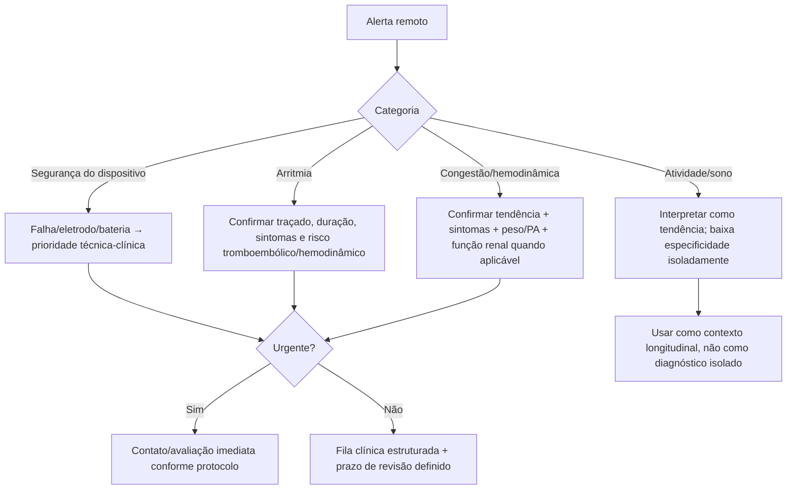

# Biomarcadores digitais em cardiologia — declaração ESC 2026

## Por que isso já é cardiologia clínica

A declaração científica ESC publicada em julho de 2026 define biomarcadores digitais como sinais quantitativos derivados de tecnologias digitais capazes de capturar fisiologia, comportamento ou hemodinâmica de forma longitudinal e, muitas vezes, quase contínua.

A revisão sistemática que sustentou o documento identificou **32 ensaios fase III–IV, 40 publicações e 32.246 participantes**. Insuficiência cardíaca foi o alvo mais frequente (**16 ensaios; 50%**) e dispositivos cardíacos implantáveis apareceram em **12 ensaios; 38%**.

Os sinais utilizados incluíram:

- ritmo e frequência cardíaca;
- pressão arterial;
- peso corporal;
- impedância;
- pressão de artéria pulmonar e outras medidas hemodinâmicas;
- atividade física e sono;
- telemetria de CIED/monitor implantável;
- métricas de imagem derivadas por processamento digital/IA.

## A pergunta correta não é “o dispositivo mediu?”

O valor clínico depende de uma cadeia completa:

**medição válida → alteração clinicamente relevante → confirmação contextual → ação definida → benefício demonstrável.**

Um alerta sem protocolo de resposta pode aumentar carga assistencial, ansiedade e falso-positivo sem melhorar desfechos.

## Árvore de decisão: do sinal digital à conduta

## Insuficiência cardíaca: onde a evidência é mais madura

Metade dos ensaios incluídos na declaração foi em insuficiência cardíaca. Os biomarcadores explorados incluem:

- peso e PA domiciliares;
- frequência cardíaca/ritmo;
- impedância;
- atividade;
- pressão de artéria pulmonar implantável;
- combinações multiparamétricas de CIED.

A mensagem da ESC não é que todo telemonitoramento funciona. Há heterogeneidade de plataformas, populações, algoritmos e resposta ao alerta. O benefício depende fortemente de **workflow clínico**, tempo de resposta e ação terapêutica vinculada.

## CIED e monitores implantáveis

Telemetria remota pode detectar:

- eventos arrítmicos;
- carga de FA;
- alterações de frequência;
- parâmetros do dispositivo/eletrodo;
- combinações que sugerem congestão ou deterioração clínica.

Mas a mesma lógica se aplica: achado automatizado deve ser classificado pela sua **validade, urgência e acionabilidade**.

## Árvore: priorização de alertas remotos

## Validação antes de escalar uma tecnologia

A declaração ESC chama atenção para quatro barreiras recorrentes:

1. **variabilidade da medição e do algoritmo**;
2. **privacidade e requisitos regulatórios**;
3. **custo/reembolso e integração com o fluxo de trabalho**;
4. **desigualdade de acesso digital**.

A adoção não deve ser guiada apenas pela acurácia de um algoritmo em coorte retrospectiva. É necessário demonstrar utilidade clínica prospectiva, segurança e, idealmente, impacto em desfechos e custo-efetividade.

## Checklist de implementação clínica

Antes de ativar um novo biomarcador digital em uma clínica/serviço, definir:

- qual população será monitorada;
- qual variável é coletada e com que dispositivo;
- qualidade mínima do sinal;
- qual alteração dispara alerta;
- quem recebe o alerta;
- em quanto tempo deve responder;
- qual ação está autorizada;
- quando o paciente deve ser encaminhado à urgência;
- como documentar falsos positivos/negativos;
- como comunicar ao paciente o que é e o que **não é** monitorado;
- plano para indisponibilidade técnica e perda de conectividade.

## Comunicação com o paciente

Uma frase essencial é:

> “Monitoramento remoto não significa vigilância humana contínua 24 horas por dia, salvo quando o serviço explicitamente oferece essa cobertura.”

O paciente deve conhecer o tempo esperado de revisão dos dados e os sintomas que exigem procurar atendimento sem esperar um alerta digital.

## Armadilhas

- Tratar alerta algorítmico como diagnóstico.
- Criar centenas de alertas sem equipe/processo para resposta.
- Usar thresholds definidos em um dispositivo como se fossem universais.
- Pressupor que mais dados significam melhor desfecho.
- Ignorar exclusão digital, alfabetização em saúde e preferências do paciente.

## Fonte verificada

Corredoira PM, Kaski JC, Duncker D, et al. Digital biomarkers in cardiovascular medicine: a scientific statement of the ESC Working Group on e-Cardiology and collaborating ESC associations/committees. *Eur Heart J Digit Health.* 2026;7(6):ztag074. PMID **42491935**. PMCID **PMC13378772**. DOI **10.1093/ehjdh/ztag074**.

## Status de revisão

`VERIFICAÇÃO HUMANA NECESSÁRIA`: este documento traduz princípios de implementação; thresholds clínicos específicos devem ser vinculados ao dispositivo/ensaio validado e protocolo institucional correspondente.
