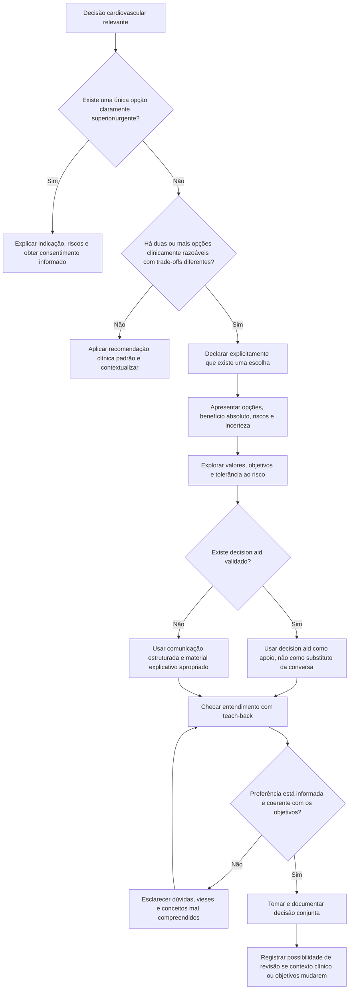

# Decisão compartilhada em cardiologia — ACC/AHA 2026

O Manual de Metodologia ACC/AHA atualizado em maio de 2026 formaliza **shared decision-making (SDM)** como processo no qual clínico e paciente constroem juntos uma decisão alinhada às melhores opções disponíveis, às evidências e aos valores, preferências e objetivos do paciente.

Em cardiologia, SDM é especialmente importante quando existem duas ou mais estratégias clinicamente defensáveis com trade-offs diferentes.

## Quando a decisão é sensível à preferência

Exemplos frequentes incluem:

- CDI em prevenção primária quando benefício absoluto é incerto ou há alto risco competitivo de morte não arrítmica;
- TAVI versus cirurgia em cenários em que ambas são tecnicamente possíveis;
- estratégia de ritmo versus controle de frequência na FA;
- anticoagulação quando benefício tromboembólico e risco hemorrágico são próximos;
- revascularização em doença coronariana estável quando objetivo principal é sintoma/qualidade de vida;
- terapias avançadas de IC;
- rechallenge de terapia oncológica após toxicidade cardiovascular;
- decisões de limitação ou desativação de terapias de dispositivo no fim da vida.

## O que NÃO é decisão compartilhada

Não é simplesmente perguntar "o que o senhor prefere?" após o médico já ter decidido. Também não significa transferir responsabilidade técnica para o paciente.

O clínico continua responsável por:

- excluir opções não seguras;
- explicar probabilidades e incerteza;
- separar benefício relativo de benefício absoluto;
- expor trade-offs relevantes;
- verificar entendimento.

## Componentes mínimos

### 1. Definir a decisão

Explicar claramente qual escolha está sendo feita e por que ela precisa ser feita agora.

### 2. Apresentar opções reais

Incluir tratamento, alternativas razoáveis e, quando clinicamente aceitável, não intervir naquele momento.

### 3. Explicar riscos, benefícios e trade-offs

Priorizar números absolutos quando disponíveis. Evitar linguagem exclusivamente relativa como "reduz 30%" sem dizer a diferença absoluta.

### 4. Explorar valores e objetivos

Perguntas úteis:

- Qual resultado o paciente mais quer evitar?
- Quanto risco imediato ele aceita por possível benefício futuro?
- Qual impacto de hospitalização, anticoagulação, choques, cirurgia ou monitorização é aceitável?
- Qual é o objetivo principal: longevidade, sintoma, funcionalidade ou evitar procedimentos?

### 5. Usar decision aid quando disponível

O manual ACC/AHA destaca que ferramentas certificadas de decisão podem apresentar opções, riscos, benefícios e aspectos práticos, ajudando o paciente a desenvolver preferência informada.

### 6. Verificar entendimento

O paciente deve conseguir descrever com suas próprias palavras a decisão, as principais opções e os trade-offs.

## Árvore de decisão — quando usar SDM estruturada

## Como comunicar risco

Preferir:

- frequências naturais: "3 em cada 100";
- horizonte temporal explícito;
- denominador constante ao comparar opções;
- risco absoluto;
- linguagem neutra, mostrando benefício e dano.

Evitar:

- alternar entre 1/100 e 10/1000 na mesma comparação;
- usar apenas redução relativa;
- apresentar opção preferida pelo médico com linguagem emocionalmente mais positiva;
- esconder incerteza de evidência.

## Documentação mínima

Registrar no prontuário:

1. decisão discutida;
2. alternativas consideradas;
3. benefícios e riscos relevantes;
4. incerteza importante;
5. objetivo/preferência expressa pelo paciente;
6. decisão final;
7. condições que justificariam revisitar a escolha.

## Regra prática

**Shared decision-making é indicada quando a medicina consegue dizer quais opções são aceitáveis, mas não consegue dizer sozinha qual delas é melhor para aquela pessoa.**