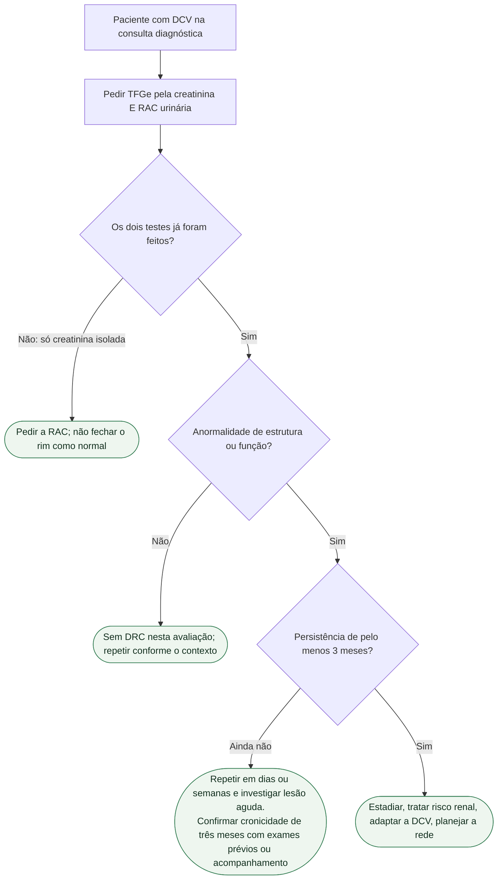

# Como explicar STAMP, TFGe e RAC na consulta

A ESC 2026 publicou a primeira diretriz dedicada à coexistência de doença cardiovascular (DCV) e doença renal crônica (DRC), com a European Renal Association (Damman, ehag098; PMID **42661426**). A frase que o paciente ouve — “sua creatinina está normal” — deixou de fechar o assunto. A diretriz pede **dois testes em todo paciente com DCV no diagnóstico**: TFGe a partir da creatinina **e** razão albumina/creatinina urinária (RAC). Sem a RAC, a DRC albuminúrica com filtração ainda preservada passa.

Não há prevalência brasileira nestas fontes. O número que a ESC e o comunicado de 28 de agosto de 2026 usam é europeu: **cerca de 100 milhões** de pessoas com DRC na Europa, todas com risco aumentado de um espectro amplo de DCV. Não transponha isso para o Brasil.

## O que é DRC — em uma frase

DRC: **anormalidades de estrutura ou função renal presentes por pelo menos 3 meses**, com implicações para a saúde. Um único valor alterado não fecha o diagnóstico. Persistência ≥3 meses distingue cronicidade; alterações novas exigem repetição em dias ou semanas e avaliação imediata se houver suspeita de lesão aguda.

## STAMP: o acrônimo da consulta, não um escore

**STAMP on CKD** (comunicado ESC e ilustração central da diretriz):

- **S**creen — rastrear
- **T**riage — estadiar e estimar risco
- **A**ddress CKD Risk — tratar o risco de progressão renal
- **M**odify CVD management — adaptar o tratamento da DCV ao rim
- **P**lan health services — planejar o acesso a cardiologia e nefrologia

Não é um escore numérico. É a ordem da conversa.

## Como dizer TFGe e RAC em frequência natural

A creatinina isolada mede o que o músculo produziu e o rim filtrou naquele dia. A **TFGe** traduz isso em mililitros por minuto (indexados a 1,73 m²). A **RAC** mede albumina na urina — dano glomerular que pode existir com TFGe ainda “normal”.

Frases úteis:

> “A creatinina no sangue pode estar no intervalo do laboratório e o rim já estar machucado. Por isso pedimos dois exames: um de sangue que estima a filtração (TFGe) e um de urina que mede albumina (RAC).”

> “DRC não é ‘creatinina alta’. É alteração de estrutura ou função que permanece três meses. Se a RAC vier elevada hoje, repetimos — não rotulamos no primeiro papel.”

Não invente NNT para o rastreio. Não diga “todo brasileiro com coração tem DRC”. Diga: **todo paciente com DCV**, no diagnóstico, faz os dois testes. A diretriz classifica essa triagem como **Classe I, nível C** (Recommendation Table 3 no extrato conferido).

## O que o paciente controla — e o que a equipe modifica

Depois do rastreio, o STAMP pede conduta, não só rótulo. Em muitos com DRC: IECA ou BRA **mais** inibidor de SGLT2, somados a controle pressórico e consideração de esquema com estatina. Em alguns com diabetes e DRC: ARM não esteroide e agonista do receptor de GLP-1. Isso é o **Address**. O **Modify** é o ajuste do que já se prescrevia para o coração (antitrombótico, contraste, dose de fármaco de depuração renal) — miligramas saem da tabela da diretriz e da bula, não desta conversa. O **Plan** é não atrasar cardiologia porque o rim é complexo, nem atrasar nefrologia porque o coração “vem primeiro”.

## O que não dizer

- “Creatinina normal, rim liberado.”
- Qualquer prevalência brasileira inventada a partir dos 100 milhões europeus.
- Que STAMP é um escore de risco com corte.
- NNT do rastreio.

Feche com o pedido concreto: **sangue (creatinina → TFGe) e urina (RAC)** agora, e repetição se o primeiro par vier alterado.

## Tudo com Tudo

- **Cardiorrenal:** o fluxograma STAMP-on-CKD da mesma diretriz é a árvore completa; este texto é a conversa.
- **Doença coronariana:** DAC nova entra no “todo paciente com DCV”; creatinina isolada na alta do infarto não substitui a RAC.
- **Insuficiência cardíaca:** iSGLT2 na IC crônica com DRC independentemente da FEVE pertence ao Address/Modify, não a esta consulta de rastreio.
- **Tromboembolismo:** o “M” inclui DOAC versus AVK na FA com DRC — outro documento.
- **Comunicação clínica:** frequência natural, dois testes, três meses, sem prevalência nacional inventada.

### Leituras conectadas

- [Fluxograma STAMP-on-CKD: rastreio e conduta na diretriz ESC 2026 de DCV e DRC](/biblioteca/fluxograma-stamp-on-ckd-esc-2026)
- [Fluxograma: proteção renal no DM2 com DRC — ESC 2026 CVD-CKD](/biblioteca/fluxograma-protecao-renal-em-dm2-com-drc-esc-2026)
