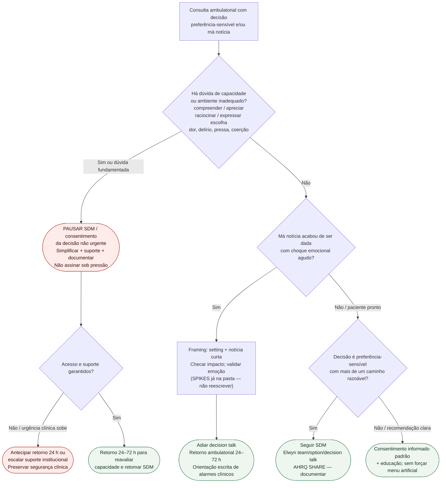

# Fluxograma ambulatorial: capacidade, SDM e má notícia — destino

Prosa: [`sinalizadores-ambulatoriais-capacidade-e-sdm-no-consultorio-cardiologico`](sinalizadores-ambulatoriais-capacidade-e-sdm-no-consultorio-cardiologico.md). Checklist: [`checklist-ambulatorial-capacidade-consentimento-consulta-cardiologica`](checklist-ambulatorial-capacidade-consentimento-consulta-cardiologica.md). SPIKES (estrutura completa): [`fluxograma-protocolo-spikes-mas-noticias-cardiologia`](fluxograma-protocolo-spikes-mas-noticias-cardiologia.md).

## Árvore de decisão

## Notas

- **D1** = gate Appelbaum (PMID 18003940) + ambiente.
- **D2** = framing ambulatorial de má notícia: não forçar *decision talk* sob choque.
- **D3** = SDM quando há verdadeira escolha (Elwyn PMID 22618581 / AHRQ SHARE).
- Não decide incapacidade legal, substituto, doses nem teach-back de alta.
