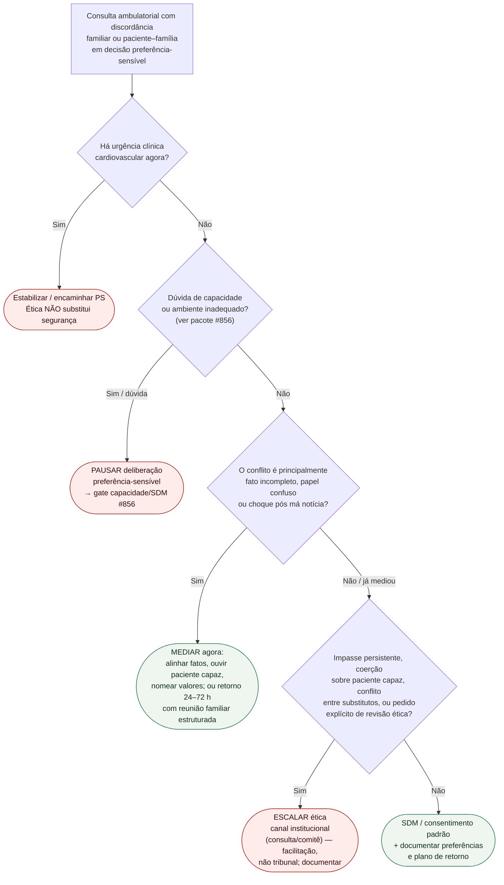

# Fluxograma ambulatorial: discordância familiar — destino

Prosa: [`sinalizadores-ambulatoriais-discordancia-familiar-escalada-etica-cardiologia`](sinalizadores-ambulatoriais-discordancia-familiar-escalada-etica-cardiologia.md). Checklist: [`checklist-ambulatorial-discordancia-familiar-quando-escalar-etica`](checklist-ambulatorial-discordancia-familiar-quando-escalar-etica.md). Capacidade/SDM: [`fluxograma-ambulatorial-capacidade-sdm-e-mas-noticias-destino`](fluxograma-ambulatorial-capacidade-sdm-e-mas-noticias-destino.md).

## Árvore de decisão

## Notas

- **D0** = segurança clínica primeiro.
- **D1** = não confundir discordância familiar com incapacidade (#856).
- **D2** = mediação alinhada a DuVal (conflito/família difícil) e Aulisio (facilitação).
- **D3** = escalada quando mediação esgota ou há coerção/impasse — Schneiderman mostra utilidade da consulta ética em conflitos de valor (contexto UTI; extrapolação operacional).
- Não decide incapacidade legal, substituto, doses nem teach-back.
