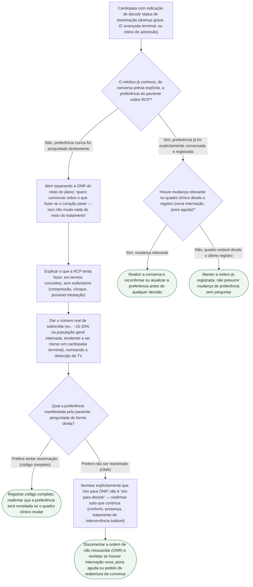

# Fluxograma: Decisão sobre Status de Reanimação (ONR) no Cardiopata

Esta árvore segue a estrutura prática de seis passos do documento-fonte, organizada em torno do achado que a justifica: médicos que não perguntam diretamente presumem, por padrão, que o paciente quer reanimação — e acertam essa suposição em 86% dos casos, mas acertam apenas 46% das vezes quando o paciente na verdade não quer ser reanimado (Wenger et al., 2000). A árvore trata isso como o ponto de partida: perguntar de forma explícita, não presumir.

## Árvore de decisão

## Sobre os critérios usados nesta árvore

A distinção entre ONR e suspensão de cuidado, verbalizada como primeiro passo, é o ponto que o documento-fonte identifica como origem da resistência de muitas famílias: "a pergunta que ouvem não é 'querem que eu tente compressão torácica quando o coração parar', é, na cabeça delas, 'vocês querem que eu pare de cuidar dele'". Nomear a diferença antes de pedir a decisão evita recusa por um motivo que não é o que está de fato em jogo.

Os números de sobrevida citados vêm de duas coortes que o documento-fonte é explícito em não generalizar sem ressalva: Girotra et al. (N Engl J Med 2012, PMID 23150959) encontraram sobrevida até a alta subindo de 13,7% para 22,3% entre 2000 e 2009 em população geral internada, e Ehlenbach et al. (N Engl J Med 2009, PMID 19571280) encontraram 18,3% em pacientes de 65 anos ou mais — nenhuma das duas seleciona especificamente cardiopatia estrutural terminal, e o documento-fonte marca essa extrapolação como raciocínio clínico razoável, não dado medido (`VERIFICAÇÃO HUMANA NECESSÁRIA` para taxa específica por classe funcional NYHA).

A evidência de que a estruturação da conversa muda desfecho vem do ensaio suíço cluster-randomizado de Becker et al. (NEJM Evid 2025, PMID 40261118): 206 residentes cuidando de 2.663 pacientes, com a intervenção estruturada associada a mais escolhas de DNR (50,0% vs. 37,2%; RR ajustado 1,37) e menor conflito decisional (14,4 vs. 21,8 pontos na Decisional Conflict Scale) — achado que o próprio estudo interpreta não como objetivo de "aumentar DNR", mas como sinal de decisão mais esclarecida quando a conversa inclui prognóstico e verificação de compreensão, e não uma pergunta binária isolada.