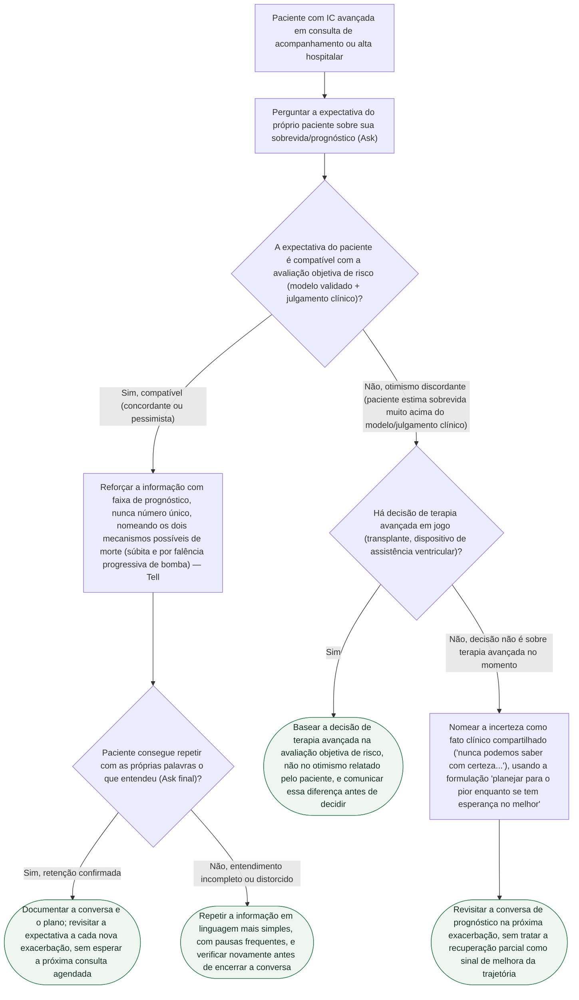

# Fluxograma: Discordância Prognóstica na Insuficiência Cardíaca Avançada

Esta árvore parte do achado central dos dois documentos-fonte: perguntar a expectativa de sobrevida do próprio paciente (Ask) e compará-la à avaliação objetiva de risco é o passo que detecta o otimismo discordante — presente em 33,1% de uma coorte de alto risco (Cascino et al., 2026) e associado a quase o dobro de mortalidade em 2 anos (HR ajustado 1,98). A partir dessa comparação, a árvore segue dois caminhos: reforçar a informação com as técnicas que a AHA nomeia (quando a expectativa é compatível), ou tratar o otimismo discordante como dado clínico relevante para a decisão de terapia avançada.

## Árvore de decisão

## Sobre os critérios usados nesta árvore

O critério de discordância segue a definição operacional do estudo mais recente: índice de estimativa (expectativa do paciente dividida pela sobrevida estimada pelo modelo) igual ou acima de 1,5 caracteriza otimismo discordante, presente em 98 dos 296 pacientes da coorte REVIVAL — 33,1% (Cascino et al., JAMA Netw Open 2026, PMID 41774443). A recomendação de basear a decisão de terapia avançada em avaliação objetiva, não no relato otimista, é a conclusão textual dos próprios autores desse estudo, reforçada pelo achado de que a maior mortalidade associada ao otimismo discordante (HR 1,98) não foi explicada por menor acesso a transplante ou dispositivo de assistência ventricular.

A bifurcação sobre recuperação parcial pós-exacerbação segue diretamente a advertência de Murray et al. (BMJ 2005, PMID 15860828): na trajetória de falência de órgão, o paciente "geralmente sobrevive a muitos desses episódios", e cada "dia bom" que sucede uma descompensação não é evidência de mudança de trajetória — é o próprio formato esperado da doença. Tratar a recuperação parcial como sinal de bom prognóstico é listado como armadilha clínica no documento-fonte.

As técnicas Ask-Tell-Ask, a faixa de prognóstico em vez de número único e a formulação "planejar para o pior enquanto se tem esperança no melhor" são nomeadas textualmente na declaração científica da American Heart Association (Allen et al., Circulation 2012, PMID 22392529), que também documenta por que nem julgamento clínico nem modelo validado bastam sozinhos: o erro de previsão maior que o dobro ou menor que a metade da sobrevida real "permanece próximo de 50% sob premissas realistas".