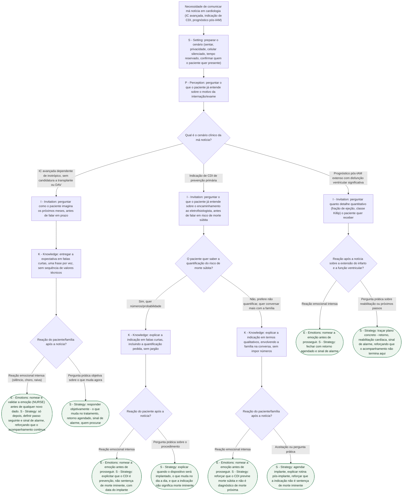

# Fluxograma: Protocolo SPIKES para Más Notícias em Cardiologia

Esta árvore segue os seis passos do SPIKES (Setting, Perception, Invitation, Knowledge, Emotions, Strategy) tal como aplicados, no documento-fonte, a três cenários cardiológicos concretos: indicação de CDI de prevenção primária, insuficiência cardíaca avançada dependente de inotrópico e prognóstico pós-infarto extenso. O ramo escolhido em cada decisão determina qual variante do passo seguinte se aplica — não é uma lista de dicas soltas, é a sequência que o documento descreve como a diferença entre o erro mais comum (pular Setting/Perception/Invitation e ir direto para a informação) e a conversa estruturada.

## Árvore de decisão

## Sobre os critérios usados nesta árvore

O ponto de bifurcação em cada "Invitation" (quanto o paciente quer saber) não é um detalhe protocolar — o documento-fonte descreve que o passo Knowledge seguinte muda de conteúdo conforme essa resposta, especialmente na indicação de CDI, onde "a conversa sobre CDI implica falar de risco de morte de forma explícita, e nem todo paciente quer essa quantificação antes de decidir". Da mesma forma, o passo Emotions (E) sempre precede qualquer novo dado quando a reação é intensa — o documento nomeia isso como o erro mais comum: "continuar informando enquanto a emoção está alta é o erro que mais frequentemente faz a pessoa sair da sala sem ter entendido o plano seguinte".

A evidência de que treinar esse protocolo (não apenas lê-lo) muda desempenho vem do ensaio de Servotte et al. (West J Emerg Med 2019, PMID 31738716): 68 estudantes/residentes randomizados para rodízio padrão versus rodízio mais 4 horas de simulação sobre o SPIKES tiveram ganho significativo (p<0,001) em autoeficácia, no processo avaliado pelo formulário de competência SPIKES e nas habilidades de comunicação — com estudantes de pouca experiência prévia alcançando, após o treinamento, desempenho equivalente ao de colegas mais experientes do grupo controle.

Esta árvore não substitui `roteiro-de-conversa-dificil-em-cardiologia.md` (script de frases prontas para IC avançada e paliativo) nem `protocolo-spikes-de-mas-noticias-aplicado-a-ic-avancada-cdi-e-prognostico-pos-iam.md` (o documento didático completo, com a explicação de cada letra e as armadilhas). É a representação, em árvore de decisão, da sequência que esse último documento descreve.