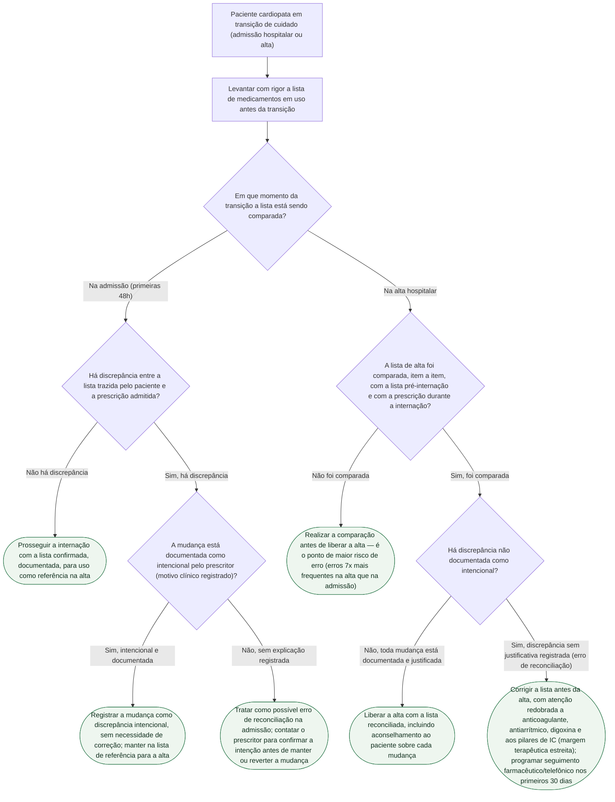

# Fluxograma: Reconciliação Medicamentosa na Transição de Cuidado

Esta árvore segue a inversão central do documento-fonte: na admissão, a maioria das discrepâncias é intencional (96,6%) e o erro é raro (3,4%); na alta, o padrão se inverte — erro de reconciliação em 24,5% das discrepâncias, contra 3,4% na admissão (Climente-Martí et al., 2010). A árvore trata admissão e alta como dois ramos com lógica de verificação diferente, refletindo essa assimetria.

## Árvore de decisão

## Sobre os critérios usados nesta árvore

A distinção entre discrepância e erro é, no documento-fonte, definida pela explicação registrada: "a diferença entre discrepância e erro é, literalmente, a explicação registrada". O estudo de Climente-Martí et al. (Ann Pharmacother 2010, PMID 20923946), com 120 pacientes de medicina interna, encontrou 109/120 (90,8%) com alguma discrepância e prevalência de erro de reconciliação de 20,8% — mas com a assimetria admissão/alta que estrutura os dois ramos desta árvore, e com número de discrepâncias na admissão associado a maior chance de erro na alta (OR 1,21).

O conduta final do ramo de alta com erro (C6) reúne duas recomendações do documento-fonte: a lista de fármacos de maior risco na cardiologia (anticoagulante, antiarrítmico, digoxina e os pilares de IC, por margem terapêutica estreita e suspensão silenciosa sem sintoma imediato) e a evidência de que programas de reconciliação conduzidos por farmacêutico, com seguimento telefônico ou domiciliar nos primeiros 30 dias, reduzem em 67% o retorno hospitalar por evento adverso de medicamento (RR 0,33; IC95% 0,20-0,53) e em 19% as readmissões (RR 0,81), sem redução de mortalidade (RR 1,05) — metanálise de Mekonnen et al. (BMJ Open 2016, PMID 26908524, 17 estudos, 21.342 pacientes). O documento-fonte também registra que o ensaio de Jacobs et al. (2023, PMID 37611896), citado como evidência adicional de atenção primária, tem desbalanço grave de alocação (36 vs. 264 pacientes) e deve ser lido com a devida ressalva.