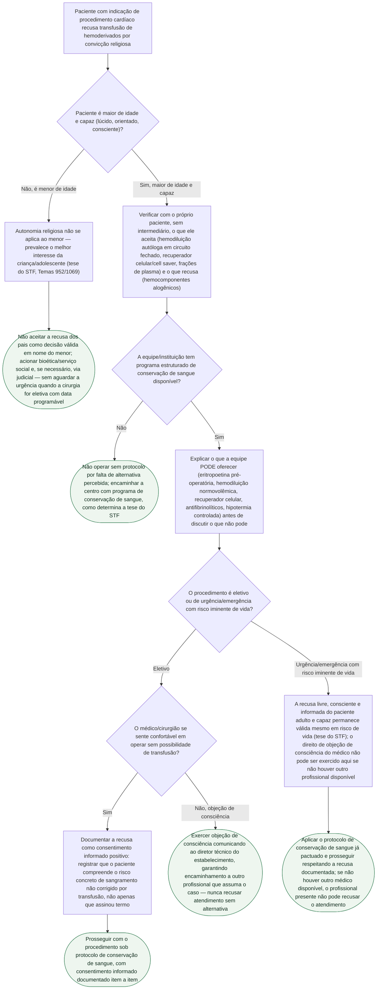

# Fluxograma: Recusa de Transfusão Sanguínea em Cirurgia Cardíaca

Esta árvore organiza, em sequência de decisão, a conduta diante do paciente que recusa
hemoderivados por convicção religiosa antes de procedimento cardíaco — a situação de maior
probabilidade histórica de necessidade de hemoderivados na prática da especialidade. Ela segue
a mesma lógica do documento-fonte já publicado neste acervo: a recusa não é tratada como
obstáculo à conduta correta, mas como um dado da história clínica que redesenha o plano
cirúrgico, dentro dos limites que a tese do STF (Temas 952 e 1069, julgamento conjunto de
25/09/2024) e a Resolução CFM 2.232/2019 estabelecem.

## Árvore de decisão

## Sobre os critérios usados nesta árvore

A primeira bifurcação (maioridade e capacidade) é o limite que a própria tese do STF
constitucionaliza e que não se negocia: a autonomia religiosa não se estende a filhos menores
de idade, prevalecendo o melhor interesse da criança e do adolescente quando há tratamento
eficaz e seguro disponível. É por isso que essa pergunta abre a árvore, antes de qualquer
outra consideração clínica.

A verificação item a item do que o paciente aceita — hemodiluição autóloga em circuito
fechado, recuperador celular intraoperatório, determinadas frações de plasma — reflete o
achado do documento-fonte de que "recusar hemoderivados" não é categoria única: muitas
Testemunhas de Jeová aceitam técnicas que mantêm o sangue em circuito contínuo com o corpo do
paciente e recusam apenas a transfusão alogênica. Essa distinção muda o plano cirúrgico
inteiro, e só o próprio paciente pode defini-la.

A bifurcação entre eletivo e urgência/emergência com risco iminente de vida reproduz a
distinção que a Resolução CFM 2.232/2019 traça para o direito de objeção de consciência do
médico — que tem limite explícito em situação de urgência/emergência sem outro profissional
disponível — sem que isso autorize, em nenhum dos dois ramos, transfundir contra a vontade do
paciente adulto e capaz: a tese do STF garante essa autonomia mesmo diante de risco de morte,
que foi exatamente o cenário do caso concreto julgado no Tema 1069 (cirurgia de troca de valva
aórtica).
