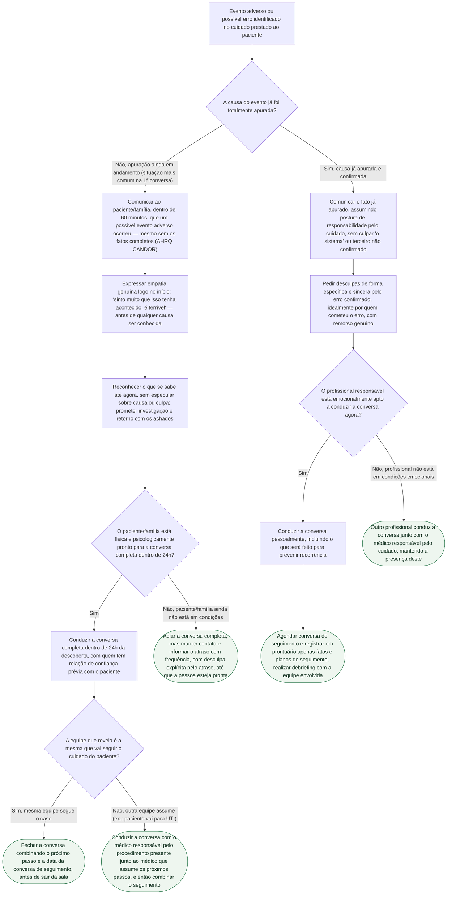

# Fluxograma: Revelação de Erro Médico e Evento Adverso ao Paciente

Esta árvore segue a estrutura prática descrita no documento-fonte, que combina o checklist CANDOR da AHRQ com o consenso de 2006 dos hospitais afiliados a Harvard. A primeira bifurcação separa o que fazer quando a causa do evento ainda não foi apurada (a situação mais comum na primeira conversa) do que fazer quando a causa já está confirmada — as duas fontes tratam essas duas situações de forma diferente, e confundi-las é uma das armadilhas nomeadas no documento-fonte ("não pular para conclusões... antes que todos os fatos sejam conhecidos").

## Árvore de decisão

## Sobre os critérios usados nesta árvore

A janela de 60 minutos para o primeiro aviso e a de 24 horas para a conversa completa vêm de fontes diferentes que o documento-fonte cita lado a lado: o checklist CANDOR da AHRQ pede avisar "dentro de 60 minutos" após o evento ser identificado, enquanto o consenso de Harvard fala em comunicar "assim que reconhecido e assim que o paciente estiver física e psicologicamente pronto, tipicamente dentro de 24 horas". A árvore trata isso como dois momentos sequenciais — o aviso inicial não espera o paciente estar pronto para a conversa completa, mas a conversa completa sim.

A bifurcação entre "causa não apurada" e "causa já apurada" segue a mesma distinção que o documento-fonte extrai das duas fontes primárias: "não especule sobre a causa antes da investigação estar completa" (AHRQ) versus a exigência, quando o erro já é confirmado, de desculpa específica e nomeação de quem cometeu o erro. A ramificação sobre quem segue o cuidado reflete a recomendação de Harvard para procedimento invasivo (cateterismo, angioplastia, implante de dispositivo), citada no documento-fonte como extensão razoável do princípio geral, não achado específico da literatura de cardiologia.

A armadilha mais medida na literatura — 56% dos médicos escolhendo frases que mencionam o evento sem declarar que houve erro, e a chance de revelação explícita caindo de 58% entre clínicos para 19% entre cirurgiões (Gallagher et al., Arch Intern Med 2006, PMID 16908791) — é o motivo pelo qual esta árvore força a explicitação do reconhecimento do fato como primeiro passo em ambos os ramos, antes de qualquer outra ação.