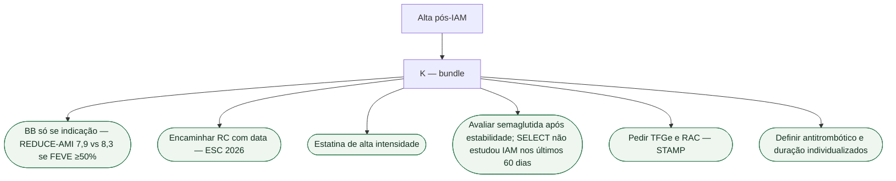

# SPIKES não substitui números: como fechar a consulta de alta pós-IAM

A alta depois do infarto ainda se fecha com “fica tranquilo, a artéria está aberta”. SPIKES (Baile et al., *Oncologist* 2000; PMID **10964998**) organiza a conversa difícil — Setting, Perception, Invitation, Knowledge, Emotion, Strategy. **Não substitui o conteúdo do Knowledge.** Sem números, o S vira consolo e a receita sai no automático de 2010. Esta ficha é o checklist de 2026, não um ensaio novo.

## SPIKES na alta

- **S — Setting.** Sala, sentar, acompanhante se a pessoa quiser. Corredor de alta não é setting.
- **P — Perception.** “O que o senhor entendeu que aconteceu no coração?” Quase sempre vem “entupiu e destupiu” — falta FE, falta o que continua em casa.
- **I — Invitation.** Quanto detalhe agora. Explicar benefícios, riscos e alternativas; definir o plano com o paciente, respeitando preferências e decisão informada.
- **K — Knowledge.** Os seis itens abaixo, em frequência natural. Sem NNT inventado.
- **E — Emotion.** Medo de esforço, culpa. Nomear; não trocar por mais um comprimido.
- **S — Strategy.** Papel com data da reabilitação, o que entra, o que **não** entra, e o pedido de TFGe + RAC.

## Bundle da alta em 2026

**1. Betabloqueador só se houver indicação.** REDUCE-AMI (Yndigegn, PMID **38587241**): IAM contemporâneo com angiografia e **FEVE ≥50%**, sem outra indicação de BB — morte ou novo IAM **7,9% versus 8,3%**; HR **0,96** (IC95% **0,79–1,16**; P=0,64). Neutro. REBOOT (Ibanez, PMID **40888702**) testou FEVE **>40%** após cuidado invasivo e também foi **neutro** no primário. Não despejar taxa de REBOOT nesta mesa — o número que esta consulta já carrega é o do REDUCE-AMI. Frase: “oito em cem com o comprimido, oito em cem sem, em três anos e meio, se a FE está preservada e não há angina, FA ou IC”. Na disfunção sistólica assintomática (estágio B), FEVE <50% tem recomendação I B1 de betabloqueador na ESC 2026 de IC. Outra indicação também pode justificar tratamento. Não suspender abruptamente um betabloqueador em uso. Irmãos: [Como conversar sobre não usar betabloqueador crônico após IAM com FE preservada](/biblioteca/conversa-sobre-nao-usar-betabloqueador-cronico-apos-iam-com-fe-preservada) e o fluxograma REDUCE-AMI.

**2. Encaminhar reabilitação cardíaca.** ESC 2026 (Bäck, Wilhelm, Hansen; DOI 10.1093/eurheartj/ehag099): a SCA é porta clássica da RC; o encaminhamento à fase II sai **antes da alta**, com data, serviço e formato — não “caminhe um pouco”. Na ESC 2026, RC após SCA é I A para reduzir mortalidade cardiovascular e IAM; I B1 para reduzir hospitalizações e melhorar qualidade de vida e capacidade funcional. O início depende da estabilidade e da avaliação do programa, sem impor um prazo universal. Telereabilitação não substitui o encaminhamento. Porta: [Reabilitação cardíaca após SCA: porta de entrada ESC 2026](/biblioteca/reabilitacao-cardiaca-apos-sca-porta-de-entrada-esc-2026).

**3. Estatina de alta intensidade.** Não sai da alta porque o BB ficou opcional ou porque entrou agonista de GLP-1. Esta ficha **não** inventa Classe ESC para a estatina. O infarto já é prevenção secundária; a intensidade é a alta, salvo intolerância documentada.

**4. Considerar GLP-1 se obesidade — recorte SELECT, não FLOW.** SELECT (Lincoff, PMID **37952131**): DCV estabelecida, IMC ≥27, **sem diabetes**, semaglutida **2,4 mg** SC semanal. MACE **6,5% versus 8,0%**; HR **0,80** (0,72–0,90). Em 100 pessoas: cerca de **8** eventos sem o fármaco, **6 ou 7** com o fármaco, em ~40 meses. **Não misturar com FLOW** (1,0 mg SC no **DM2 com DRC**; primário renal). Não é o comprimido de 14 mg (SOUL). Morte CV isolada no SELECT **não** foi significativa — não prometer morte. A Anvisa aprovou em fevereiro de 2026 a indicação de Wegovy para reduzir eventos cardiovasculares maiores em adultos com DCV estabelecida e sobrepeso ou obesidade. SELECT excluiu eventos cardiovasculares/cerebrovasculares nos 60 dias anteriores: não prova benefício de iniciar semaglutida durante a internação pelo IAM agudo. A exclusão de diabetes no ensaio não significa contraindicação geral ao medicamento em diabetes. Porta: [SELECT depois do IAM não é o FLOW](/biblioteca/select-depois-do-iam-nao-e-o-flow).

**5. Rastrear DRC — STAMP.** ESC 2026 CVD-CKD (Damman; PMID **42661426**): **todo** paciente com DCV, no diagnóstico, faz **TFGe** (creatinina) **e RAC** urinária. Creatinina isolada na alta **não** fecha o rim. STAMP é ordem da conversa, não escore. Persistência ≥3 meses para rotular DRC; resultado inesperadamente alterado deve ser reavaliado em dias a semanas para excluir lesão renal aguda, sem aguardar três meses. Porta: [Como explicar STAMP, TFGe e RAC na consulta](/biblioteca/como-explicar-stamp-tfge-e-rac-na-consulta).

**6. Antitrombótico e reconciliação da receita.** Definir antiplaquetários e eventual anticoagulação conforme a SCA, intervenção realizada, indicação de anticoagulante e risco hemorrágico. Registrar duração, reavaliação e sinais de sangramento; não aplicar combinação universal.

## O que não dizer no Knowledge

- “Betabloqueador para sempre” sem olhar a FE.
- “GLP-1 só se tiver diabetes” (o SELECT **excluiu** diabetes).
- “É o remédio do rim” para 2,4 mg.
- “Creatinina normal, rim liberado.”
- “Reabilitação quando ficar mais firme.”
- Qualquer NNT sobre HR 0,96 com intervalo que atravessa 1.

## Tudo com Tudo

- **Comunicação clínica.** SPIKES é andaime; o K são os números já verificados neste lote.
- **Doença coronariana.** REDUCE-AMI / REBOOT decidem BB; SELECT decide 2,4 mg — perguntas distintas.
- **Reabilitação cardíaca.** Encaminhamento escrito na alta.
- **Prevenção e lipídios.** Estatina permanece; SELECT não a substitui.
- **Diabetes e cardiologia.** Sem diabetes → SELECT, não FLOW.
- **Cardiorrenal.** STAMP na alta do infarto.
- **Farmacologia.** 2,4 mg SC ≠ 1,0 mg SC ≠ 14 mg oral.
- **Insuficiência cardíaca.** FE reduzida tira o paciente do ramo “BB opcional”.

## Limite editorial

Números desta ficha: REDUCE-AMI 7,9 vs 8,3 (PMID 38587241) e SELECT 6,5 vs 8,0 (PMID 37952131). REBOOT citado como neutro, sem taxa nova. Classes da RC confrontadas com ESC 2026; indicação brasileira conferida no comunicado da Anvisa de fevereiro de 2026. SPIKES (PMID 10964998) não gera evidência de desfecho cardiovascular.
