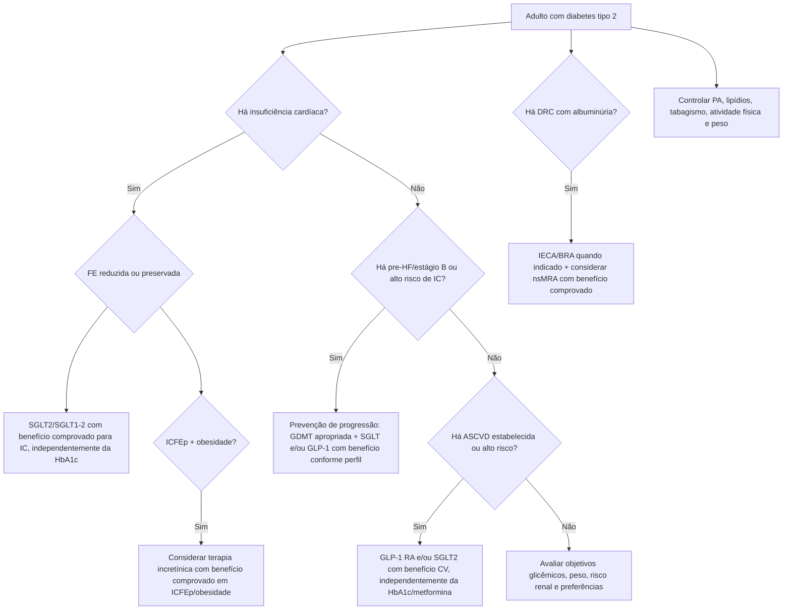
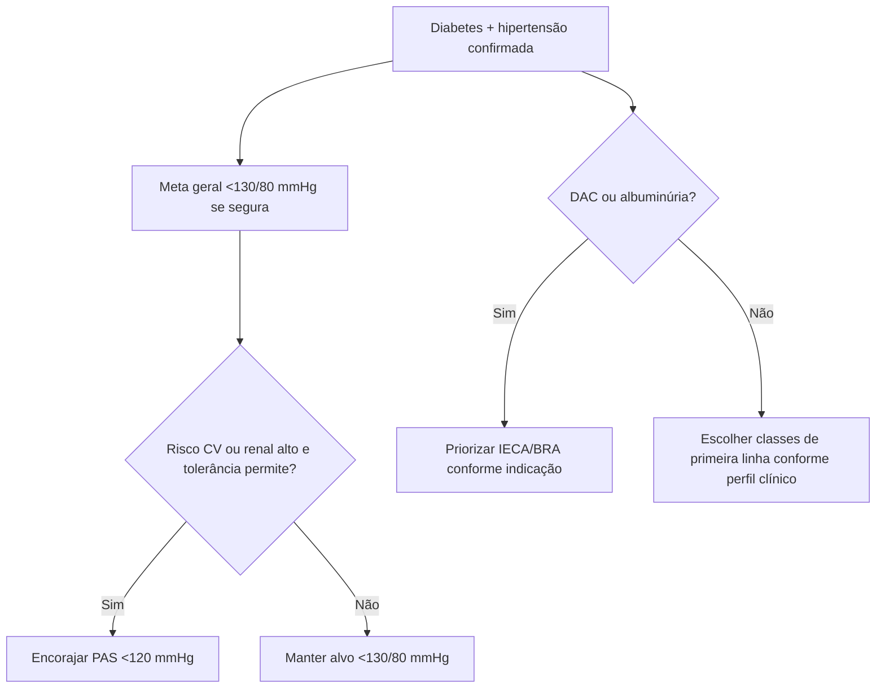

# ADA 2026 — prevenção e tratamento cardiovascular no diabetes

Os **Standards of Care in Diabetes 2026** reforçam que a escolha de terapia no diabetes tipo 2 não deve ser guiada apenas pela HbA1c. Doença cardiovascular aterosclerótica (ASCVD), insuficiência cardíaca (IC), doença renal crônica (DRC) e obesidade podem determinar a escolha de tratamento **independentemente da HbA1c atual ou do uso prévio de metformina**.

## 1. Diabetes + ASCVD ou alto risco de ASCVD

Em adultos com diabetes tipo 2 e ASCVD estabelecida ou alto risco, o plano deve incluir medicamento com benefício cardiovascular demonstrado, particularmente:

- agonista de receptor GLP-1 com benefício cardiovascular demonstrado;
- inibidor de SGLT2 com benefício cardiovascular demonstrado;
- em pacientes selecionados, combinação das duas classes pode ser considerada para redução adicional de eventos cardiovasculares e renais.

A indicação cardiovascular não depende exclusivamente de necessidade adicional de redução de HbA1c.

## 2. Diabetes + insuficiência cardíaca

Para diabetes tipo 2 com IC estabelecida, tanto com FE reduzida quanto preservada, a ADA 2026 recomenda **inibidor de SGLT2/SGLT1-2 com benefício comprovado** para reduzir piora de IC e morte cardiovascular (**Recomendação 10.41a, nível A**).

Também recomenda SGLT2 com benefício demonstrado para melhora de qualidade de vida em IC (**10.41b, nível A**).

### Estágio B / pre-HF

Em diabetes com IC assintomática (estágio B), a ADA recomenda abordagem interprofissional com otimização de tratamento para reduzir progressão para IC sintomática (**10.44a, nível A**).

A diretriz recomenda IECA ou BRA e betabloqueador nesse cenário quando indicado (**10.44b, nível A**) e recomenda terapia com SGLT com benefício de prevenção de IC ou GLP-1 RA com benefício de prevenção de IC em diabetes tipo 2 com estágio B, alto risco ou DCV estabelecida (**10.44c; níveis A/B conforme classe**).

## 3. Diabetes + obesidade + ICFEp sintomática

Uma novidade importante de 2026 é a incorporação de terapias baseadas em incretinas no algoritmo de ICFEp associada a obesidade.

A seção farmacológica recomenda, independentemente de HbA1c:

- agonista dual GIP/GLP-1 com benefício demonstrado para sintomas e eventos de IC (**nível A**);
- agonista GLP-1 com benefício demonstrado para sintomas (**A**) e/ou eventos de IC (**B**).

A aplicação deve respeitar indicação e bula vigentes; este documento não fornece doses.

## 4. Diabetes + DRC/albuminúria

Em diabetes tipo 2 e DRC com albuminúria, em uso de dose máxima tolerada de IECA/BRA quando indicado, a ADA recomenda **antagonista não esteroidal do receptor mineralocorticoide (nsMRA) com benefício demonstrado** para reduzir eventos cardiovasculares e progressão renal (**10.42, nível A**).

## 5. Pressão arterial no diabetes

A figura de tratamento de hipertensão da ADA 2026 orienta:

- meta em tratamento **<130/80 mmHg**, se alcançável com segurança;
- considerar/encorajar PAS **<120 mmHg** em pessoas com risco cardiovascular ou renal alto, quando tolerado;
- IECA/BRA têm papel preferencial quando coexistem DAC ou albuminúria, especialmente UACR elevada.

## Árvore de decisão — escolha cardiovascular no diabetes tipo 2

## Árvore de decisão — hipertensão no diabetes

## Armadilhas clínicas

- Esperar HbA1c subir para só então introduzir uma terapia indicada por benefício cardiovascular.
- Considerar metformina obrigatória antes de qualquer terapia com benefício cardiovascular.
- Prescrever SGLT2 apenas como redutor de glicose em paciente com IC.
- Ignorar obesidade como alvo terapêutico relevante na ICFEp.
- Tratar risco cardiovascular do diabético apenas com glicemia, sem PA, lipídios, rim e tabagismo.

## Regra prática

**No diabetes tipo 2, a pergunta antes de escolher o fármaco não é apenas “qual a HbA1c?”, mas “há ASCVD, IC, DRC ou obesidade?”** Essas comorbidades podem definir a terapia antes do objetivo glicêmico.