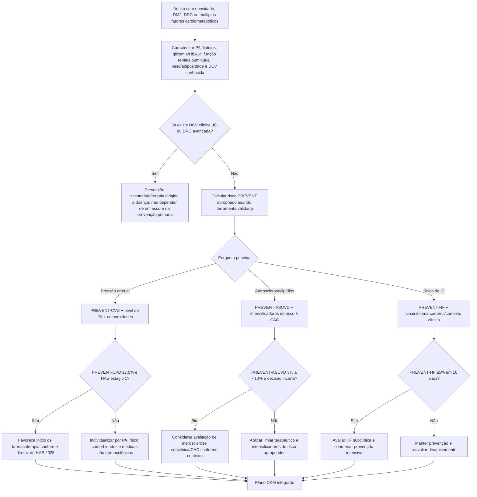

# Síndrome cardiovascular–renal–metabólica (CKM) — diretriz 2026

## O que mudou

Em junho de 2026, AHA/ACC/ADA/ASN publicaram uma diretriz dedicada à **síndrome cardiovascular–renal–metabólica (CKM)**. O documento trata obesidade, diabetes tipo 2, doença renal crônica e doença cardiovascular como componentes interligados de um mesmo continuum de risco, em vez de linhas assistenciais independentes.

A diretriz substitui e expande a antiga diretriz norte-americana de obesidade de 2013 e cria um framework útil para cardiologistas, endocrinologistas, nefrologistas e atenção primária.

## Por que isso é especialmente relevante para a cardiologia

O paciente com diabetes/obesidade/DRC não deve ser avaliado apenas pela HbA1c. A pergunta clínica passa a ser:

> **qual é o risco cardiovascular, aterosclerótico, de insuficiência cardíaca e renal deste paciente — e qual intervenção oferece maior benefício absoluto?**

A diretriz integra ferramentas **PREVENT** para estimar diferentes eixos de risco.

## PREVENT: usar o desfecho certo para a pergunta certa

- **PREVENT-CVD:** risco de doença cardiovascular global; é usado, entre outros cenários, para apoiar decisão de tratamento intensivo da PA.
- **PREVENT-ASCVD:** risco de eventos ateroscleróticos; pode orientar intensificação de prevenção e avaliação de aterosclerose subclínica.
- **PREVENT-HF:** risco de insuficiência cardíaca; ajuda a identificar quem pode se beneficiar de investigação/coordenação preventiva mais intensiva.

> A fórmula completa PREVENT **não é reproduzida neste documento**. Deve-se usar implementação oficialmente validada. Não é seguro reconstruir coeficientes por memória ou a partir de calculadoras de terceiros.

## Limiares explicitamente usados na diretriz CKM 2026

A diretriz descreve, no contexto de integração com outras diretrizes norte-americanas:

- **PREVENT-CVD ≥7,5% em 10 anos:** limiar usado pela diretriz AHA/ACC 2025 de hipertensão para recomendar início de farmacoterapia em hipertensão estágio 1 no contexto apropriado.
- **PREVENT-ASCVD de 3% a <10% em 10 anos:** faixa na qual avaliação de aterosclerose subclínica pode ser útil quando existe incerteza sobre iniciar/intensificar tratamento preventivo.
- **PREVENT-ASCVD ≥5% em 10 anos:** limiar citado para recomendar tratamento hipolipemiante na diretriz norte-americana contemporânea de dislipidemia.
- **PREVENT-ASCVD de 3% a <5%:** tratamento pode ser considerado após integrar intensificadores de risco, risco de 30 anos ou CAC quando persistir incerteza.
- **PREVENT-ASCVD ≥10% em 30 anos:** pode apoiar consideração de terapia hipolipemiante mesmo com risco de 10 anos mais baixo.
- **PREVENT-HF ≥5% em 10 anos:** limiar para recomendar avaliação de insuficiência cardíaca subclínica e coordenação de cuidados no framework CKM.

## Árvore de decisão CKM + PREVENT

## O que significa “plano CKM integrado”

Não é apenas prescrever mais medicamentos. O plano deve revisar simultaneamente:

1. **adiposidade e estilo de vida**;
2. **pressão arterial**;
3. **risco aterosclerótico e lipídios**;
4. **diabetes e seleção de terapias com benefício cardiorrenal quando indicadas**;
5. **DRC, albuminúria e progressão renal**;
6. **prevenção e detecção de insuficiência cardíaca**;
7. **adesão, custo, acesso e preferência do paciente**.

## Armadilhas

- Não usar PREVENT em prevenção secundária como se substituísse o diagnóstico de DCV clínica.
- Não confundir PREVENT-ASCVD com PREVENT-HF: os desfechos e decisões são diferentes.
- Não reconstruir a fórmula do PREVENT sem coeficientes oficiais validados.
- Não usar HbA1c isoladamente para definir risco cardiovascular de uma pessoa com diabetes.

## Fonte verificada

Ndumele CE, Rodriguez F, Dixon DL, et al. 2026 AHA/ACC/ADA/ASN Guideline for the Prevention, Detection, Evaluation, and Management of Cardiovascular-Kidney-Metabolic Syndrome. *J Am Coll Cardiol.* 2026;87(22S):e1889-e2007. PMID **42265997**. PMCID **PMC13399222**. DOI **10.1016/j.jacc.2026.03.056**.

## Status de revisão

`VERIFICAÇÃO HUMANA NECESSÁRIA`: os limiares acima foram extraídos do documento de 2026 e de sua integração explícita com diretrizes contemporâneas; antes de publicação assistencial final, conferir a classe/nível de evidência e a implementação local do PREVENT.
