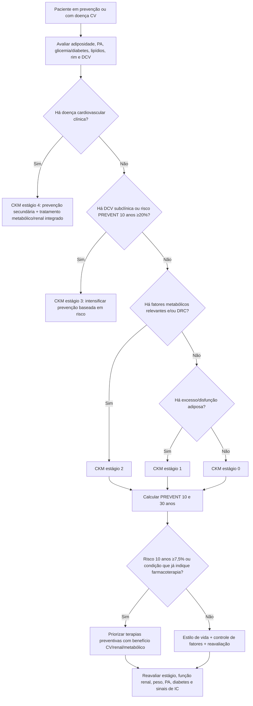
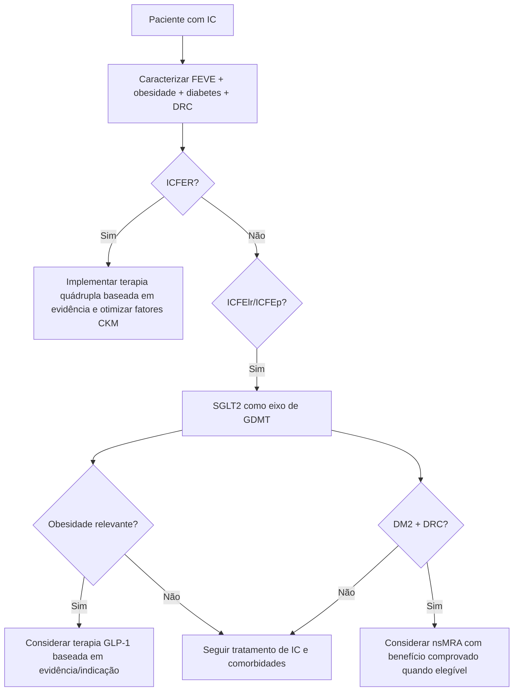

# Diretriz CKM 2026

A diretriz AHA/ACC/ADA/ASN de 2026 formaliza a **síndrome cardiovascular–renal–metabólica (CKM)** como um continuum que conecta adiposidade, diabetes, doença renal crônica e doença cardiovascular. A proposta é abandonar o manejo fragmentado em silos e definir **estágio + risco absoluto + terapias com benefício multissistêmico**.

## Estadiamento CKM

A diretriz recomenda estadiar jovens e adultos para prevenir progressão e, quando possível, promover regressão de estágio.

De forma conceitual:

- **Estágio 0:** sem fatores de risco CKM relevantes;
- **Estágio 1:** excesso ou disfunção do tecido adiposo, sem outros grandes fatores metabólicos/renais;
- **Estágio 2:** fatores metabólicos e/ou doença renal, sem doença cardiovascular clínica;
- **Estágio 3:** doença cardiovascular subclínica ou risco cardiovascular previsto muito alto;
- **Estágio 4:** doença cardiovascular clínica em contexto CKM.

A classificação detalhada deve seguir a tabela oficial da diretriz; este documento não transforma o resumo conceitual acima em substituto do estadiamento formal.

## PREVENT entra no centro do algoritmo

Para indivíduos nos estágios CKM 0–3, a diretriz recomenda quantificação de risco pelas equações **PREVENT**, estimando risco em 10 e 30 anos de:

- ASCVD;
- insuficiência cardíaca;
- doença cardiovascular total.

Dois limiares destacados pelo documento:

- risco de DCV em 10 anos **≥20%** pode funcionar como um critério para **estágio CKM 3**;
- risco em 10 anos **≥7,5%** ajuda a priorizar farmacoterapias preventivas.

A fórmula PREVENT não é reproduzida neste documento. Para implementação como calculadora interativa, os coeficientes oficiais completos precisam ser importados e validados contra a ferramenta/publicação original; até isso ocorrer: **VERIFICAÇÃO HUMANA NECESSÁRIA**.

## Por que IC faz parte do risco CKM

A diretriz amplia prevenção para além de aterosclerose. Obesidade, diabetes e DRC também elevam risco de IC, e o PREVENT estima esse desfecho especificamente.

Na IC com FE reduzida, a diretriz destaca benefícios cardiovasculares e renais do bloqueio do SRAA/ARNI e SGLT2 como componentes da terapia quádrupla com betabloqueador e ARM.

Na IC com FE levemente reduzida/preservada:

- SGLT2 é colocado como terapia de primeira linha orientada por diretriz;
- terapias baseadas em GLP-1 ganham papel em pacientes com obesidade ou outros fatores CKM;
- nsMRA deve ser considerado em diabetes tipo 2 + DRC para reduzir eventos cardiovasculares e perda de função renal quando apropriado.

## Árvore de decisão — estadiar e tratar CKM

## Árvore de decisão — CKM no paciente com insuficiência cardíaca

## O que muda na prática

1. Risco de IC deve ser considerado junto ao risco aterosclerótico.
2. PREVENT substitui abordagens antigas de risco em várias decisões preventivas contemporâneas.
3. Obesidade deixa de ser apenas “fator de risco” e passa a ser alvo terapêutico dentro do continuum CKM.
4. Terapias devem ser escolhidas por benefício cardiovascular/renal/metabólico, não apenas por um marcador isolado como HbA1c.
5. Estadiamento deve ser repetido ao longo da vida; progressão não é inevitável.

## Armadilhas

- Chamar CKM de sinônimo de síndrome metabólica.
- Calcular apenas ASCVD e ignorar risco de IC.
- Usar PREVENT sem respeitar população/variáveis e horizonte para os quais foi validado.
- Tratar diabetes, rim, obesidade e coração em planos desconectados.
- Considerar estágio CKM uma etiqueta fixa, sem possibilidade de regressão/progressão.

## Regra prática

**CKM transforma quatro consultas paralelas — peso, diabetes, rim e coração — em uma única trajetória de risco.** Estagie, quantifique risco com PREVENT quando indicado e escolha intervenções pelo benefício integrado.