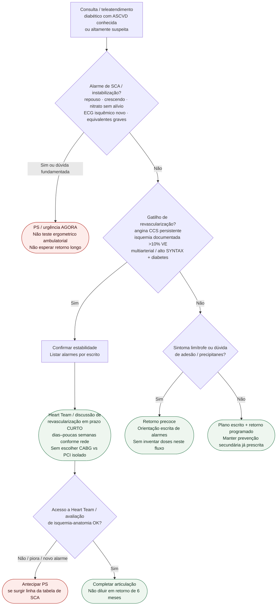

# Fluxograma ambulatorial: ASCVD no diabetes — destino de encaminhamento

Prosa: [`sinalizadores-ambulatoriais-ascvd-no-diabetes-quando-encaminhar`](sinalizadores-ambulatoriais-ascvd-no-diabetes-quando-encaminhar.md) · [`angina-ccs-persistente-no-diabetes-quando-discutir-revascularizacao`](angina-ccs-persistente-no-diabetes-quando-discutir-revascularizacao.md).

Não substitui #826 (lesão de órgão-alvo / IC-FA), #855 (hipoglicemia / iSGLT2-GLP1), FREEDOM detalhado nem vias hospitalares de SCA.

## Árvore de decisão

## Notas

- **D1** = gate de segurança SCA (ESC 2024 CCS / ESC 2023 diabetes).
- **D2** = gatilho de revascularização ambulatorial (angina persistente, isquemia >10% VE, multiarterial — ESC 2023 + FREEDOM/Heart Team).
- **D3–D4** = limítrofe vs estável; prazos curtos são operacionais de rede.
- **Não decide** doses, SCORE2, rastreio IC/FA (#826), alarmes iSGLT2 (#855) nem a escolha final CABG vs PCI.
