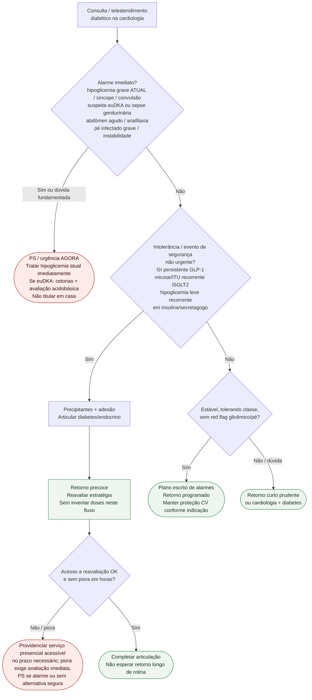

# Fluxograma ambulatorial: sinalizadores diabetes-CV — destino

Prosa: [sinalizadores-ambulatoriais-hipoglicemia-grave-no-consultorio-de-cardiologia](/biblioteca/sinalizadores-ambulatoriais-hipoglicemia-grave-no-consultorio-de-cardiologia) · [sinalizadores-ambulatoriais-intolerancia-e-alarme-sglt2-glp1-sem-doses](/biblioteca/sinalizadores-ambulatoriais-intolerancia-e-alarme-sglt2-glp1-sem-doses).

Não substitui #826 (lesão de órgão-alvo / IC-FA), CAD euglicêmica detalhada, nem CVOTs de classe.

## Árvore de decisão

## Notas

- **D1** = gate de segurança (hipoglicemia grave, euDKA, infecção grave, pé, instabilidade).
- **D2** = intolerância / evento não urgente → retorno precoce + diabetes (**sem doses**).
- **Não decide** lesão de órgão-alvo, SCORE2, rastreio de IC/FA, miligramas nem escolha de CVOT.

## Segurança operacional

Hipoglicemia nível 3 é alteração mental/física que exige auxílio, independentemente da glicemia. Episódio histórico inteiramente recuperado, com estabilidade e causa avaliada, pede revisão rápida de metas/esquema, educação e plano de resgate; recorrência, convulsão persistente, trauma, isquemia ou arritmia exigem urgência. Confirmar glicemia quando possível sem atrasar resgate; palpitação/pré-síncope mantém diferenciais cardíacos.

Suspeita de euDKA requer cetonas e avaliação acidobásica mesmo com glicemia não elevada, com suspensão temporária do iSGLT2 durante investigação/estado agudo. Dor/edema/eritema perineal desproporcional com febre/toxemia sugere Fournier: emergência. Micose genital ou ITU simples não equivale a sepse/intolerância de classe.

Vômitos persistentes com desidratação/LRA, dor abdominal intensa persistente, suspeita de pancreatite/obstrução ou reação alérgica exigem avaliação urgente; não atribuir automaticamente à GLP-1RA. Pé com infecção grave/sistêmica, isquemia, necrose, abscesso profundo ou progressão rápida pede urgência; úlcera/infecção leve estável segue via rápida de pé diabético.
