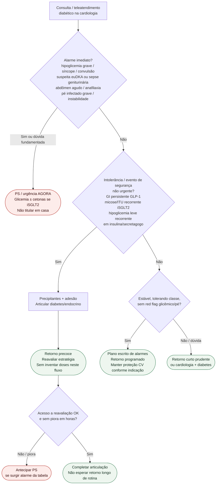

# Fluxograma ambulatorial: sinalizadores diabetes-CV — destino

Prosa: [`sinalizadores-ambulatoriais-hipoglicemia-grave-no-consultorio-de-cardiologia`](sinalizadores-ambulatoriais-hipoglicemia-grave-no-consultorio-de-cardiologia.md) · [`sinalizadores-ambulatoriais-intolerancia-e-alarme-sglt2-glp1-sem-doses`](sinalizadores-ambulatoriais-intolerancia-e-alarme-sglt2-glp1-sem-doses.md).

Não substitui #826 (lesão de órgão-alvo / IC-FA), CAD euglicêmica detalhada, nem CVOTs de classe.

## Árvore de decisão

## Notas

- **D1** = gate de segurança (hipoglicemia grave, euDKA, infecção grave, pé, instabilidade).
- **D2** = intolerância / evento não urgente → retorno precoce + diabetes (**sem doses**).
- **Não decide** lesão de órgão-alvo, SCORE2, rastreio IC/FA (#826), miligramas nem escolha de CVOT.
