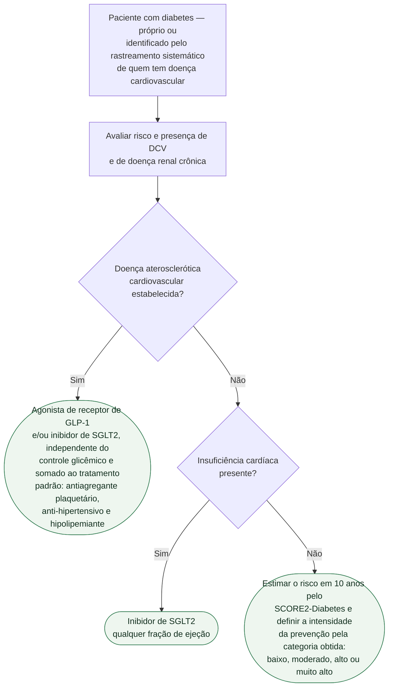

# Fluxograma: Diabetes e Doença Cardiovascular (ESC 2023)

A diretriz ESC 2023 estabelece uma via de mão dupla: **todo paciente com doença
cardiovascular deve ser rastreado para diabetes**, e **todo paciente com diabetes
deve ser avaliado para doença cardiovascular e doença renal crônica**. A partir
daí, a conduta farmacológica deixa de depender exclusivamente do controle
glicêmico.

## Árvore de decisão

As variáveis que alimentam o SCORE2-Diabetes estão detalhadas na seção seguinte:
são entradas de um mesmo cálculo, não ramos de decisão, e por isso não aparecem
na árvore.

## SCORE2-Diabetes

Modelo de predição introduzido nesta diretriz, para estimar o risco de evento
cardiovascular fatal ou não fatal em 10 anos em pessoas com **diabetes tipo 2 sem
doença aterosclerótica cardiovascular e sem lesão grave de órgão-alvo**. Combina
dois blocos de variáveis:

| Fatores convencionais | Fatores específicos do diabetes |
|---|---|
| idade | idade ao diagnóstico do diabetes |
| tabagismo | HbA1c |
| pressão arterial sistólica | taxa de filtração glomerular estimada |
| colesterol total e HDL | — |

O resultado classifica o paciente em risco **baixo, moderado, alto ou muito alto**.

## A mudança de lógica na indicação farmacológica

O ponto mais importante da diretriz para a prática: em paciente com diabetes e
doença aterosclerótica cardiovascular, o agonista de GLP-1 e/ou o inibidor de
SGLT2 são recomendados **para reduzir risco cardiovascular, independentemente do
controle glicêmico** — e somados ao tratamento padrão com antiagregante,
anti-hipertensivo e hipolipemiante. A indicação deixa de ser "tratar a glicemia"
e passa a ser "reduzir desfecho cardiovascular".

Na insuficiência cardíaca, a recomendação é ainda mais direta: **todo paciente
diabético com IC deve receber inibidor de SGLT2, qualquer que seja a fração de
ejeção**, para reduzir hospitalização por IC e morte cardiovascular.
