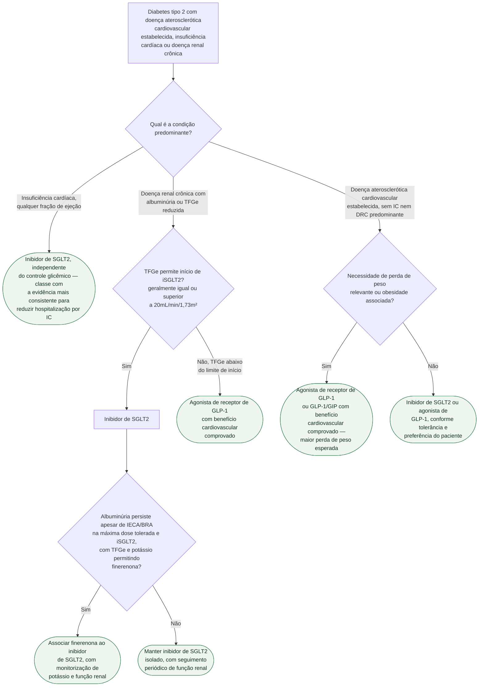

# Fluxograma: Escolha entre inibidor de SGLT2 e agonista de GLP-1 no diabético com doença cardiovascular

Com dois trials pivotais de cada classe já documentados nesta pasta, a pergunta de
consultório que falta responder é prática: diante de um diabético tipo 2 com doença
cardiovascular ou renal já estabelecida, qual classe começar primeiro — e quando associar
as duas. Este fluxograma organiza essa escolha pela condição clínica predominante.

## Árvore de decisão

## O que a árvore não mostra

- **A combinação das duas classes não é um ramo isolado da árvore, porque ela é
  compatível com qualquer um dos seis desfechos finais.** A metanálise em rede de Chuang
  et al. (CMAJ 2026, 99.683 participantes) estimou menor hospitalização por IC com a
  combinação frente a cada monoterapia, mas a comparação é de uma metanálise em rede e
  não equivale a um ensaio que randomizou diretamente combinação versus cada classe.
  Portanto, os RRs não devem ser apresentados como prova causal suficiente para combinar
  as classes; a decisão se apoia primeiro nas indicações independentes de cada uma e nas
  características do paciente.
- **A escolha por condição predominante é simplificação didática.** Na prática, um mesmo
  paciente costuma reunir mais de uma condição ao mesmo tempo (DRC e ASCVD, por exemplo)
  — a árvore segue a ordem de prioridade mais citada na literatura (IC primeiro, depois
  DRC, depois ASCVD isolada), mas a decisão final é sempre individualizada.
- **Generalização de classe para molécula não é automática.** As diretrizes especificam
  agentes com benefício cardiovascular ou renal demonstrado em trial dedicado — o
  resultado de um agente específico não deve ser presumido para toda a classe sem o
  próprio trial daquele fármaco.
- **Controle glicêmico continua sendo meta em paralelo**, mas não é o critério que decide
  esta escolha — as duas classes são indicadas por redução de risco cardiovascular e
  renal, independentemente do valor de HbA1c, e essa é justamente a mudança de lógica que
  a diretriz ESC 2023 introduziu (documentada no fluxograma diagnóstico geral desta
  pasta).
- **Contraindicações e efeitos adversos específicos de cada classe não são ramos** (risco
  de cetoacidose euglicêmica e de infecção genital com iSGLT2; efeitos gastrointestinais e
  risco de aspiração perioperatória com GLP-1, documentados em itens próprios desta
  pasta) — entram na decisão individual, não na estrutura geral do algoritmo.
