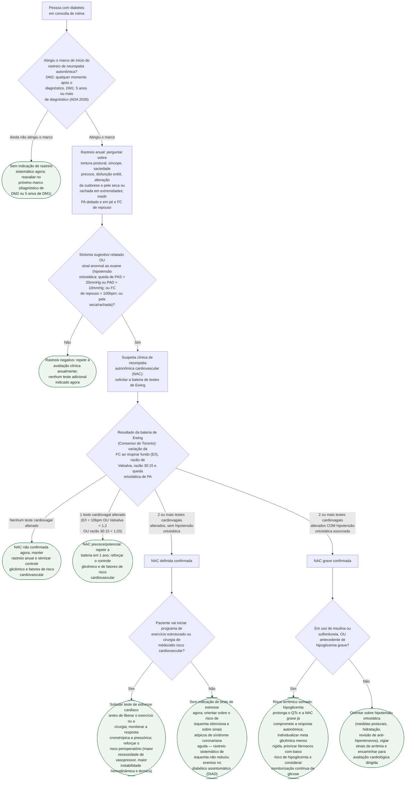

# Fluxograma: Investigação da Neuropatia Autonômica Cardiovascular no Diabético

Esta pasta já documenta os mecanismos da neuropatia autonômica cardíaca (NAC) —
manifestações, bateria de testes de Ewing e valor prognóstico — e o elo entre
hipoglicemia, prolongamento de QT e arritmia, mas faltava traduzir esse
conhecimento em um algoritmo de consultório: quem rastrear, quando suspeitar,
como confirmar e o que fazer depois de confirmada a NAC. Este fluxograma segue
a Recomendação 12.19 do Standards of Care in Diabetes—2026 da ADA para o
rastreio inicial e a estratificação do Consenso de Toronto para a bateria de
Ewing, e reforça — a partir do ensaio DIAD já documentado nesta pasta — que a
NAC não é, isoladamente, indicação para rastrear isquemia silenciosa de rotina.

## Árvore de decisão

A árvore separa dois momentos distintos. Primeiro, o **rastreio sistemático**
baseado em tempo de doença (Recomendação 12.19 da ADA 2026, nível de evidência
E), que não depende de sintomas e deve ser repetido ao menos uma vez por ano.
Segundo, a **confirmação diagnóstica** pela bateria de Ewing só quando o
rastreio for positivo — e a estratificação em NAC precoce, definida ou grave
determina condutas diferentes: da simples repetição anual até a indicação de
teste de estresse antes de liberar exercício ou cirurgia de risco, e o cuidado
redobrado com hipoglicemia em quem já tem NAC grave, pelo efeito somado sobre o
QTc. O fluxograma deixa explícito que NAC não é, isoladamente, gatilho para
rastrear isquemia silenciosa de rotina — o ensaio DIAD, já documentado nesta
pasta, mostrou que essa estratégia não reduz eventos cardíacos no diabético
assintomático.
