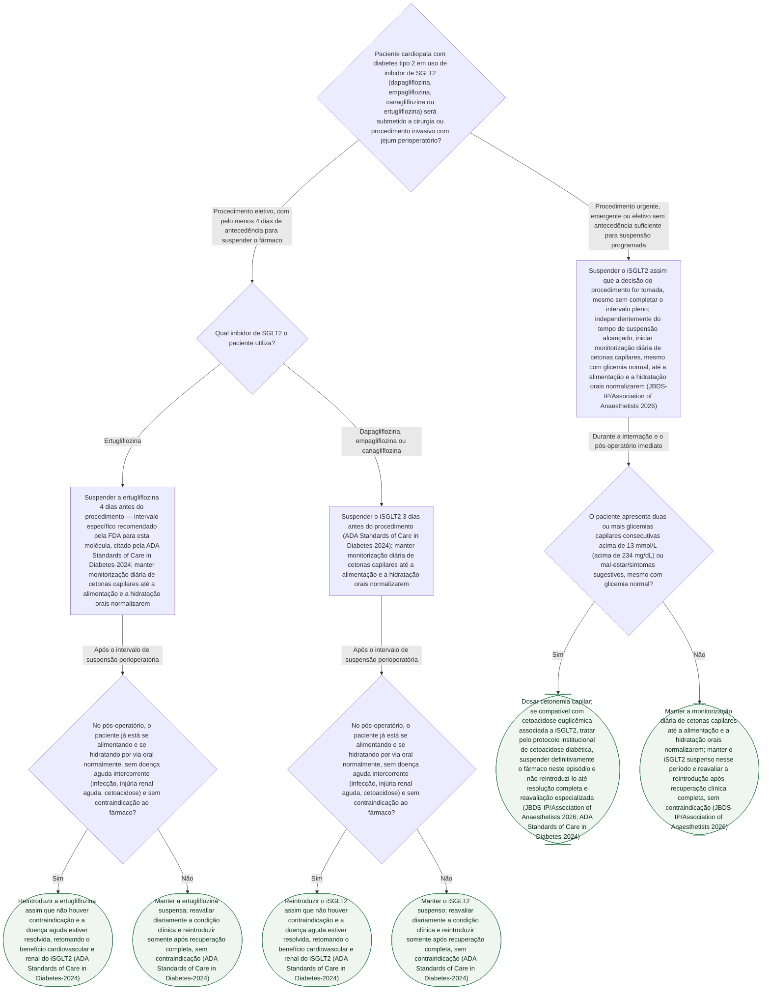

# Fluxograma: Manejo Perioperatório de Inibidores de SGLT2 no Diabético Cardiopata

O inibidor de SGLT2 (iSGLT2) hoje é tratamento de base para o diabético tipo 2
com doença cardiovascular, insuficiência cardíaca ou doença renal crônica — é
exatamente por isso que a pergunta de quando suspendê-lo antes de uma cirurgia,
e quando reintroduzi-lo depois, se tornou frequente em qualquer cardiopata
diabético que vai a um procedimento invasivo. A classe está associada a
cetoacidose diabética euglicêmica no período de jejum, um quadro que cursa com
glicemia normal ou pouco elevada e por isso escapa da suspeita clínica
habitual. Este fluxograma organiza a decisão de suspensão e reintrodução do
iSGLT2 ao redor do procedimento, separando o cenário eletivo (com tempo para
planejar) do urgente/emergente (sem esse tempo), e não repete o conteúdo dos
três fluxogramas já publicados neste tema — nenhum deles trata do período
perioperatório.

## Árvore de decisão

## O que a árvore não mostra

- **A ertugliflozina tem ramo próprio só pela diferença de intervalo, não por
  diferença de conduta.** A ADA Standards of Care in Diabetes-2024 registra que
  a FDA recomenda 3 dias de suspensão para a classe em geral e 4 dias
  especificamente para a ertugliflozina — o restante da decisão (monitorização
  de cetonas, critério de reintrodução) é idêntico entre as moléculas.
- **O gatilho de duas glicemias consecutivas acima de 13 mmol/L para dosar
  cetonemia vem da consenso multidisciplinar britânico (JBDS-IP/Association of
  Anaesthetists 2026), não é um corte da ADA.** Essa mesma fonte recomenda
  monitorização diária de cetonas em todo paciente diabético em uso de iSGLT2
  internado, mesmo com glicemia normal, até a retomada da alimentação e
  hidratação orais — é a base do ramo de cirurgia urgente, no qual não há tempo
  para completar o intervalo de suspensão programado.
- **Não há corte numérico de cetonemia capilar que defina tratamento como
  cetoacidose nesta árvore**, porque as duas fontes verificadas nesta produção
  não especificam esse valor — a decisão de tratar segue o protocolo
  institucional de cetoacidose diabética diante do quadro clínico compatível
  (cetonemia elevada com sintomas ou hiperglicemia persistente), sem que um
  número específico de mmol/L de cetona tenha sido verificado em fonte
  primária para esta árvore.
- **Os dados observacionais mais recentes ainda são pequenos e não mostram
  diferença estatisticamente significativa de cetoacidose entre suspender e
  manter o iSGLT2 no perioperatório.** A análise secundária do estudo MOPED
  (Buggy DJ et al., Br J Anaesth 2026) encontrou taxas semelhantes de
  cetoacidose entre os dois grupos (1,9% suspenso vs. 1,6% mantido), mas os
  próprios autores destacam que as coortes de iSGLT2 eram pequenas demais para
  conclusões firmes — o que reforça, e não contradiz, a prática de seguir a
  suspensão programada recomendada pela ADA e pelo consenso britânico em vez
  de manter o fármaco no perioperatório.
- **Contraindicações específicas do iSGLT2 fora do contexto perioperatório**
  (infecção genital recorrente, TFGe abaixo do limiar de início da classe) não
  são ramos desta árvore — entram na decisão individual de manter o paciente
  na classe a longo prazo, já tratada no fluxograma de escolha entre iSGLT2 e
  GLP-1 desta mesma pasta.
