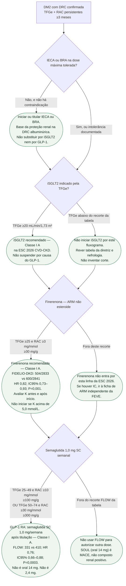

# Fluxograma: proteção renal no DM2 com DRC — ESC 2026 CVD-CKD

Pergunta desta árvore: **neste paciente com diabetes tipo 2 e DRC, o que a ESC 2026 (Damman, PMID 42661426) recomenda para reduzir falência renal e eventos cardiovasculares?** Folhas verdes são condutas. Não mistura dose de semaglutida (1,0 mg SC ≠ 14 mg oral ≠ 2,4 mg). Não suspende IECA/BRA para “abrir espaço”.

A porta de rastreio (todo paciente com DCV, TFGe + RAC) está no fluxograma STAMP ([Fluxograma STAMP-on-CKD: rastreio e conduta na diretriz ESC 2026 de DCV e DRC](/biblioteca/fluxograma-stamp-on-ckd-esc-2026)). Esta árvore começa **depois** do diagnóstico de DRC no DM2.

## Árvore de decisão

## O que a árvore não mostra

**Camadas, não rodízio.** IECA/BRA + iSGLT2 + finerenona + semaglutida 1,0 mg SC somam-se quando cada recorte é preenchido. O FLOW não autoriza suspender iSGLT2: o subgrupo com iSGLT2 basal foi pequeno (n=550) e o P de interação para o primário foi 0,109.

**SOUL não substitui C6.** Semaglutida oral 14 mg reduziu MACE (12,0% vs 13,8%; HR 0,86; 0,77–0,96; P=0,006; n=9.650). O composto renal do SOUL **não** foi positivo. Para quem prefere via oral, a evidência do SOUL pode embasar discussão da prevenção de MACE, conforme indicação e elegibilidade, não por esta folha renal.

**Finerenona e hipercalemia.** FIDELIO-DKD: descontinuação por hipercalemia **2,3% vs 0,9%**. FIGARO-DKD (Pitt, PMID 34449181): descontinuação **1,2% vs 0,4%**; composto CV incluindo hospitalização por IC: 12,4% vs 14,2%; HR 0,87 (0,76–0,98). A bula FDA não recomenda iniciar finerenona com TFGe <25 e orienta não iniciar com K >5,0 mmol/L; no FIDELIO/FIGARO, o limite de K para entrada no ensaio foi ≤4,8. Não confundir critérios de ensaio com bula. Reavaliar K/função renal em quatro semanas e após ajustes.

**iSGLT2 sem diabetes.** A ESC 2026 também recomenda iSGLT2 em DRC **sem** diabetes com TFGe ≥20 e RAC ≥20 mg/mmol (≥200 mg/g) — Classe I A. Esse ramo não está nesta árvore porque a raiz é DM2.

## Números que cabem nas folhas

- FLOW (PMID 38785209): n=3.533; 331 vs 410; HR 0,76 (0,66–0,88); P=0,0003; mediana 3,4 anos; dose 1,0 mg SC semanal.
- FIDELIO-DKD (PMID 33264825): 504/2.833 (17,8%) vs 600/2.841 (21,1%); HR 0,82 (0,73–0,93); P=0,001; mediana 2,6 anos.
- Classes I A da ESC 2026 CVD-CKD: iSGLT2; finerenona no recorte TFGe ≥25 + RAC ≥3 mg/mmol; semaglutida SC 1,0 mg no recorte FLOW da tabela.

## Tudo com Tudo

Cardiorrenal · Diabetes e cardiologia · Insuficiência cardíaca · Farmacologia · Prevenção e lipídios · Comunicação clínica.

### Leituras conectadas

- [FLOW: semaglutida 1,0 mg subcutânea e desfechos renais e cardiovasculares no DM2 com DRC](/biblioteca/flow-semaglutida-dm2-e-doenca-renal-cronica)
- [FINEARTS-HF não é FIGARO-DKD nem FIDELIO-DKD](/biblioteca/finearts-nao-e-figaro-nem-fidelio)
- [Fluxograma STAMP-on-CKD: rastreio e conduta na diretriz ESC 2026 de DCV e DRC](/biblioteca/fluxograma-stamp-on-ckd-esc-2026)
