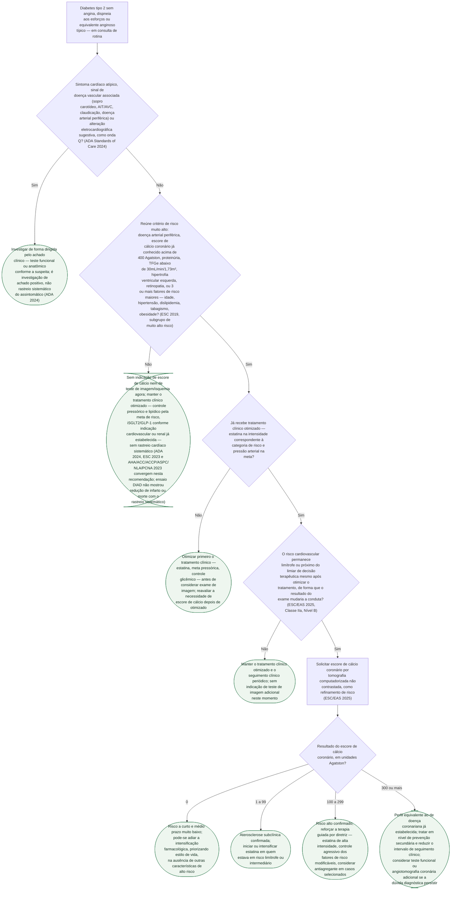

# Fluxograma: Rastreio de Doença Coronariana Assintomática no Diabetes Tipo 2 — Quando Pedir Escore de Cálcio ou Teste de Imagem

Esta pasta já documenta, em separado, o resultado neutro do ensaio DIAD (rastrear
isquemia de rotina no diabético assintomático não reduziu infarto nem morte
cardíaca) e a estratificação de risco geral pelo SCORE2-Diabetes da ESC 2023.
Faltava juntar essas duas peças numa pergunta de consultório muito comum: diante
de um diabético tipo 2 sem sintoma cardíaco, **quando vale a pena pedir escore de
cálcio coronário ou outro teste de imagem, e quando a resposta certa é só
otimizar o tratamento clínico?** As principais diretrizes atuais (ADA 2024, ESC
2023, ESC 2024 de síndromes coronarianas crônicas e a diretriz americana de
doença coronariana crônica 2023) convergem contra o rastreio sistemático — mas
identificam subgrupos e situações em que a informação adicional de um exame de
imagem pode mudar a conduta terapêutica, e é essa seleção que a árvore organiza.

## Árvore de decisão

## O que a árvore não mostra

- **As diretrizes atuais não falam a mesma língua sobre o subgrupo de "muito alto
  risco".** A árvore usa os critérios do subgrupo de muito alto risco descritos
  na diretriz ESC 2019 de diabetes (doença arterial periférica, escore de cálcio
  acima de 400, proteinúria, TFGe abaixo de 30, hipertrofia ventricular esquerda,
  retinopatia, ou 3 ou mais fatores de risco maiores) porque é o critério mais
  explícito e operacional disponível na literatura revisada nesta produção — mas
  a **ESC 2023, que sucede essa diretriz**, registra apenas que "o rastreio
  sistemático não invasivo não é recomendado", sem repetir esse carve-out por
  subgrupo. A ESC 2024 de síndromes coronarianas crônicas, por sua vez, diz que
  "as opções ideais de rastreio ainda precisam ser definidas" para grupos de alto
  risco específicos, como o diabético com mais de 10 anos de doença — reconhecendo
  a lacuna em vez de resolvê-la. A árvore reflete essa divergência real entre
  diretrizes, não a esconde: o ramo de "risco muito alto" é a leitura mais
  favorável ao rastreio seletivo dentro da literatura atual, não um consenso
  unânime entre todas as sociedades citadas.
- **O ensaio DIAD, já documentado nesta pasta, é a base empírica do "não" à
  esquerda da árvore.** 1.123 diabéticos tipo 2 assintomáticos, randomizados para
  cintilografia de perfusão com adenosina ou não rastreio: HR 0,88 (IC95%
  0,44-1,88; p=0,73) para morte cardíaca ou infarto não fatal — sem diferença —, e
  a prevenção medicamentosa aumentou igualmente nos dois grupos, sugerindo que é o
  tratamento clínico, não o exame, que move o desfecho. O próprio ensaio mostrou
  que o exame estratifica risco de verdade (HR 6,3 para defeito moderado/grande),
  mas com valor preditivo positivo de apenas 12% — população de risco basal baixo
  demais para o rastreio sistemático compensar.
- **A interpretação por faixa do escore de cálcio (0 / 1-99 / 100-299 / ≥300) não
  vem de um único ensaio randomizado dedicado ao diabético** — é a categorização
  de risco por faixa de Agatston já consolidada na literatura de prevenção
  cardiovascular geral, aplicada ao contexto do diabético nesta revisão de 2025.
  A indicação de **pedir** o exame (Classe IIa, Nível B) é da atualização focada
  ESC/EAS 2025 de dislipidemias, e vale para quem está perto do limiar de decisão
  terapêutica — não para todo diabético indiscriminadamente.
- **Sintomas típicos de angina, dispneia de esforço ou equivalente anginoso ficam
  fora desta árvore por definição** — o recorte é o diabético **assintomático**;
  quem tem sintoma típico segue a investigação padrão de síndrome coronariana
  (aguda ou crônica), não este fluxograma.
- **Revascularização não é desfecho automático de escore de cálcio elevado.** A
  árvore intensifica terapia clínica e considera teste adicional quando a dúvida
  diagnóstica persiste (CAC ≥300), mas não prescreve cateterismo nem
  revascularização — essa decisão depende de teste funcional/anatômico adicional
  e de julgamento clínico individualizado, fora do escopo deste recorte.
- **Cortes numéricos de estatificação de LDL, meta pressórica e indicação de
  iSGLT2/GLP-1** já estão detalhados no fluxograma geral desta pasta
  (`fluxograma-diabetes-e-doenca-cardiovascular-esc-2023.md`) e não são repetidos
  aqui — a árvore trata só da decisão de pedir ou não o exame de imagem.
