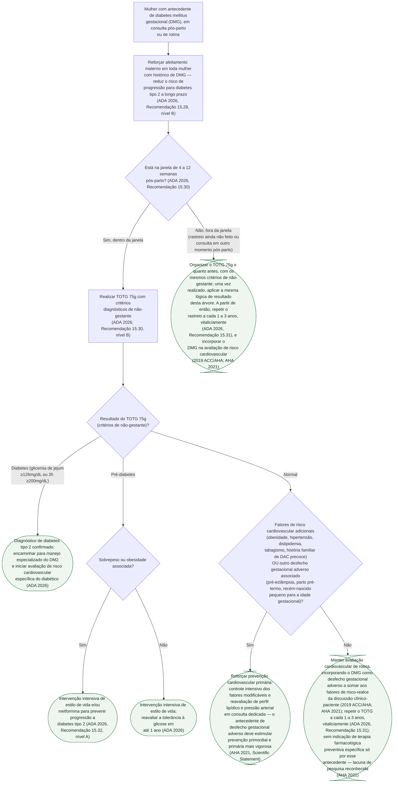

# Fluxograma: Rastreio Pós-Parto e Manejo do Risco Cardiovascular de Longo Prazo Após Diabetes Gestacional

Esta pasta já documenta, em profundidade, que o diabetes mellitus gestacional
(DMG) não é um evento que se encerra no parto — a meta-análise de Kramer et al.
(Diabetologia 2019, 5,4 milhões de mulheres) mostra risco cardiovascular
futuro quase duas vezes maior (RR 1,98), que persiste mesmo sem progressão
para diabetes tipo 2 (RR 1,56) e que já se manifesta na primeira década
pós-parto (RR 2,31). O que faltava era traduzir esse conhecimento em um
algoritmo de conduta: quando rastrear, o que fazer com cada resultado do
teste pós-parto, e como incorporar o antecedente de DMG na avaliação de
risco cardiovascular da mulher ao longo da vida — não apenas diagnosticar o
DMG durante a gestação.

## Árvore de decisão

A árvore separa três decisões distintas que a literatura costuma tratar
juntas. Primeiro, **quando fazer o rastreio pós-parto** — a janela de 4 a 12
semanas definida pela ADA 2026, distinta do rastreio ainda feito durante a
gestação. Segundo, **o que fazer com cada resultado do TOTG 75g** — diabetes
tipo 2 confirmado, pré-diabetes (com a intervenção reforçada por metformina
quando há sobrepeso ou obesidade associados) ou normalidade. Terceiro, e é o
ponto que mais falta na prática clínica, **o que fazer quando o resultado é
normal**: a árvore não encerra o acompanhamento aí, porque a evidência
reunida nesta pasta mostra que o risco cardiovascular do DMG persiste mesmo
sem progressão glicêmica. Por isso o resultado normal leva a uma nova
pergunta — sobre outros fatores de risco cardiovascular e outros desfechos
gestacionais adversos — antes de definir a conduta final, e não a um simples
"alta do acompanhamento".

## O que a árvore não mostra

- **A magnitude do risco cardiovascular associado ao DMG não é uniforme entre
  as fontes, e este documento não escolhe um número único.** A meta-análise
  de Kramer et al. (Diabetologia 2019, 9 estudos, 5.390.591 mulheres) mostrou
  RR 1,98 para eventos cardiovasculares em geral, RR 1,56 (IC95%
  1,04-2,32) restringindo a mulheres que nunca desenvolveram diabetes tipo 2,
  e RR 2,31 (IC95% 1,57-3,39) na primeira década pós-parto — números já
  documentados em profundidade, com a divergência real entre fontes
  registrada, no documento `diabetes-gestacional-e-risco-cardiovascular-materno-de-longo-prazo.md`
  desta pasta. A árvore usa esses dados só como justificativa da vigilância
  contínua, não como corte numérico de nenhuma decisão.
- **A árvore não gradua o risco cardiovascular por escore formal** (Pooled
  Cohort Equations, SCORE2 ou equivalente). O antecedente de DMG entra como
  fator de risco-realce a **discutir** na avaliação clínico-paciente — é
  assim que o 2019 ACC/AHA emprega a categoria de "pregnancy-associated
  conditions" —, não como um multiplicador automático de escore.
- **Aspirina, estatina e metformina para prevenção cardiovascular
  especificamente pós-DMG não são recomendação estabelecida.** O próprio
  posicionamento da AHA de 2021 identifica isso como pergunta de pesquisa em
  aberto, e a árvore reflete essa lacuna explicitamente no ramo de resultado
  normal sem fatores de risco adicionais — não afirma nem descarta uso dessas
  classes, porque a fonte não sustenta nenhuma das duas posições como
  conduta padronizada.
- **Metformina e sulfonilureia continuam contraindicadas como primeira linha
  durante a própria gestação** (ADA 2026, Recomendação 15.21, já fora do
  escopo desta árvore, que trata do período pós-parto) — a metformina
  aparece aqui só como opção pós-parto para prevenir progressão a diabetes
  tipo 2 em quem já teve o parto e tem pré-diabetes com sobrepeso ou
  obesidade associados.
- **A árvore não distingue por etnia/raça**, apesar de o posicionamento da
  AHA 2021 registrar que mulheres negras e asiáticas têm proporção maior de
  desfechos gestacionais adversos, com apresentação mais grave — a fonte
  pede mais estudos nessas populações antes de estratificar a conduta por
  esse eixo, e a árvore não antecipa uma estratificação que a evidência ainda
  não sustenta.
