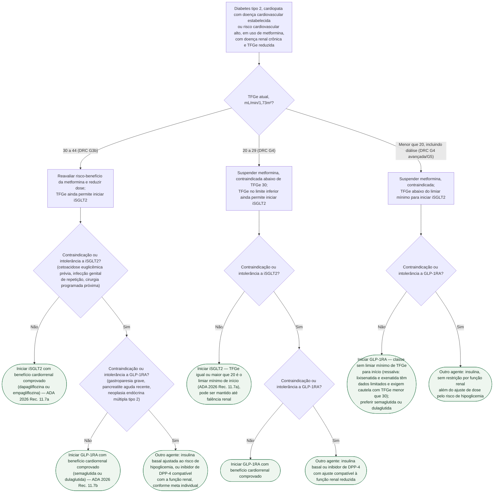

# Fluxograma: Segunda linha hipoglicemiante no diabético tipo 2 cardiopata com doença renal crônica avançada

O fluxograma geral já publicado nesta pasta escolhe entre iSGLT2 e GLP-1RA a partir da condição
predominante (insuficiência cardíaca, DRC ou doença aterosclerótica), com um único corte de TFGe
(≥20 ou <20 mL/min/1,73m²) dentro do ramo de DRC. O recorte que falta é o que acontece **dentro**
da DRC avançada: como a própria queda progressiva da TFGe muda tanto o destino da metformina já em
uso quanto a viabilidade de iniciar iSGLT2, e o que fazer quando a primeira escolha de segunda linha
esbarra em contraindicação ou intolerância. Este fluxograma organiza a decisão em três faixas de
TFGe — 30 a 44, 20 a 29, e abaixo de 20 (incluindo diálise) — cada uma com sua própria cadeia de
decisão entre iSGLT2, GLP-1RA e outro agente.

## Árvore de decisão

## O que a árvore não mostra

- **Finerenona não é hipoglicemiante e não entra na árvore.** A Recomendação 11.8 do ADA 2026
  indica antagonista mineralocorticoide não esteroide (finerenona) para reduzir progressão de DRC e
  eventos cardiovasculares quando há albuminúria e TFGe ≥25 mL/min/1,73m² — é aditiva ao iSGLT2 ou
  ao GLP-1RA escolhidos aqui, não uma alternativa a eles. A combinação já está documentada nesta
  pasta em `confidence-combinacao-de-finerenona-e-empagliflozina-na-doenca-renal-cronica-diabetica.md`.
- **A ordem de preferência entre iSGLT2 e GLP-1RA, quando os dois são elegíveis, depende do problema
  predominante — o mesmo critério do fluxograma geral já publicado.** O capítulo ADA 2026 posiciona
  iSGLT2 como primeira escolha para quem tem risco de progressão renal (albuminúria ou queda
  documentada de TFGe) e sugere GLP-1RA quando o risco cardiovascular é o problema predominante. Esta
  árvore assume que, dentro da DRC avançada, a proteção renal já é a prioridade clínica — por isso o
  ramo padrão é iSGLT2 primeiro sempre que a TFGe permitir, reservando GLP-1RA para quando iSGLT2 não
  pode ser usado.
- **A reavaliação da metformina não é binária.** Entre TFGe 30 e 44, a diretriz pede reavaliar
  risco-benefício e considerar redução de dose, não necessariamente suspender de imediato — a decisão
  final depende de tolerância, função renal estável ou em queda, e julgamento clínico. Abaixo de 30, a
  contraindicação é formal.
- **Dentro de "outro agente" (folhas C3, C6 e C8), a escolha entre insulina e inibidor de DPP-4 não é
  detalhada por fármaco específico.** O capítulo da diretriz usado como fonte principal não desenvolve
  o ajuste renal de cada gliptina; a única classe com ressalva renal explícita e citada literalmente
  na fonte é a de dois GLP-1RA específicos (lixisenatida e exenatida, com dados limitados e uso com
  cautela abaixo de TFGe 30) — as demais moléculas de GLP-1RA não têm essa restrição na fonte citada.
- **Efeitos adversos específicos de cada classe não são ramos da árvore** — risco de cetoacidose
  euglicêmica e infecção genital com iSGLT2, efeitos gastrointestinais com GLP-1RA — já documentados
  em itens próprios desta pasta, e entram na avaliação individual de contraindicação/intolerância
  representada nos losangos, não como estrutura própria do algoritmo.
- **A árvore não substitui o julgamento nefrológico em TFGe muito baixa ou diálise.** Nessa faixa, o
  manejo farmacológico costuma ser conduzido em conjunto com nefrologia, e a escolha final considera
  também expectativa de transplante, adesão e capacidade de automonitorização glicêmica do paciente.
