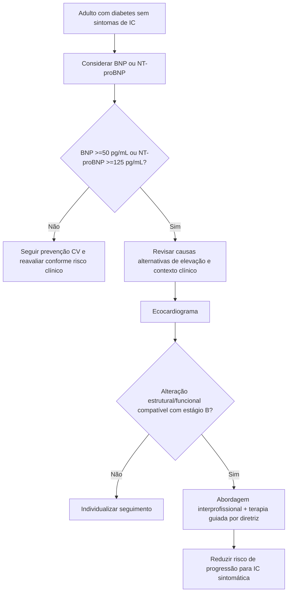

# Diabetes e insuficiência cardíaca assintomática — rastreio com BNP/NT-proBNP na ADA 2026

A ADA 2026 reforça que insuficiência cardíaca (IC) não deve ser procurada apenas quando surge dispneia ou edema. Adultos com diabetes têm risco aumentado de alterações cardíacas estruturais ou funcionais assintomáticas — **estágio B de IC** — e a diretriz propõe um fluxo de rastreio baseado em **BNP ou NT-proBNP**, seguido de ecocardiograma quando o biomarcador está alterado.

## 1. Quem entra no raciocínio

A recomendação se dirige a **adultos com diabetes**, mesmo sem sintomas de IC. A ADA 2026 reconhece maior risco de progressão dos estágios assintomáticos A/B para IC sintomática e considera razoável usar peptídeos natriuréticos para facilitar prevenção de estágio C.

Essa abordagem difere do rastreio rotineiro de doença coronariana assintomática, que a mesma diretriz **não recomenda de forma indiscriminada** quando os fatores de risco aterosclerótico já estão sendo tratados.

## 2. Primeiro passo — BNP ou NT-proBNP

A recomendação 10.38a da ADA 2026 orienta **considerar** rastreio de adultos com diabetes com BNP ou NT-proBNP para ajudar a prevenir progressão para IC sintomática (**evidência B**).

O texto da diretriz utiliza como valores anormais para esse fluxo:

- **BNP ≥50 pg/mL**;
- **NT-proBNP ≥125 pg/mL**.

Esses pontos de corte não devem ser interpretados mecanicamente. Insuficiência renal, hipertensão pulmonar, DPOC, apneia obstrutiva do sono, AVC e anemia podem elevar peptídeos natriuréticos; obesidade pode reduzi-los e diminuir a sensibilidade do teste.

## 3. Biomarcador alterado — o próximo exame é ecocardiograma

Em pessoa assintomática com diabetes e peptídeo natriurético anormal, a recomendação 10.38b indica **ecocardiografia para identificar estágio B de IC** (**evidência A**).

O ecocardiograma deve procurar, conforme o contexto:

- função sistólica do ventrículo esquerdo;
- hipertrofia/remodelamento;
- tamanho atrial;
- valvopatias;
- índices Doppler de função diastólica e pressões de enchimento;
- repercussão sobre ventrículo direito e circulação pulmonar quando pertinente.

A meta é identificar cardiopatia estrutural/funcional antes do aparecimento de sintomas, não apenas repetir um biomarcador alterado indefinidamente.

## 4. Se estágio B for confirmado

A ADA 2026 recomenda abordagem **interprofissional**, incluindo especialista cardiovascular, para otimizar terapia guiada por diretriz e reduzir o risco de progressão para estágio C (recomendação 10.44a, evidência A).

Em pacientes com diabetes e IC estágio B, a diretriz também recomenda **IECA ou BRA e betabloqueador** para reduzir progressão para IC sintomática (10.44b, evidência A), particularmente no contexto de cardiopatia estrutural apropriada como disfunção ventricular esquerda ou doença isquêmica prévia.

Para diabetes tipo 2 com estágio B de IC ou alto risco/doença cardiovascular estabelecida, terapias com benefício comprovado de prevenção de IC também entram no manejo; a escolha deve seguir o fenótipo clínico e as recomendações farmacológicas específicas da ADA.

## 5. O que mudou no raciocínio clínico

O modelo tradicional era:

**diabetes → esperar sintomas → ecocardiograma → diagnosticar IC.**

O modelo preventivo proposto passa a ser:

**diabetes assintomático → peptídeo natriurético → eco se alterado → identificar estágio B → tratar precocemente.**

Isso desloca parte do cuidado da IC para uma fase em que o paciente ainda não relata limitação funcional.

## Árvore prática

## Armadilhas

- Confundir rastreio de IC com rastreio indiscriminado de DAC em todo diabético assintomático.
- Diagnosticar IC somente por BNP/NT-proBNP aumentado, sem confirmar estrutura/função e excluir confundidores.
- Considerar BNP/NT-proBNP normal como exclusão absoluta em pessoa com obesidade.
- Pedir ecocardiograma seriado sem uma pergunta clínica após biomarcador normal e baixo risco.
- Identificar estágio B e não modificar o tratamento porque o paciente “não tem sintomas”.

## Referência principal

American Diabetes Association Professional Practice Committee for Diabetes. *10. Cardiovascular Disease and Risk Management: Standards of Care in Diabetes-2026.* Diabetes Care. 2026;49(Suppl 1):S216-S245. DOI **10.2337/dc26-S010**. PMID **41358899**. PMCID **PMC12690187**.
