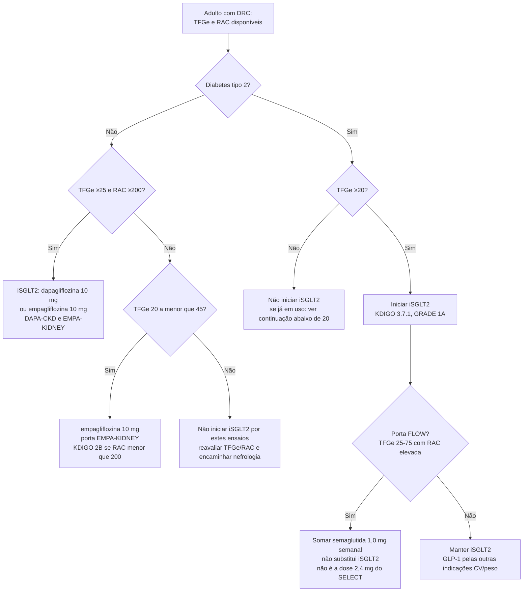

# iSGLT2 e semaglutida na DRC: protocolo comparativo DAPA-CKD, EMPA-KIDNEY e FLOW

## Para que serve este protocolo
A biblioteca já tem os ensaios isolados. O que falta no consultório é a pergunta operacional: **este paciente cabe em qual porta**, qual molécula começar, até que TFGe iniciar, o que fazer com a queda inicial de filtração, e se a semaglutida do FLOW substitui ou soma ao iSGLT2.

Este texto **não substitui** os cards:

- iSGLT2 na DRC: `inibidores-de-sglt2-na-doenca-renal-cronica-dapa-ckd-e-empa-kidney.md`
- FLOW (card curto): `flow-semaglutida-drc-diabetes-tipo-2.md`
- FLOW (card com subgrupo iSGLT2): `semaglutida-e-desfecho-renal-no-diabetes-tipo-2-o-ensaio-flow.md`

Tampouco substitui finerenona (`finerenona-fidelio-dkd-figaro-dkd-e-a-fidelity.md`, `confidence-combinacao-de-finerenona-e-empagliflozina-na-doenca-renal-cronica-diabetica.md`) nem o bloqueio do SRAA (`nefroprotecao-com-bloqueio-do-sraa-na-nefropatia-diabetica-renaal-idnt-e-o-limite-do-ontarget.md`). iSGLT2 e GLP-1 entram **sobre** IECA ou BRA em dose máxima tolerada, não no lugar deles.

O FLOW **não é iSGLT2**. Entra neste protocolo porque a porta renal do cardiologista hoje tem três ensaios de desfecho primário renal/cardiorrenal — dois de gliflozina, um de semaglutida 1,0 mg — e a confusão de dose com o SELECT (2,4 mg, sem diabetes, desfecho MACE) já está documentada no card dedicado `select-semaglutida-desfechos-cardiovasculares-obesidade-sem-diabetes.md`.

## As três portas, lado a lado

Números conferidos contra o abstract de cada ensaio (PMID 32970396, 36331190, 38785209). Os compostos **não são idênticos** — não comparar HR com HR como se fossem o mesmo desfecho.

| | DAPA-CKD | EMPA-KIDNEY | FLOW |
|---|---|---|---|
| Fármaco | dapagliflozina **10 mg/dia** | empagliflozina **10 mg/dia** | semaglutida **1,0 mg SC semanal** |
| Classe | iSGLT2 | iSGLT2 | agonista de GLP-1 |
| N | **4.304** (2.152 vs. 2.152) | **6.609** (3.304 vs. 3.305) | **3.533** (1.767 vs. 1.766) |
| Diabetes | com **ou** sem tipo 2 | com **ou** sem diabetes | **só tipo 2** |
| TFGe | **25 a 75** | **20 a <45**, **ou** 45 a <90 com albuminúria | 50–75 **ou** 25 a <50 (ver RAC) |
| RAC (mg/g) | **200 a 5.000** | ≥200 se TFGe 45–<90; **não exigida** se TFGe 20–<45 | >300 e <5.000 (TFGe 50–75) **ou** >100 e <5.000 (TFGe 25–<50) |
| Seguimento | mediana **2,4 anos** | mediana **2,0 anos** | mediana **3,4 anos** (interrompido na interina) |
| Primário | queda sustentada ≥50% da TFGe, DRT ou morte renal/CV | progressão renal (DRT, TFGe sustentada <10, queda sustentada ≥40%, morte renal) **ou** morte CV | falência renal (diálise, transplante ou TFGe <15), queda ≥50% da TFGe, ou morte renal/CV |
| Primário, resultado | 197/2.152 (**9,2%**) vs. 312/2.152 (**14,5%**); HR **0,61** (0,51–0,72; P<0,001); NNT **19** (15–27) | 432/3.304 (**13,1%**) vs. 558/3.305 (**16,9%**); HR **0,72** (0,64–0,82; P<0,001) | **331 vs. 410** primeiros eventos; HR **0,76** (0,66–0,88; P=0,0003) |
| Morte por qualquer causa | **4,7% vs. 6,8%**; HR **0,69** (0,53–0,88; P=0,004) | **4,5% vs. 5,1%** — sem diferença significativa | HR **0,80** (0,67–0,95; P=0,01) |
| Morte CV ou intern. por IC | HR **0,71** (0,55–0,92; P=0,009) | **4,0% vs. 4,6%** — sem diferença significativa | morte CV HR **0,71** (0,56–0,89); MACE HR **0,82** (0,68–0,98; P=0,029) |

Leitura curta da tabela:

- **DAPA-CKD** é a porta da DRC **albuminúrica** (RAC ≥200), TFGe a partir de **25**, com ou sem diabetes, e o ensaio que mostrou **mortalidade total**.
- **EMPA-KIDNEY** abre a porta mais baixa de TFGe (**20**) e inclui quem tem TFGe 20–<45 **mesmo com albuminúria mais baixa**. Não mostrou diferença em morte total nem no composto IC/morte CV — populações e seguimento diferem; o card dedicado explica por que isso não é contradição.
- **FLOW** exige **diabetes tipo 2** e albuminúria elevada; a dose é **1,0 mg**, não 2,4 mg. Proteção renal **e** MACE/mortalidade no mesmo ensaio.

## Conduta por fenótipo

### 1. DRC com ou sem diabetes, RAC ≥200 mg/g, TFGe ≥25
Cabe nas duas portas de iSGLT2. KDIGO 2024 recomenda iSGLT2 nesta faixa (**recomendação 3.7.2, GRADE 1A**) independentemente de diabetes, e também em T2D com TFGe ≥20 (**3.7.1, GRADE 1A**). Começar **dapagliflozina 10 mg** ou **empagliflozina 10 mg**, sobre IECA/BRA. A molécula com o ensaio que melhor descreve *este* paciente é aceitável; não há head-to-head.

### 2. DRC sem diabetes, TFGe 20 a <25, ou TFGe 20–45 com RAC <200
Fora do DAPA-CKD. Dentro do EMPA-KIDNEY. KDIGO 2024 **sugere** iSGLT2 em TFGe 20–45 com RAC <200 (**3.7.3, GRADE 2B**) — sugestão, não recomendação forte. Empagliflozina 10 mg é a molécula randomizada nessa porta. Não prometer redução de mortalidade com base no EMPA-KIDNEY.

### 3. Diabetes tipo 2 + DRC albuminúrica (porta FLOW)
O mesmo paciente costuma caber em iSGLT2 **e** em semaglutida 1,0 mg. Ordem prática:

1. Garantir IECA ou BRA em dose máxima tolerada
2. Iniciar iSGLT2 se TFGe ≥20 (base KDIGO 1A; piso do EMPA-KIDNEY)
3. Acrescentar semaglutida 1,0 mg semanal se a porta FLOW estiver preenchida e não houver contraindicação — mecanismo distinto, desfecho renal primário próprio
4. Se a albuminúria persistir, finerenona entra como terceiro mecanismo (`confidence-combinacao-de-finerenona-e-empagliflozina-na-doenca-renal-cronica-diabetica.md`)

A combinação iSGLT2 + semaglutida **não** tem ensaio dedicado de desfecho renal duro. O subgrupo do FLOW com iSGLT2 basal (550/3.533) está no card `semaglutida-e-desfecho-renal-no-diabetes-tipo-2-o-ensaio-flow.md`: HR 1,07 no subgrupo, **p de interação 0,109**, poder insuficiente. Isso **não** autoriza restringir semaglutida a quem não usa iSGLT2.

### 4. Diabetes tipo 2 + DRC + obesidade + doença aterosclerótica
Não misturar as doses:

- **FLOW / nefroproteção em T2D**: semaglutida **1,0 mg**
- **SELECT / MACE em obesidade sem diabetes**: semaglutida **2,4 mg** — população **sem** diabetes; ver o card SELECT desta produção
- iSGLT2 continua indicado pela porta renal/IC, independentemente da dose de GLP-1

## Árvore curta de prescrição

## Iniciar, continuar, não suspender

- **Piso para iniciar**: TFGe **≥20** mL/min/1,73 m² (EMPA-KIDNEY; KDIGO 3.7.1/3.7.2). DAPA-CKD começava em 25.
- **Queda inicial de TFGe**: esperada, hemodinâmica, em geral reversível. KDIGO practice point 3.7.3: a queda reversível **não é**, por si, indicação de suspender. O mesmo raciocínio está em `elevacao-de-creatinina-ao-iniciar-ieca-ou-bra-quando-manter-e-quando-suspender.md` (tema Hipertensão).
- **Continuar se a TFGe cair abaixo de 20**: KDIGO practice point 3.7.1 — razoável manter, salvo intolerância ou início de terapia renal substitutiva. ESC 2026 (CVD + DRC, STAMP on CKD) considera a continuação do iSGLT2 já em uso mesmo com TFGe <20, se tolerado, **Classe IIa, nível C** (`esc-2026-doenca-cardiovascular-e-doenca-renal-cronica-stamp-on-ckd.md`).
- **Sick day e perioperatório**: suspender em jejum prolongado, cirurgia eletiva (3 dias para dapagliflozina/empagliflozina) ou doença crítica — risco de cetoacidose euglicêmica. Protocolo próprio: `cetoacidose-euglicemica-associada-a-inibidores-de-sglt2.md`.

## O que este protocolo deliberadamente não faz
- Não reabre CREDENCE (canagliflozina, só diabetes, TFGe 30–90) — ensaio de DRC diabética anterior, não card deste lote
- Não trata sotagliflozina/SCORED como equivalente de desfecho renal primário — o SCORED tem documento próprio; desfecho primário foi centrado em IC
- Não escolhe entre iSGLT2 e finerenona: são mecanismos complementares
- Não usa o SELECT para indicar semaglutida na DRC

## Armadilhas clínicas
- **Restringir iSGLT2 a diabéticos** — DAPA-CKD e EMPA-KIDNEY randomizaram com e sem diabetes; o efeito renal foi semelhante
- **Exigir TFGe “alta” para começar** — o piso randomizado mais baixo é **20** (EMPA-KIDNEY)
- **Suspender na primeira queda de creatinina** — efeito hemodinâmico esperado
- **Ler EMPA-KIDNEY como ensaio negativo de mortalidade que anula o DAPA-CKD** — ver o card dedicado
- **Tratar FLOW como iSGLT2, ou usar 2,4 mg e chamar de FLOW** — FLOW é semaglutida 1,0 mg em T2D + DRC
- **Comparar os três HR do primário como se o composto fosse o mesmo** — limiar de queda de TFGe (50% vs. 40%), componente de morte e definição de falência renal diferem
- **Ler o subgrupo FLOW + iSGLT2 (HR 1,07) como prova de que a combinação não funciona** — p de interação 0,109; n=550
- **Prometer mortalidade menor a todo paciente com DRC** — mortalidade total saiu no DAPA-CKD e no FLOW, não no EMPA-KIDNEY
