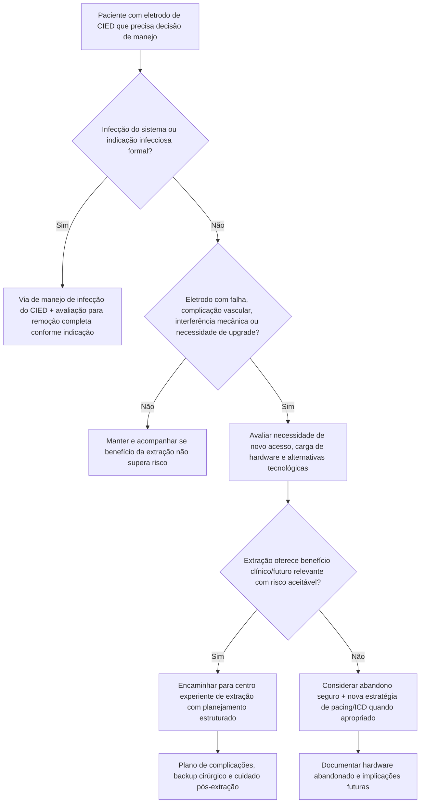
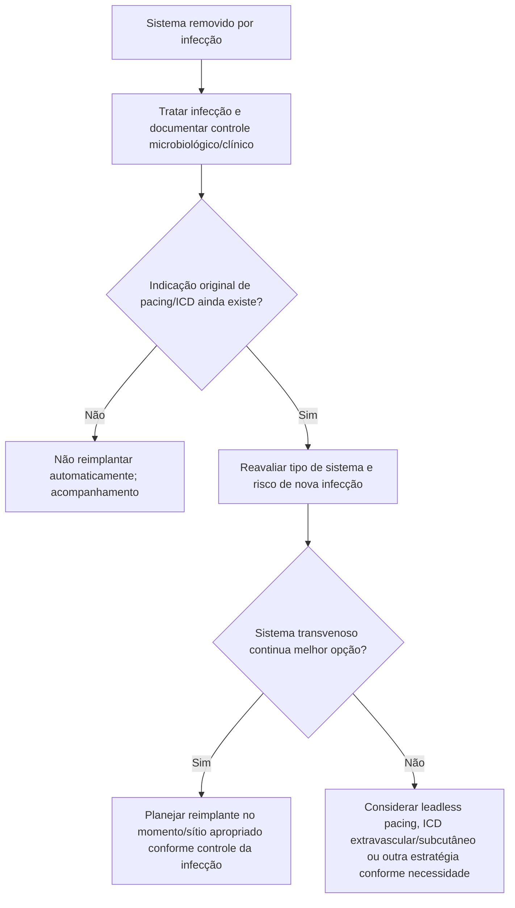
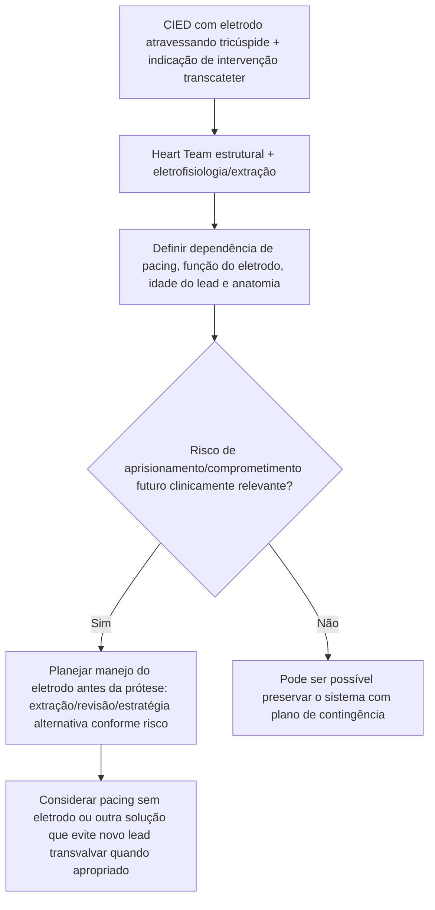

# Manejo e extração de eletrodos de CIED — consenso HRS 2026

## Por que a atualização de 2026 é importante

A atualização conjunta HRS/AHA/APHRS/EHRA/IDSA/LAHRS/PACES/STS publicada em abril de 2026 substitui a lógica simplista de “eletrodo velho = extrair” por uma decisão individualizada que compara **risco atual, risco futuro, benefício clínico e complexidade da extração**.

O documento incorpora novas tecnologias que não estavam maduras em 2017, como:

- pacing sem eletrodo;
- sistemas de desfibrilação fora do sistema vascular;
- novos eletrodos lumenless;
- novas ferramentas e técnicas de extração;
- interação entre eletrodos transvalvares e intervenções tricúspides transcateter.

## Princípio central

A decisão entre **manter, abandonar ou extrair** um eletrodo deve ser feita por decisão compartilhada, levando em conta:

- indicação clínica atual;
- risco de infecção;
- mau funcionamento;
- acesso vascular;
- necessidade de upgrade;
- idade e expectativa de vida;
- tempo de permanência do eletrodo;
- futuras necessidades de acesso venoso/MRI/intervenção estrutural;
- risco procedural e experiência do centro.

## Árvore de decisão: manter, abandonar ou extrair

## Extração é procedimento de alto impacto, não simples “troca de cabo”

O consenso enfatiza que extração transvenosa pode produzir complicações ameaçadoras à vida. Portanto, deve ser realizada em estrutura apropriada, com:

- operador e equipe experientes;
- protocolo institucional padronizado;
- ferramentas adequadas;
- planejamento por imagem quando indicado;
- capacidade de resposta imediata a complicações;
- **backup cirúrgico** e recursos compatíveis com o risco do procedimento.

## Quando a infecção muda a lógica

Infecção de CIED não deve ser abordada apenas com antibiótico e observação do pocket. O documento de 2026 atualiza evidências sobre diagnóstico, tratamento e prevenção de infecção de dispositivos e mantém a necessidade de considerar **remoção do sistema quando existe indicação infecciosa**, acompanhada de antibioticoterapia e estratégia adequada de reimplante.

A decisão de reimplantar deve responder:

1. o paciente ainda precisa de dispositivo?
2. qual tipo de dispositivo oferece menor risco futuro?
3. o sítio e o momento do reimplante são seguros?
4. alternativas sem eletrodo transvenoso podem reduzir risco?

## Árvore: após extração por infecção

## Valva tricúspide: uma nova interface crítica

O consenso aborda especificamente pacientes com eletrodos atravessando a tricúspide e indicação de **substituição tricúspide transcateter**.

Esses pacientes devem ser avaliados por **Heart Team multidisciplinar**, incluindo eletrofisiologista com experiência em manejo/extração de eletrodos, porque aprisionar um eletrodo entre prótese e tecido pode comprometer futuras intervenções, funcionamento do eletrodo e possibilidade de extração.

## Árvore: CIED antes de intervenção tricúspide transcateter

## Eletrodo abandonado: o custo futuro também conta

Abandono evita o risco imediato da extração, mas pode aumentar:

- quantidade de hardware intravascular;
- complexidade de futura extração;
- risco de obstrução venosa e interação entre eletrodos;
- dificuldade de upgrades;
- questões relacionadas a futuras intervenções estruturais.

Por outro lado, extrair preventivamente um eletrodo antigo e aderido em paciente de alto risco pode causar dano desproporcional. Por isso, o consenso insiste em **decisão individualizada e compartilhada**.

## Armadilhas

1. Não indicar extração apenas pela idade cronológica do eletrodo.
2. Não minimizar risco de extração porque o procedimento é “percutâneo”.
3. Não abandonar lead sem documentar implicações para acesso venoso e futuras intervenções.
4. Não planejar TTVR ignorando eletrodo transvalvar.
5. Não presumir que todo paciente removido por infecção precisa do mesmo tipo de dispositivo novamente.

## Fonte verificada

Cha YM, El-Chami MF, Liu CF, et al. 2026 HRS/AHA/APHRS/EHRA/IDSA/LAHRS/PACES/STS Expert Consensus Statement Update on Cardiovascular Implantable Electronic Device Lead Management and Extraction. *Heart Rhythm.* Published online April 23, 2026. PMID **42034327**. DOI **10.1016/j.hrthm.2026.04.015**.

## Status de revisão

`VERIFICAÇÃO HUMANA NECESSÁRIA`: antes de converter qualquer indicação específica de extração em regra automática, conferir classe, força e texto integral da recomendação no consenso final de 2026.
