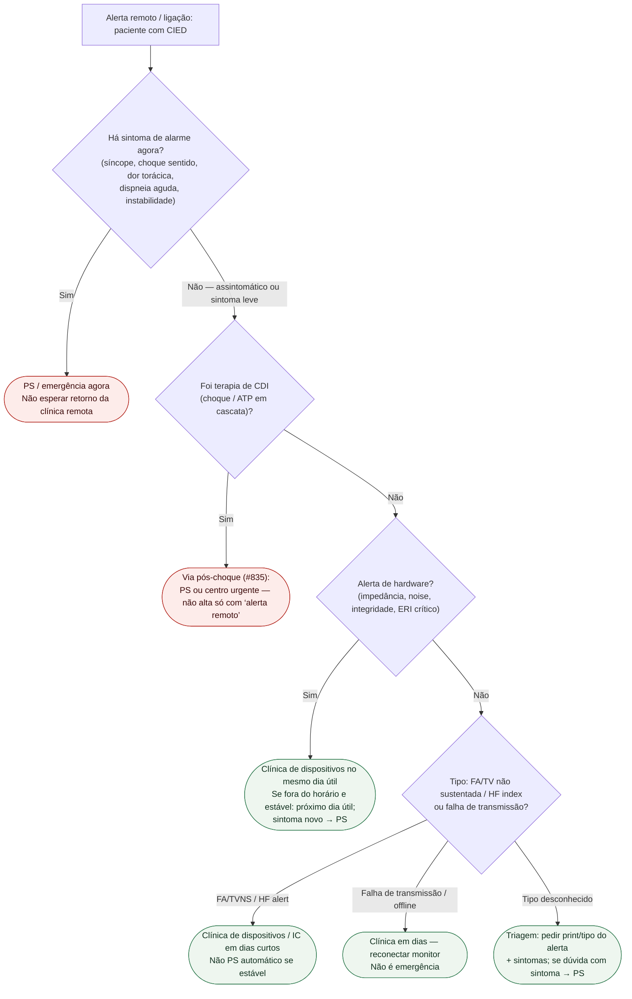

# Fluxograma: alerta remoto de CIED no ambulatório — destino

Prosa: [`alerta-remoto-de-cied-no-ambulatorio-quando-ligar-clinica-vs-ps`](alerta-remoto-de-cied-no-ambulatorio-quando-ligar-clinica-vs-ps.md). Premissa: [`monitoramento-remoto-nao-e-servico-de-emergencia-24h`](monitoramento-remoto-nao-e-servico-de-emergencia-24h.md). Evidência de desfecho: [`telemonitoramento-remoto-de-cdi-e-crt-d-e-desfecho-clinico-o-ensaio-in-time`](telemonitoramento-remoto-de-cdi-e-crt-d-e-desfecho-clinico-o-ensaio-in-time.md).

## Árvore de decisão

## O que a árvore não decide

- Reprogramação de zonas / discriminação.
- Anticoagulação na FA detectada remotamente.
- Se o índice de IC deve mudar diurético hoje.
- Extração de eletrodo ou colete vestível.

Essas decisões ficam com o centro de dispositivos / EP e com os documentos irmãos deste tema.

## Lembrete de evidência

RM acelera detecção (TRUST, PMID 20625110) e pode melhorar desfecho composto em IC selecionada (IN-TIME, PMID 25131977), mas o consenso 2023 (PMID 37208301) deixa explícito: **não é serviço de emergência**. Por isso o ramo “assintomático” aponta para a **clínica**, e o ramo “sintomático” para o **PS** — independentemente do bip no app.
