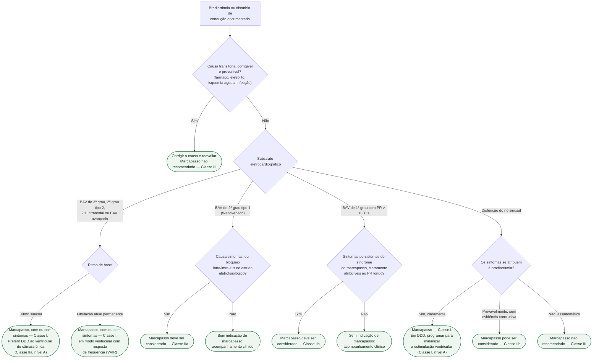
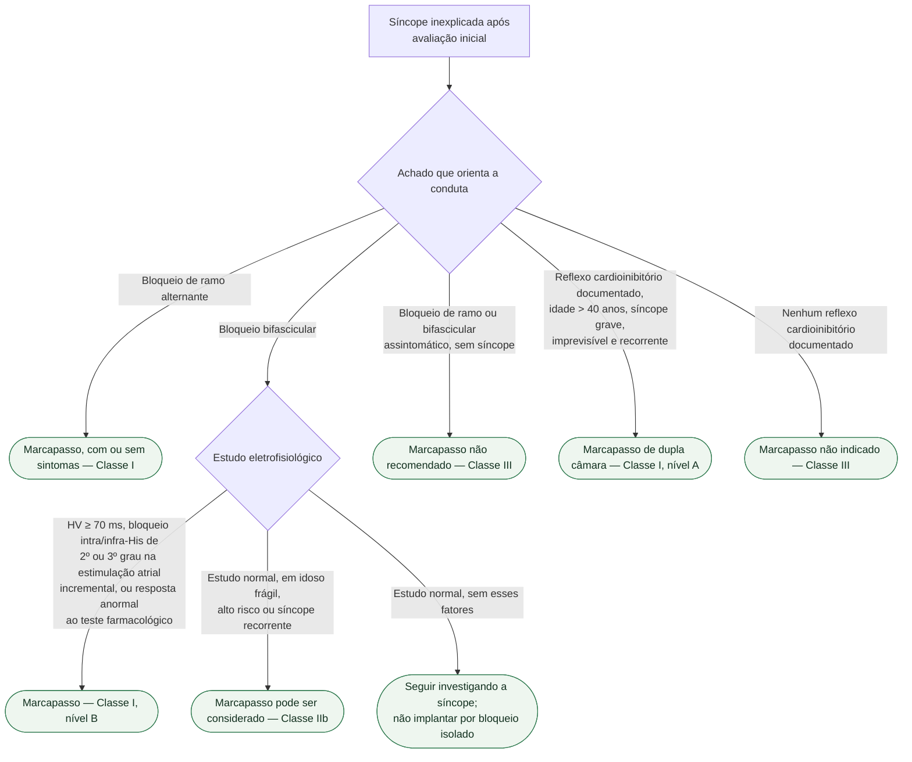

# Fluxograma: Bradiarritmia — indicação de marcapasso definitivo (ESC 2021)

Duas assimetrias organizam toda a decisão, e quem as inverte erra sempre:

1. **Na disfunção do nó sinusal, quem manda é o sintoma.** Bradicardia sinusal
   assintomática não se estimula — a recomendação é explicitamente contrária
   (Classe III). Sem sintoma atribuível, não há indicação.
2. **No bloqueio atrioventricular avançado, quem manda é o eletrocardiograma.**
   Bloqueio de terceiro grau, de segundo grau tipo 2, 2:1 infranodal ou avançado
   indicam marcapasso **independentemente de sintomas** (Classe I), porque aqui a
   estimulação tem valor prognóstico, não só sintomático.

E antes das duas, a pergunta que anula todo o resto: **a causa é transitória e
corrigível?** Bradiarritmia por fármaco, distúrbio eletrolítico, isquemia aguda
ou processo infeccioso não é indicação de marcapasso — é Classe III enquanto a
causa puder ser corrigida e prevenida.

## Árvore de decisão: bradiarritmia documentada

## Árvore de decisão: síncope com distúrbio de condução ou reflexa

## O que conta como reflexo cardioinibitório documentado

A recomendação Classe I, nível A, para marcapasso de dupla câmara na síncope
reflexa exige **idade acima de 40 anos** e síncope **grave, imprevisível e
recorrente**, mais um destes três achados:

- **pausa assistólica espontânea sintomática > 3 s**, ou **pausa assintomática
  > 6 s**, por parada sinusal ou bloqueio atrioventricular;
- **síndrome do seio carotídeo cardioinibitória**;
- **síncope assistólica durante o teste de inclinação**.

Sem reflexo cardioinibitório documentado, a estimulação **não está indicada**
(Classe III) — implantar por síncope recorrente sem documentação é o erro que
essa recomendação existe para impedir.

## Modo de estimulação: o que a árvore só resume

**Na disfunção do nó sinusal**, o DDD é o modo de primeira escolha, mas com uma
condição que vale como recomendação Classe I, nível A: **programar para minimizar
a estimulação ventricular desnecessária**. Estimular o ventrículo direito sem
necessidade favorece fibrilação atrial e deterioração da insuficiência cardíaca,
sobretudo quando a função sistólica já é limítrofe. Um DDD mal programado, nesse
cenário, é pior do que o problema que veio tratar.

**Na incompetência cronotrópica** com sintomas claros ao esforço, deve-se
considerar DDD com resposta de frequência (Classe IIa).

**No bloqueio atrioventricular**, o DDD deve ser preferido ao marcapasso
ventricular de câmara única, para evitar síndrome do marcapasso e melhorar
qualidade de vida (Classe IIa, nível A) — mas **na fibrilação atrial permanente**
não há átrio a sincronizar, e a recomendação é estimulação ventricular com
resposta de frequência (Classe I).

## Duas saídas que evitam o implante

**Ablação da fibrilação atrial** deve ser considerada como estratégia para evitar
o implante em pacientes com bradicardia relacionada à FA ou pausas
pré-automáticas sintomáticas após a reversão (Classe IIa).

**Na forma bradicardia-taquicardia** da disfunção do nó sinusal, o marcapasso é
indicado no paciente sintomático para corrigir a bradiarritmia e **permitir o
tratamento farmacológico** da taquiarritmia (Classe I) — **a menos que a ablação
da taquiarritmia seja preferível**. A ordem importa: perguntar primeiro se a
arritmia rápida pode ser tratada na origem.

## O que as árvores não mostram

**BAV 2:1 com QRS estreito e assintomático** tem uma ressalva na própria
diretriz: a estimulação pode ser evitada quando houver suspeita clínica ou
demonstração de bloqueio supra-hissiano — Wenckebach concomitante e
desaparecimento do bloqueio com o exercício.

**A investigação etiológica é paralela à decisão**: polissonografia, testes
laboratoriais dirigidos, imagem cardíaca quando se suspeita de doença estrutural,
teste de esforço quando o sintoma aparece ao exercício e teste genético na doença
de condução progressiva de início precoce (abaixo de 50 anos). Nada disso é ramo
da árvore, mas muda a causa — e a causa muda a conduta.

**Marcapasso após infarto, após cirurgia cardíaca e após TAVI** tem recomendações
próprias na mesma diretriz, com janelas de espera específicas, e não estão
representados aqui.
