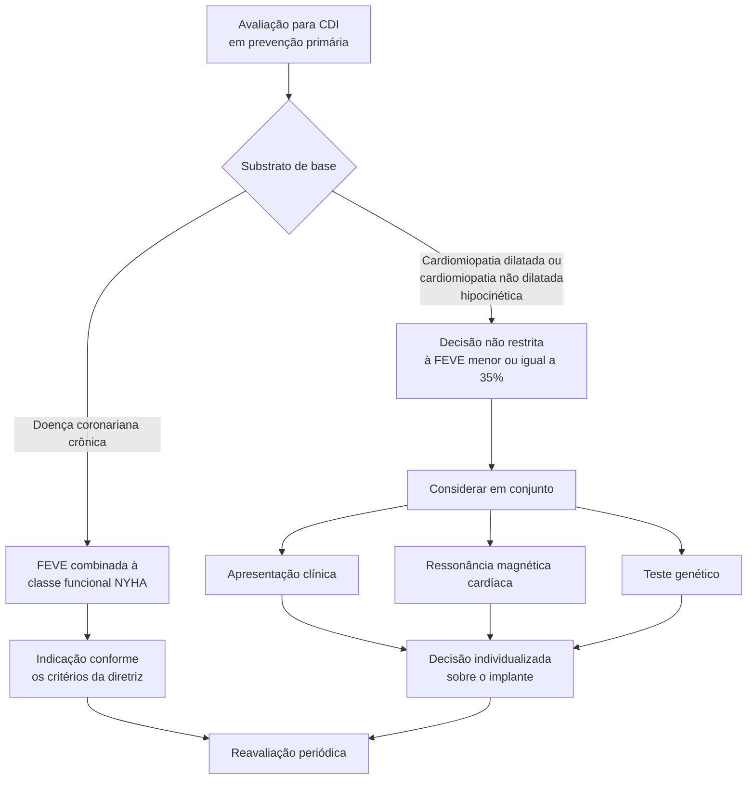

# Fluxograma: CDI em prevenção primária (ESC 2022)

A mudança mais importante da diretriz ESC 2022 para a decisão sobre
cardiodesfibrilador implantável é o **enfraquecimento da fração de ejeção como
critério isolado**. Ela continua central na doença coronariana crônica, mas na
cardiomiopatia dilatada a indicação deixou de poder ser reduzida a um corte
numérico.

## Caminho decisório

## Onde a fração de ejeção ainda decide

A FEVE é usada — frequentemente **em combinação com a classe funcional NYHA** —
para a indicação de CDI em prevenção primária no contexto de **doença arterial
coronariana crônica** e de **cardiomiopatia dilatada**.

## Onde ela deixou de bastar

Em pacientes com **cardiomiopatia dilatada ou cardiomiopatia não dilatada
hipocinética**, a diretriz é explícita: a indicação de CDI em prevenção primária
**não deve ser restrita a uma FEVE ≤ 35%**. A apresentação clínica e o resultado
de exames adicionais são importantes na decisão, com destaque para:

- **ressonância magnética cardíaca**
- **teste genético**

## A elevação da ressonância magnética cardíaca

O papel da RMC foi **significativamente elevado** nesta diretriz, tanto na
avaliação diagnóstica quanto — sobretudo — na estratificação de risco e na
decisão sobre terapia com CDI em prevenção primária. É a mudança que mais altera
a rotina de investigação antes do implante.

## Contexto da revisão

A diretriz de 2022 atualiza a de 2015. A revisão foi motivada por novos dados
sobre a epidemiologia da morte súbita cardíaca, por evidência nova em genética,
imagem e achados clínicos para estratificação de risco de arritmia ventricular e
morte súbita, e por avanços na avaliação diagnóstica e nas estratégias
terapêuticas.
