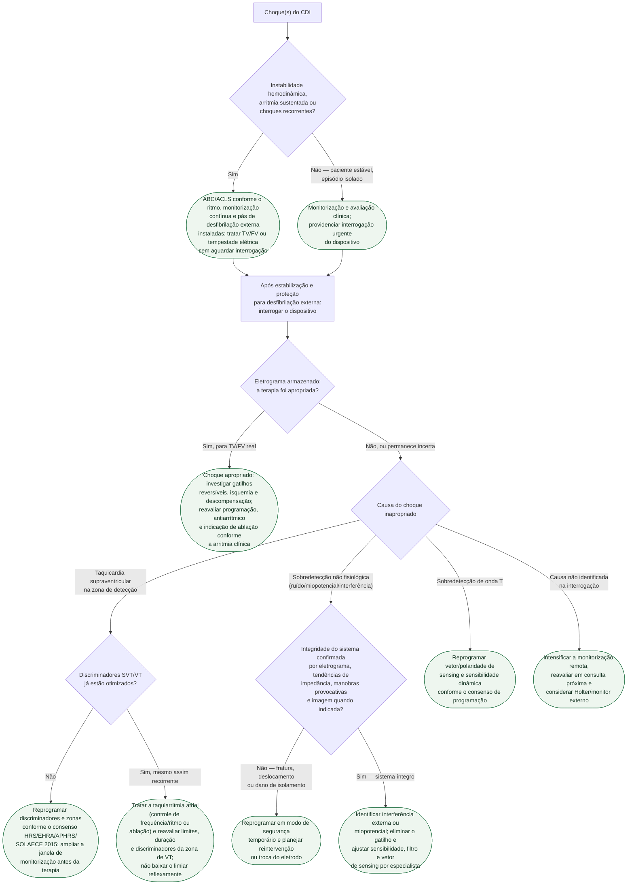

# Fluxograma: Choque inapropriado de CDI — investigação e manejo

Todo choque de CDI exige primeiro **triagem clínica imediata**. Instabilidade
hemodinâmica, arritmia sustentada ou choques recorrentes são manejados como
emergência, com monitorização e capacidade de desfibrilação externa, sem
esperar a interrogação. Depois de estabilizar e proteger o paciente, revisar o
eletrograma armazenado evita presumir a causa pelo relato ou pela frequência
cardíaca isolada. A árvore então segue as quatro causas mais frequentes de
terapia inapropriada — taquicardia
supraventricular mal discriminada, falha de integridade do sistema de
eletrodo, ruído/miopotencial e sobredetecção de onda T —, cada uma com conduta
própria.

## Árvore de decisão

## O que a árvore não mostra

**Choques repetidos ou causa ainda incerta exigem avaliação urgente.** Antes
de suspender terapias, instalar monitorização contínua e proteção com
desfibrilação externa. Se os choques forem recorrentes e houver forte suspeita
de terapia inapropriada, a suspensão temporária por programação ou ímã pode
ser considerada apenas com capacidade imediata de tratar TV/FV externamente;
o ímã não corrige a causa. Se os choques tratarem TV/FV real, conduzir a
tempestade elétrica e não atrasar desfibrilação para interrogar o CDI.

**A reprogramação de discriminadores segue princípios do consenso de 2015, não
uma regra única.** O documento recomenda, entre outras medidas, ampliar o
número de intervalos exigidos antes da terapia e usar zonas de detecção mais
altas quando clinicamente seguro — a escolha exata depende da arritmia clínica
de base, não é um ajuste padronizado para todo paciente.

**MADIT-RIT é a evidência de que reprogramar reduz terapia inapropriada e
mortalidade, não só desconforto.** O braço com detecção retardada/zona alta
teve redução de 79% na primeira terapia inapropriada e também menor
mortalidade por todas as causas em relação à programação convencional — é por
isso que a árvore trata reprogramação como conduta ativa, não como medida
paliativa.

**Fratura de eletrodo pode coexistir com terapia apropriada prévia.** Um
sistema que já tratou VT real corretamente no passado não está isento de
desenvolver falha de integridade depois — a checagem de impedância e imagem
vale mesmo quando o histórico do dispositivo é bom. Impedância pontual normal
também não exclui fratura intermitente; tendências e eletrograma importam.

**O suporte psicológico ao choque, apropriado ou não, não está na árvore** por
não ser um ramo de decisão clínica sobre a programação, mas é parte
recomendada do seguimento — choque de CDI é evento com impacto relatado sobre
qualidade de vida e ansiedade, independentemente da causa identificada.
