# Fluxograma: Disfunção de eletrodo (fratura ou falha de isolamento) detectada em telemetria — conduta

A disfunção de eletrodo raramente se anuncia como um evento único e óbvio. O
padrão mais comum é um alerta de monitorização remota — impedância de
estimulação ou de choque fora da tendência habitual, elevação de limiar,
perda intermitente de sensing ou artefato de alta frequência no eletrograma
armazenado — que chega ao consultório antes de qualquer sintoma clínico. É
justamente nesse ponto, antes de o choque inapropriado ou a perda de captura
acontecerem, que a conduta muda o desfecho: o algoritmo Lead Integrity Alert
mostrou, num ensaio prospectivo com 213 pacientes por braço, todos com fratura
de eletrodo confirmada por análise do eletrodo explantado, uma redução
relativa de 46% em pacientes com pelo menos um choque inapropriado (LIA 38%
vs. controle 70%, p<0,001) — a diferença entre monitorizar a tendência de
impedância e esperar o choque acontecer. A árvore abaixo parte do achado de
telemetria, passa pela confirmação radiográfica e organiza a decisão entre
implante urgente, ponte com colete desfibrilador vestível e revisão cirúrgica
eletiva, conforme dependência de marca-passo e envolvimento do eletrodo de
choque — de acordo com o consenso de manejo e extração de eletrodo de CIED da
HRS (2017, atualizado em 2026).

## Árvore de decisão

```mermaid
flowchart TD
  A["Telemetria de rotina ou monitorização remota mostra impedância de estimulação/choque fora da faixa esperada, elevação abrupta de limiar de captura, perda de sensing ou artefato de alta frequência (ruído) no eletrograma armazenado, sem sinais de infecção de bolsa"]
  A --> D1{"Manobras provocativas (compressão do trajeto do eletrodo, manobras posturais/de braço) e revisão do eletrograma armazenado confirmam ruído não fisiológico e/ou a tendência de impedância é compatível com fratura do condutor (elevação abrupta) ou falha de isolamento (queda abrupta)?"}
  D1 -->|"Não — impedância estável na faixa esperada e o ruído tem outra causa identificada (miopotencial, sobredetecção de onda T, interferência eletromagnética externa)"| C1(["Eletrodo íntegro: corrigir a causa alternativa (reprogramar sensibilidade, orientar sobre a fonte de interferência) e manter o cronograma habitual de seguimento"])
  D1 -->|"Sim — achados compatíveis com fratura do condutor ou dano de isolamento"| B1["Confirmar com radiografia de tórax dedicada (incidências PA e oblíqua) e correlacionar com a curva de impedância armazenada no dispositivo"]
  B1 --> D2{"O paciente é marca-passo-dependente e o eletrodo comprometido está associado a perda de captura ou de sensing eficaz no momento da avaliação?"}
  D2 -->|"Sim"| C2(["Internar em unidade com telemetria contínua, providenciar marca-passo transvenoso temporário como ponte se houver bradicardia sintomática, e implantar novo eletrodo de estimulação em caráter urgente, antes da alta"])
  D2 -->|"Não — ritmo próprio suficiente ou estimulação/sensing preservados no restante do sistema"| D3{"O eletrodo comprometido é, ou compartilha o corpo/via de, um eletrodo de choque de CDI ou TRC-D com terapias antitaquicardia ativas?"}
  D3 -->|"Sim — risco de choque inapropriado por ruído no canal de detecção/choque"| B2["Desativar temporariamente a terapia de choque, manter a estimulação antibradicardia ativa e reprogramar filtros de discriminação de ruído/alerta de integridade de eletrodo"]
  B2 --> D4{"Persiste indicação de proteção contra morte súbita (prevenção secundária, taquicardia ventricular documentada ou disfunção ventricular grave) enquanto a terapia de choque permanece desligada?"}
  D4 -->|"Sim"| C3(["Prescrever colete desfibrilador vestível como ponte e agendar revisão cirúrgica do eletrodo em caráter de urgência, em poucos dias"])
  D4 -->|"Não — risco de morte súbita atualmente baixo (ex.: prevenção primária sem evento arrítmico prévio)"| C4(["Manter vigilância clínica com o choque desativado e agendar revisão cirúrgica eletiva do eletrodo em curto prazo, com verificação diária de impedância por monitorização remota"])
  D3 -->|"Não — eletrodo comprometido tem apenas função de estimulação/sensing, sem via de choque"| C5(["Agendar revisão cirúrgica eletiva do eletrodo; manter seguimento remoto intensificado até o procedimento, sem necessidade de internação"])
  classDef conduta fill:#eef6ef,stroke:#2f7a4f,color:#12301f;
  class C1,C2,C3,C4,C5 conduta;
```

## O que a árvore não mostra

**A árvore decide urgência de correção, não a técnica de correção em si.**
Uma vez indicada a revisão cirúrgica — urgente ou eletiva —, a escolha entre
extrair o eletrodo antigo ou abandoná-lo e implantar um novo ao lado depende
de fatores que este fluxograma não resolve: presença de infecção (que por si
só já indica extração completa e é tratada em fluxograma próprio deste
catálogo), idade e expectativa de carga de eletrodo do paciente, limitação de
acesso venoso por múltiplos eletrodos, recall do fabricante e o risco do
próprio procedimento de extração em função do volume do centro. Esse é o
recorte do consenso de manejo e extração de eletrodo de CIED da HRS, e é
matéria de decisão compartilhada no momento do procedimento, não de triagem
inicial.

**A distinção entre fratura do condutor e falha de isolamento não muda a via
de decisão desta árvore, mas muda o padrão elétrico observado.** Fratura do
condutor tipicamente eleva a impedância de estimulação (às vezes de forma
abrupta e intermitente, reproduzível por manipulação do eletrodo); falha de
isolamento tipicamente reduz a impedância de choque, por corrente de fuga
entre condutores ou para o tecido. As duas produzem oversensing não
fisiológico e podem gerar terapia inapropriada em CDI — por isso a árvore as
trata pelo mesmo caminho de manejo imediato, embora a causa elétrica seja
oposta.

**A desativação temporária da terapia de choque não é uma medida trivial, e a
árvore trata como decisão explícita, não automática.** É exatamente o
mecanismo que o algoritmo Lead Integrity Alert tentou substituir por um alerta
mais precoce: ele reduziu não só a proporção de pacientes com pelo menos um
choque inapropriado (46% de redução relativa), mas também a proporção com
cinco ou mais choques (50% de redução relativa, LIA 25% vs. controle 50%,
p<0,001) — o dado que mostra que, sem intervenção, o mesmo eletrodo fraturado
tende a gerar múltiplos episódios, não um só.

**Radiografia normal não exclui fratura elétrica.** Fratura do condutor
interno costuma ser invisível ao raio-X convencional — o que se vê é a
descontinuidade da bainha externa ou o deslocamento grosseiro do eletrodo.
A confirmação diagnóstica real, na maioria dos casos, é elétrica (curva de
impedância armazenada, reprodução de ruído por manobra provocativa), não
radiográfica; a imagem serve para excluir outras causas mecânicas visíveis
(deslocamento franco, dano evidente à bainha) e para planejamento cirúrgico,
não para descartar o diagnóstico quando normal.
