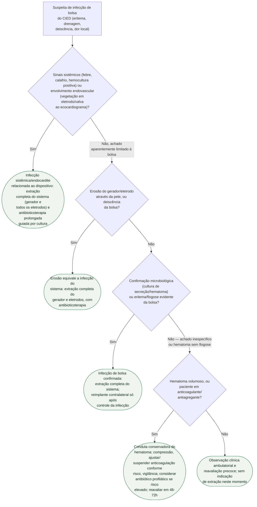

# Fluxograma: Infecção de bolsa de gerador — conduta

O ponto que a árvore protege é uma regra sem exceção do consenso HRS 2017:
**erosão do dispositivo através da pele é infecção do sistema**, mesmo sem
febre, sem hemocultura positiva e sem sinal florido de flogose — e infecção de
sistema, uma vez estabelecida, exige extração completa (gerador e todos os
eletrodos), nunca troca isolada do gerador ou desbridamento local mantendo o
eletrodo. A árvore percorre esse critério antes de qualquer outro, e só chega
à conduta conservadora quando infecção foi razoavelmente afastada.

## Árvore de decisão

## O que a árvore não mostra

**"Extração completa" significa gerador e todos os eletrodos, mesmo os
eletrodos abandonados de trocas anteriores.** O consenso HRS 2017 é explícito
em não aceitar extração parcial como tratamento de infecção de sistema —
deixar um eletrodo antigo para trás mantém o reservatório de biofilme que
sustenta a recorrência.

**O antibiótico profilático não substitui a decisão de extrair.** Quando a
árvore chega a "erosão" ou "infecção de bolsa confirmada", nenhum esquema de
antibiótico isolado é conduta aceitável — a extração é a intervenção
definidora, e o antibiótico é complemento, não alternativa.

**O envelope antibacteriano (WRAP-IT) é medida de prevenção no implante ou na
reintervenção, não de tratamento da infecção já instalada.** O ensaio reduziu
infecção maior de CIED em 40% em procedimentos de risco (trocas, upgrades,
revisões) — pertence à decisão de prevenir antes do procedimento seguinte, não
a esta árvore de manejo da infecção já suspeita.

**O momento do reimplante depois da extração** depende de hemocultura
negativa sustentada e ausência de vegetação residual, com prazos que variam
conforme o organismo isolado e a extensão do envolvimento — não está detalhado
na árvore por ser decisão de acompanhamento posterior à extração, não critério
de quando extrair.
