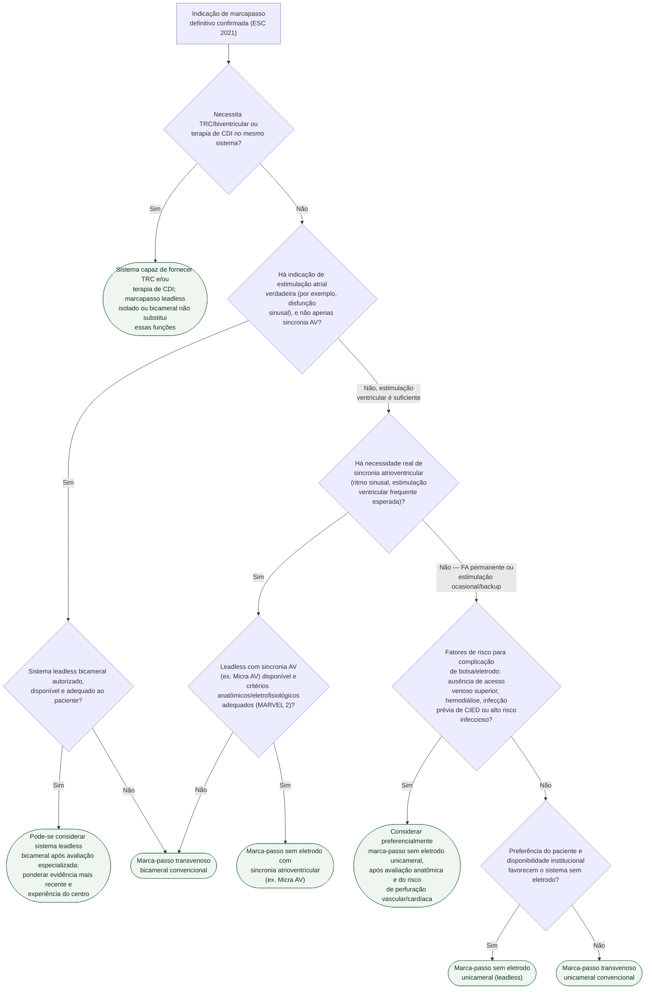

# Fluxograma: Marca-passo transvenoso versus sem eletrodo (leadless)

A discussão sobre marca-passo sem eletrodo só começa depois que a indicação de
estimulação definitiva já está confirmada pela diretriz ESC 2021. A partir
daí, a escolha de plataforma não é preferência de tecnologia — depende de três
perguntas objetivas: qual terapia precisa ser fornecida, se a estimulação
atrial verdadeira ou apenas sincronia atrioventricular é necessária, quais
plataformas estão autorizadas/disponíveis e se existem fatores que elevam o
risco de complicação de bolsa ou de eletrodo transvenoso.

## Árvore de decisão

## O que a árvore não mostra

**O Micra Transcatheter Pacing Study encontrou 96% de liberdade de complicação
maior relacionada ao sistema ou procedimento em 6 meses.** Isso não equivale
a ausência universal de complicações: perfuração/tamponamento e complicações
do acesso femoral permanecem possíveis, embora não exista bolsa ou eletrodo
transvenoso.

**O MARVEL 2 avaliou sincronia AV mecânica, não elétrica**, comparando o
algoritmo de detecção mecânica de contração atrial do Micra AV contra
estimulação assíncrona — a decisão de usar essa plataforma depende de o
paciente manter ritmo sinusal e de haver expectativa real de estimulação
ventricular frequente, não é indicada indistintamente a todo paciente elegível
a marcapasso unicameral. O estudo foi curto e não demonstrou desfechos clínicos
de longo prazo equivalentes aos de um sistema bicameral convencional.

**Sistemas leadless bicamerais passaram a existir depois da diretriz ESC
2021.** O ensaio pivotal de 2023 demonstrou desempenho inicial de dois módulos
intracardíacos comunicantes, mas isso não fornece TRC nem terapia de CDI e não
elimina a necessidade de confirmar indicação, autorização local, experiência
do centro e dados de seguimento mais longo.

**Extração de um sistema leadless em caso de infecção ou necessidade de
upgrade** segue via própria, tecnicamente diferente da extração de eletrodo
transvenoso — essa diferença pesa na decisão em paciente jovem com expectativa
de múltiplas trocas ao longo da vida, mas não está representada como ramo
porque é consideração de planejamento de longo prazo, não critério de seleção
inicial.

**RM condicional e compatibilidade de longo prazo** variam por modelo e
geração de dispositivo em ambas as plataformas — checar a ficha técnica do
sistema específico antes do implante, não presumir pela categoria
(transvenoso versus leadless).
